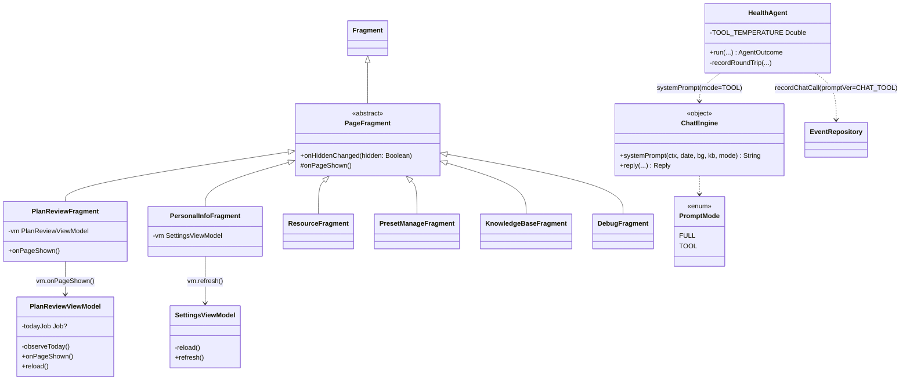
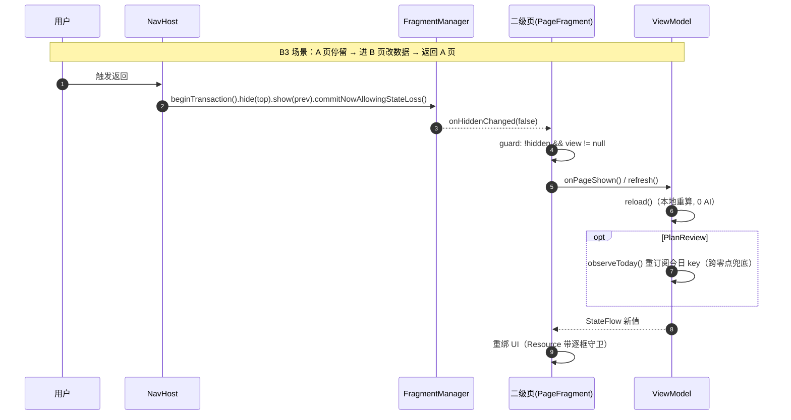
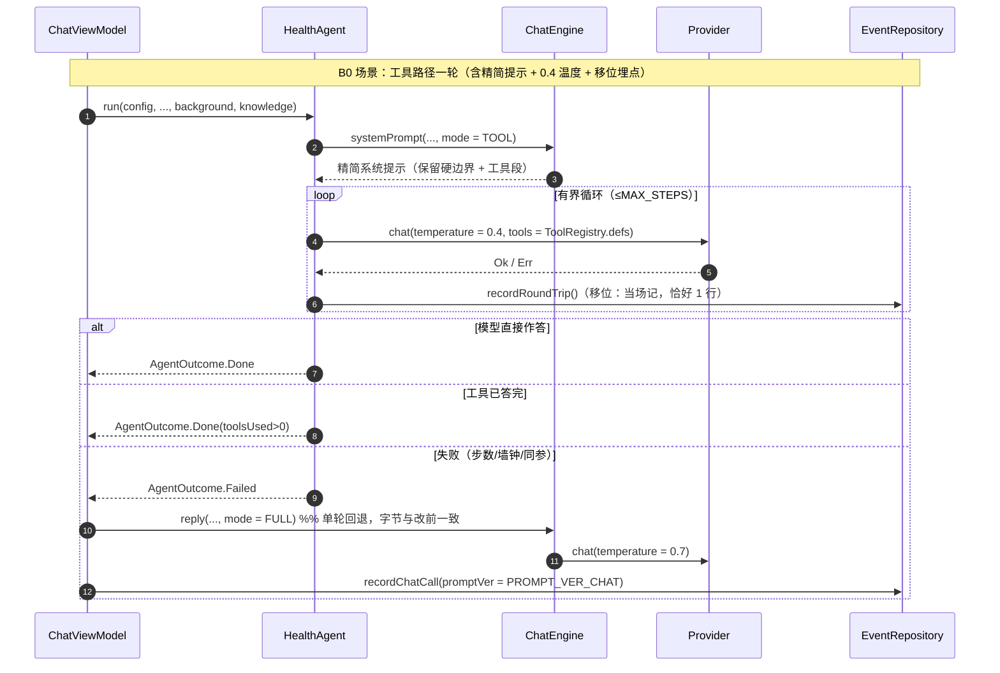

# Healix v0.3 增量设计（第一波：B0 / B1 / B3）

> 角色：架构师（高见远）｜出单：2026-10-06
> 上游增量 PRD：`docs/v0.3-升级清单-2026-10-06.md`（§1 / §6 / §8.2 / §8.4）
> 交付范围：**本波只做三项** —— B0（需求 6 诊断：提示组织 / temperature / 埋点核对）、B1（需求 1 计划页滑动弹跳）、B3（需求 4 二级页实时刷新）。
> 原则：**原型 = 设计意图 ≠ 实现现状**。本文件所有行号均为**本机亲读后**的真实行号；与上游 PRD 不一致处已在 §0 标注纠偏。

---

## 0. 核实结论与纠偏（先核实再设计）

以下为逐条 Read/Grep 核对结果。**一致**的不再展开，**不一致或需要更正**的列在此。

| # | 上游（PRD / team-lead）表述 | 代码实况（亲读） | 处置 |
|---|---|---|---|
| V1 | 「`ChatEngine.systemPrompt` 在字节冻结区，`pipeline/` 的 `PROMPT_PARITY` 做字节比对」 | ⚠️ **部分不符**：`pipeline/check_kotlin.py:944-947` 的 `PROMPT_PARITY` 只含 `PROMPT_EXTRACT`(→`parse/SchemaValidator.kt`) 与 `PROMPT_TRAINING`(→`ui/TrainingPlanner.kt`)。**`ChatEngine.systemPrompt` 不在机器校验名单内**。 | 机器只守 2 条；`ChatEngine.systemPrompt` 靠**人工约定**（`ChatEngine.kt:23` KDoc「不参与任何 prompt 字节校验」+ PRD §8.2 红线）。**结论**：B0 的「字节不动」没有 CI 守卫 → 必须人工逐字核 + 强烈建议补金样本（见 §8 待明确）。 |
| V2 | team-lead：「`HealthAgent` temperature = 0.7（PRD §6.3）」 | ✅ `HealthAgent.kt:266` `temperature = 0.7` | 一致，改 0.4。 |
| V3 | 「回退链埋点可能不是移位记录，需核对」 | ✅ **现状已是移位记录**：`HealthAgent.run()` 每轮 `provider.chat` 后**立即** `recordRoundTrip()`（`HealthAgent.kt:261-272`），失败/成功都记；`ChatViewModel` 仅在 agent `Failed` 后回退单轮再补**那一笔**（`ChatViewModel.kt:286-300`）。逐分支枚举见 §1.1-③。 | **核对结论：埋点不变式当前已成立，本项无需改代码**（仅补 KDoc/回归断言）。 |
| V4 | 「`PlanReviewViewModel.observeToday()` 只订阅进入时刻的 `day_key`」 | ✅ `PlanReviewViewModel.kt:183-190` + 仅 `init`（`:130-134`）调用一次 | 一致（B3 需重订阅）。 |
| V5 | 「`PlanReviewViewModel.reload()` 供页面重建调用」 | ⚠️ 现为 **`private suspend fun reload()`**（`PlanReviewViewModel.kt:172-174`）；`SettingsViewModel.reload()` 亦为 **private**（`:291`）。 | B3 需为二者**新增公开刷新入口**（不能把 private 直接暴露成 public 而不审视语义）。 |
| V6 | 「`itemContainer` 换 `RecyclerView`（方案 A）」 | ⚠️ **`itemContainer` 嵌在 `ScrollView#contentScroll` 内**（`fragment_plan_review.xml:116-121` 的 ScrollView → `:123` 内层 LinearLayout → `:220-224` `itemContainer`），并非页面唯一滚动轴。 | **关键风险**：直接换 RecyclerView 会与 ScrollView 抢滚动、失去回收语义。详见 §1.2 方案 A/B 的取舍与建议。 |
| V7 | 「6 个二级页**未挂** `onHiddenChanged`、需刷新」 | ✅ 6 页确实未挂（Grep 全仓 `onHiddenChanged` 仅 5 处实现：`AssistantFragment:143`、`RecordFragment:225`、`SettingsFragment:205`、`StatusDetailFragment:112`、`MedicalSummaryFragment:167`）。但**数据来源不同**：`PresetManageFragment`/`KnowledgeBaseFragment` 是 Room Flow（`observeAll`）→ **天然实时**；`ResourceFragment`(一次性读,`:59-68`)、`PersonalInfoFragment`(StateFlow 快照,`SettingsViewModel.reload`)、`DebugFragment`(列表 Flow 但**汇总是一次性**,`:70-91`)、`PlanReview` 才是真陈旧。 | 逐页处置必须**分级**（见 §1.3），不能一刀切。 |
| V8 | 「keep-alive：被覆盖页 `onResume` 不触发」 | ✅ `NavHost.kt:75-77` 明文；`open()` 用 `commitNowAllowingStateLoss()` + `hide/show`（`:206-212`）。 | 一致；**红线：不得用 onResume 替代**。 |
| V9 | 现有 5 页 `onHiddenChanged` 的写法 | ✅ 统一形态 `super.onHiddenChanged(hidden); if (!hidden) onVisible()/refresh()`，多数带 `view != null` 守卫 | B3 基类据此收敛。 |

---

## 1. 实现方案

### 1.1 批次 B0 — 需求 6 工具路径诊断优化

目标：**只优化 agent（工具）路径**，单轮 / 抽取链**零变化**。三处动作对齐 PRD §6.4 的 A / B / C。

#### ① 工具路径用精简系统提示（按路径参数化注入）

现状（取证）：`HealthAgent.kt:240-244` 把系统提示拼成
`ChatEngine.systemPrompt(context, sessionDate, background, knowledge) + TOOLS_SECTION` ——
即**工具路径与单轮共用同一份完整系统提示**（含超长「说话方式」段，`ChatEngine.kt:255`）。

**取舍**：不做「第二套 prompt」（漂移风险 + 违反「新增走新通道、字节不动」）。选**按路径参数化注入**：
给 `ChatEngine.systemPrompt` 增加一个**路径模式**参数，工具路径传「精简」，单轮传「完整」。

- `ChatEngine.systemPrompt` 的函数**产出字节**：`FULL` 模式必须与现状**逐字节相同**（守护 §8.2 红线）。
- 实现手段（**关键、需人工逐字核**）：把「说话方式」那**一整段**（`ChatEngine.kt:255` 的 `像一个懂行…别在回复开头重复固定指引。`）抽成**两个常量**，在原 raw string 里用插值引入：
  - `SPEAKING_STYLE_FULL`（内容 == 现段落，逐字符一致）；
  - `SPEAKING_STYLE_TOOL`（压缩版：保留「直接、有温度、有判断」「给具体食物+分量 / 动作+组数」「不猜数、直说没记录」的骨，砍掉深夜/追问/开场白等冗余）。
  - 按 `mode` 选择插值变量。**其余模板字符（人格首句、今日数字、硬边界 4 条、隐私追加项、`foodPoolLine`、`backgroundBlock`、`knowledgeBlock`）一字不动。**

签名变更（**合规性**，硬约束 #4）：`systemPrompt(context, sessionDate, background, knowledge)` 的 4 个形参**均非函数类型**，故新增可选参数 `mode: PromptMode = PromptMode.FULL` **追加在末尾**是安全的（尾随 lambda 纪律只约束"函数型形参"，此处不涉及）。所有既有单轮调用点（`ChatEngine.reply:86`）不传 → 默认 `FULL`，行为不变。

```kotlin
// ChatEngine.kt 新增
enum class PromptMode { FULL, TOOL }   // FULL=单轮/回退（现状字节）；TOOL=agent 工具路径（精简说话方式）

internal fun systemPrompt(
    context: Context, sessionDate: String, background: String, knowledge: String,
    mode: PromptMode = PromptMode.FULL,     // 追加在末尾：无函数型形参，安全
): String { … val speaking = if (mode == PromptMode.TOOL) SPEAKING_STYLE_TOOL else SPEAKING_STYLE_FULL … }
```

`HealthAgent.kt:242` 改为 `ChatEngine.systemPrompt(context, sessionDate, background, knowledge, mode = PromptMode.TOOL)`。

> ⚠️ 只压缩「说话方式」，**硬边界段（`ChatEngine.kt:257-261` 的 4 条）与 `TOOLS_SECTION`（`HealthAgent.kt:379-386`）原样保留** —— 二者共同构成 PRD §6.4 A 要求的「保留硬边界 + 工具段」。

#### ② 工具路径 temperature 0.7 → 0.4

`HealthAgent.kt:266` 的 `temperature = 0.7` 改为命名常量（`HealthAgent.companion` 新增 `private const val TOOL_TEMPERATURE = 0.4`，落在 0.3~0.5 区间，取中）。**单轮 `ChatEngine.kt:106` 仍 0.7；抽取 0.3、训练 0.4 不动**（对齐 PRD §6.4 B）。

常量单一来源（硬约束 #7）：落地前 `grep -rnE 'const val TOOL_TEMPERATURE'` 确认无同名同值。

#### ③ 回退链埋点核对（**结论：现状已合格，不改代码**）

逐分支枚举（亲读 `HealthAgent.run:257-325` 与 `ChatViewModel.executeChat:258-315`）：

| 路径 | agent 内 `recordRoundTrip` 行数 | 回退单轮 `recordChatCall` 行数 | 合计 vs provider 往返 |
|---|---|---|---|
| Done | N（每轮 1 行，`272`） | 0（`completeWithText` 不记） | N = N ✅ |
| ProposalPending | M | 0（仅 persist + emit，`:262-266`） | M = M ✅ |
| RateLimited | 1 | 0（`:268-271`） | 1 = 1 ✅ |
| Failed（含步数/墙钟/同参耗尽） | M（每轮都记） | 1（`:286-300`） | M+1 = M 次 agent 往返 + 1 次回退往返 ✅ |

`recordRoundTrip` 是**移位写法**（`provider.chat` 之后**当场**记，不批处理、不事后补记）—— 满足「一次 provider 往返恰好一行、失败也记、禁补记」。

**动作**：仅补一处 KDoc 断言（在 `HealthAgent.recordRoundTrip` 头注释里把上表结论固化为不变式说明），**无行为改动**；验收时用调试页对照往返数。

**改动文件（B0）**：`app/src/main/java/com/healix/app/ui/ChatEngine.kt`（修改）、`app/src/main/java/com/healix/app/agent/HealthAgent.kt`（修改）。

---

### 1.2 批次 B1 — 需求 1 计划页滑动弹跳

#### 根因（复核后确认）
`renderTimeline()` 每次 `vm.plan.collect` 都 `removeAllViews()`(`PlanReviewFragment.kt:229`) → 逐条 `addView`(`:251,254`)；配合同帧多处 `visibility` 切换（`:153,177,183,191,197,202,232,244,258`）→ `ScrollView.onLayout` 把 `scrollY` 夹到 `0` 且不还原。

#### 方案取舍（**纠偏见 V6**）

「方案 A = `itemContainer` 换 RecyclerView」在字面上成立，但 **`itemContainer` 不是页面滚动轴**（它在 `contentScroll` 这个 ScrollView 里，V6）。要让「滚动位置由 RecyclerView 自身持有」，必须让 RecyclerView 成为页面唯一滚动轴 —— 这要求把滚动区内的**所有**兄弟（`planSourceLabel`/`planModeLabel`/`undoBar`/`trainingSummary`/`trainingFocus`/`planEmptyRow`/`planNote`/`trainingGenerateRow`/`reviewGroup`）都变成适配器条目 —— 其体量与「需求 2 记录页合并滚动区」（PRD 自评**高风险、单独成批**）同量级。**因此把 A 原样塞进"低风险 B1"是不成立的。**

**架构决策**：

- **B（必做，本批交付）**：不动布局结构，做两件事根治夹取——
  1. **重建前后保 `scrollY`**：在 `vm.plan.collect` 块**开头**取 `val y = binding.contentScroll.scrollY`；在渲染**末尾**（`renderTimeline` 返回后）`binding.contentScroll.post { scrollTo(0, y) }`（`post` 保证在新子树 layout 之后，否则会被旧高度夹取）。
  2. **visibility 变更合并到重建末尾**：把 `renderPlanHeader`/`renderTrainingSummary` 里对视图的 `visibility` 写操作，改为**先算后写**或**整体后移**到重建之后统一提交，消除同帧"先塌后复"的中间态（A 之外的额外加固；即使只做 1 也足以消除最终跳变，2 让中间帧更干净）。
   - `renderTimeline` 内部保持 `removeAllViews` 逐条 `addView`（本方案不追求回收收益，只求零跳变）。
- **A（推荐但**建议与 B2 同期做****）：真正的「RecyclerView 作页面唯一滚动轴」。要点：`contentScroll` 由 `ScrollView` 换成 `RecyclerView`（`layout_weight=1`）；用**多 ViewType 的 `ListAdapter`**（或 `ConcatAdapter`：headerAdp / timelineAdp / footerAdp 三段）承载全部内容；`item_plan_timeline.xml`（条目）与 `item_timeline_day.xml`（日头）原样复用；时间轴条目走 `DiffUtil` 增量更新。**关键约束**：
  - `undoBar` **不放进 RecyclerView**（`UndoBar` 用 `WeakHashMap<View,Runnable>` 存 5s 定时器，`UndoBar.kt:37,69-71`，RecyclerView 会回收其宿主 View → 定时器悬挂）。把 `undoBar` 提为**固定元素**（并因此让 `PlanReviewFragment.kt:138` 的 `smoothScrollTo(0,0)` 从「滚到顶部露条」变成「条常驻可见」→ 该行**整体删除**，比「仅当不可见时才滚」更简单且更符合 §15.7 的"撤得回看得见"意图）。
  - 但把 `undoBar` 移出滚动区 = **视觉位置改变** → 需拍板（§8）。
  - `PlanReviewFragment.kt:138` 是**刻意设计**（PRD §15.7），A 下不可直接删——按上面"提为固定元素"处置，或退化为"仅当目标不可见时才滚"。
- **C（不采纳）**：仅去 `smoothScrollTo` / 加 `descendantFocusability` —— 治标（PRD 已否决）。

**B 方案落点（`PlanReviewFragment.observe()` 的 `vm.plan.collect` 块）**：

```kotlin
vm.plan.collect { p ->
    val savedY = binding.contentScroll.scrollY      // ① 开头取
    binding.gapLabel.text = …
    renderPlanHeader(p)
    renderTrainingSummary(p)
    renderTimeline(p)
    // ② 末尾统一恢复（post 到新子树 layout 后，规避夹取）
    binding.contentScroll.post { binding.contentScroll.scrollTo(0, savedY) }
}
```

**不触碰**：`PlanReviewViewModel`（B1 范围，见 team-lead 约束）、AI 链路、`TimelineMerger`。

**改动文件（B1）**：`app/src/main/java/com/healix/app/ui/PlanReviewFragment.kt`（修改）；若走 A 追加 `app/src/main/res/layout/fragment_plan_review.xml`（修改）与 `app/src/main/java/com/healix/app/ui/PlanTimelineAdapter.kt`（新增）。

---

### 1.3 批次 B3 — 需求 4 二级页实时刷新

#### 统一范式（结构上杜绝"某页忘挂"）
选 **`PageFragment` 基类**（team-lead 给的二选一之一），不选 NavHost 回调：
- 理由 1：`onHiddenChanged` 是本仓**已验证**的机制（5 页在用，V9），基类只是**收敛样板 + 显式契约**；
- 理由 2：NavHost 回调会与 `onHiddenChanged` **双触发**（要么重复刷新、要么还要抑制其一），且需在 `MainActivity` 里按 `TAG_PREFIX` 反查 Fragment，耦合更重；
- 理由 3：`onHiddenChanged` 由 FragmentManager 在**事务执行的正确时机**派发（含 `commitNowAllowingStateLoss` 的 `show()`），无需自己拿捏时序。

```kotlin
// 新文件 ui/PageFragment.kt
abstract class PageFragment : Fragment() {
    final override fun onHiddenChanged(hidden: Boolean) {
        super.onHiddenChanged(hidden)
        if (!hidden && view != null) onPageShown()   // 统一守卫：视图未建不触碰 binding
    }
    /** 被覆盖后再展示（keep-alive 下 onResume 不触发）。默认无操作；按需刷新者覆写。 */
    protected open fun onPageShown() {}
}
```

> 既有 5 页（`RecordFragment`/`AssistantFragment`/`SettingsFragment`/`StatusDetailFragment`/`MedicalSummaryFragment`）**本批不改**（它们已工作，属"纯加法"范围的边界）；基类仅由本波 6 个目标页采用。两范式并存的收敛列为后续债务。

#### 逐页刷新语义分级（写进文档，防后人乱挂）

| 页面 | 数据来源（亲读） | `onPageShown()` 动作 | 依据 |
|---|---|---|---|
| `PlanReviewFragment` | `vm.plan`（`reload` 快照）+ 今日 key 订阅（`observeToday:183`） | `vm.onPageShown()`：`reload()` + **重订阅今日 key** | 跨零点 / 外部变更兜底 |
| `PersonalInfoFragment` | `vm.values`（`SettingsViewModel` 快照，`reload:291`） | `vm.refresh()`（= 公开版 `reload()`） | 体重等外部变更 |
| `ResourceFragment` | **一次性读库**（`onViewCreated:59-68`） | 重读 `ResourceStore` 并**按字段守卫**回填 | 唯一真陈旧页之一 |
| `PresetManageFragment` | Room Flow `observeAll()`（`:69-77`） | **空操作**（Flow 天然实时；保留空实现以统一范式） | Flow 实时 |
| `KnowledgeBaseFragment` | Room Flow `observeAll()`（`:81-88`） | **空操作**（同上） | Flow 实时 |
| `DebugFragment` | 列表 Room Flow（`:64`）**但汇总/ token 是一次性**（`:70-91`） | 重算汇总行 + token 行（列表无需动） | 半陈旧 |

**红线**：二级页**不得**用 `onResume` 替代（keep-alive 下不触发，V8）。

#### PlanReviewViewModel 的重订阅
现 `observeToday()` 只在 `init` 调一次且 key 固定（V4）。改为**可重订阅**（B3 范围内允许改 VM）：

```kotlin
private var todayJob: Job? = null
private fun observeToday() {
    todayJob?.cancel()
    todayJob = viewModelScope.launch(Dispatchers.IO) {
        val key = runCatching { generator.todayKey() }.getOrNull() ?: return@launch
        runCatching { db.eventDao().observeCountByDay(key).collect { computeAndEmit() } }
    }
}
/** 二级页被重新展示：数据可能已在别处变化 + 可能已跨零点 → 重算 + 重订阅今日键。 */
fun onPageShown() { reload(); observeToday() }
```
`init` 保持 `reload(); observeToday(); autoRerankIfDue()`（**不动 `autoRerankIfDue`** —— 它已有 `day_key` 日节流，`onPageShown` 不重复触发，保住"打开页面 0 AI"与成本纪律）。

#### 需要新增的公开入口
- `SettingsViewModel`：新增 `fun refresh()` → 内部调私有 `reload()`（**不**把 `reload` 直接改 public，保持语义收口）。
- `PlanReviewViewModel`：新增 `fun onPageShown()`（见上）。
- `ResourceFragment`：新增私有 `reloadFields()`，**逐框守卫**：仅当 `!edit.hasFocus()` 且 `edit.text.toString() == lastSaved[edit]`（无未落库草稿）时才回填，避免覆盖用户正在编辑的内容（对齐 `PersonalInfoFragment` 背景框 `hasFocus()` 守卫 `:365-371` 的既有口径）。

**改动文件（B3）**：`ui/PageFragment.kt`（新增）、`ui/PlanReviewViewModel.kt`（修改）、`ui/PlanReviewFragment.kt`（修改，`Fragment`→`PageFragment` + 覆写 `onPageShown`）、`ui/SettingsViewModel.kt`（修改）、`ui/PersonalInfoFragment.kt`、`ui/ResourceFragment.kt`、`ui/PresetManageFragment.kt`、`ui/KnowledgeBaseFragment.kt`、`ui/DebugFragment.kt`（均修改）。

---

## 2. 文件清单（相对 `app/src/main/`）

| 文件 | 批次 | 新增/修改 | 说明 |
|---|---|---|---|
| `java/com/healix/app/ui/ChatEngine.kt` | B0 | 修改 | 新增 `PromptMode`、`SPEAKING_STYLE_FULL/TOOL`、`systemPrompt(..., mode)`；`FULL` 字节不动 |
| `java/com/healix/app/agent/HealthAgent.kt` | B0 | 修改 | 传 `PromptMode.TOOL`；`TOOL_TEMPERATURE=0.4`；工具路径 `promptVer` 改 `v1`（独立版本序列）；埋点 KDoc |
| `java/com/healix/app/ui/PlanReviewFragment.kt` | B1 / B3 | 修改 | B1：`collect` 块保 `scrollY` + visibility 收尾；B3：基类 + `onPageShown()` |
| `java/com/healix/app/ui/PlanTimelineAdapter.kt` | B1(A) | 新增（可选） | 仅走方案 A 时新增：多 ViewType `ListAdapter` + `DiffUtil` |
| `res/layout/fragment_plan_review.xml` | B1(A) | 修改（可选） | 仅走 A：`contentScroll` 换 `RecyclerView`、`undoBar` 提为固定元素 |
| `java/com/healix/app/ui/PageFragment.kt` | B3 | 新增 | 页面可见基类（统一 `onHiddenChanged` 派发） |
| `java/com/healix/app/ui/PlanReviewViewModel.kt` | B3 | 修改 | `observeToday()` 可重订阅 + 公开 `onPageShown()` |
| `java/com/healix/app/ui/SettingsViewModel.kt` | B3 | 修改 | 新增公开 `refresh()` |
| `java/com/healix/app/ui/PersonalInfoFragment.kt` | B3 | 修改 | 基类 + `onPageShown()→vm.refresh()` |
| `java/com/healix/app/ui/ResourceFragment.kt` | B3 | 修改 | 基类 + `onPageShown()→reloadFields()`（带守卫） |
| `java/com/healix/app/ui/PresetManageFragment.kt` | B3 | 修改 | 基类 + 空 `onPageShown()`（Flow 实时） |
| `java/com/healix/app/ui/KnowledgeBaseFragment.kt` | B3 | 修改 | 基类 + 空 `onPageShown()`（Flow 实时） |
| `java/com/healix/app/ui/DebugFragment.kt` | B3 | 修改 | 基类 + `onPageShown()` 重算汇总/ token |

**不动**：`ui/NavHost.kt`（B3 选基类方案，NavHost 零改动）、`PlanReviewViewModel` 的 AI 链路、`TimelineMerger`、既有 5 个已挂 `onHiddenChanged` 的页面、`pipeline/`（B0 不触发 `PROMPT_PARITY`，V1）。

---

## 3. 数据结构与接口

### 3.1 新增 / 变更签名

```kotlin
// ── ChatEngine.kt ────────────────────────────────────────────────
enum class PromptMode { FULL, TOOL }

const val PROMPT_VER_CHAT: String = "v2"        // 单轮/回退：字节未变 → 保持 v2（见 §8 待明确 PV-1）
const val PROMPT_VER_CHAT_TOOL: String = "v1"   // 工具路径：提示已变更 → 独立版本序列，**从 v1 起**（已拍板；初版误写 v3 作废）

internal fun ChatEngine.systemPrompt(
    context: Context, sessionDate: String, background: String, knowledge: String,
    mode: PromptMode = PromptMode.FULL,          // 追加末尾（无函数型形参，尾随 λ 纪律不涉及）
): String

private const val SPEAKING_STYLE_FULL = "像一个懂行、也在认真训练和吃饭的朋友，…别在回复开头重复固定指引。"
private const val SPEAKING_STYLE_TOOL = "…"      // 压缩版（保留骨、砍冗余；见 §1.1-①）

// ── HealthAgent.kt ──────────────────────────────────────────────
private const val TOOL_TEMPERATURE = 0.4         // 0.3~0.5 区间；仅工具路径
// • :242  systemPrompt(..., mode = PromptMode.TOOL)
// • :266  temperature = TOOL_TEMPERATURE
// • :343/:357  promptVer = PROMPT_VER_CHAT_TOOL

// ── PageFragment.kt（新）─────────────────────────────────────────
abstract class PageFragment : Fragment() {
    final override fun onHiddenChanged(hidden: Boolean)
    protected open fun onPageShown()             // 默认空
}

// ── PlanReviewViewModel.kt ──────────────────────────────────────
private var todayJob: Job? = null
private fun observeToday()                       // 改为可重订阅（先 cancel 旧 job）
fun onPageShown()                                // reload() + observeToday()

// ── SettingsViewModel.kt ────────────────────────────────────────
fun refresh()                                    // = 私有 reload() 的公开入口

// ── ResourceFragment.kt ─────────────────────────────────────────
private fun reloadFields()                       // 重读 store + 逐框守卫回填
```

### 3.2 类图（Mermaid）

见 `docs/v0.3-增量-类图.mermaid`（同内容）。
> ⚠️ 未写入 `docs/class-diagram.mermaid` / `docs/sequence-diagram.mermaid` —— 这两个名字**已被上一份（v8「AI 数据注入」）设计的图占用**，覆盖会破坏既有文档引用。本增量另存 `v0.3-增量-*`。



### 3.3 序列图（Mermaid）

见 `docs/v0.3-增量-时序图.mermaid`（同内容）：





---

## 4. 任务列表（有序，按实现顺序；每条可独立验证）

> 说明：本波是**增量**批次，文件天然按功能模块聚合成 2~3 个/批；不强行凑通用模板的"每任务 ≥3 文件"（那适合绿地新建）。任务间以文件冲突最小化为依赖依据。

| Task ID | 名称 | 源文件（相对路径） | 依赖 | 优先级 | 独立验证 |
|---|---|---|---|---|---|
| **T01** | B0 · 工具路径诊断优化 | `java/com/healix/app/ui/ChatEngine.kt`、`java/com/healix/app/agent/HealthAgent.kt` | 无 | P0 | ① 单轮路径 `systemPrompt(FULL)` 与改前**逐字相同**；② 工具路径走 `TOOL`（说话方式已压缩、4 条硬边界 + `TOOLS_SECTION` 原样）；③ `temperature==0.4`；④ 埋点枚举表逐分支复算（§1.1-③） |
| **T02** | B1 · 计划页滑动弹跳修复（B 必做） | `java/com/healix/app/ui/PlanReviewFragment.kt` | 无 | P0 | 真机：任意位置连滑 10 次零跳变；页面中部停留触发记录页写入 → 返回计划页 `scrollY` 前后相同；空态↔有内容切换 5 次无跳顶 |
| **T03** | B1(A) · 计划页 RecyclerView 化（**推荐、建议与 B2 同期**） | `res/layout/fragment_plan_review.xml`、`java/com/healix/app/ui/PlanTimelineAdapter.kt`（新）、`java/com/healix/app/ui/PlanReviewFragment.kt` | T02 | P1 | ≥30 条目 `nav.open→frag.resumed` + 渲染总耗时 ≤ 改前（`PerfProbe` MARK 对照）；点击/撤销条/空态/两 Tab 全回归 |
| **T04** | B3 · 统一页面可见范式（基类 + 计划页） | `java/com/healix/app/ui/PageFragment.kt`（新）、`java/com/healix/app/ui/PlanReviewViewModel.kt`、`java/com/healix/app/ui/PlanReviewFragment.kt` | T02（同一文件，避免冲突） | P1 | 计划页：设置页改目标→返回，缺口行/时间轴/训练汇总同步；03:59→04:01 返回日期同口径 |
| **T05** | B3 · 其余 5 页刷新 | `java/com/healix/app/ui/SettingsViewModel.kt`、`ui/PersonalInfoFragment.kt`、`ui/ResourceFragment.kt`、`ui/PresetManageFragment.kt`、`ui/KnowledgeBaseFragment.kt`、`ui/DebugFragment.kt` | T04 | P1 | 逐页回归表（PRD §4）：个人信息←记体重后刷新、资源清单重读（且不覆盖未落库草稿）、预设/知识库无回归、调试页汇总随返回重算 |
| **T06** | 真机回归 + 验收对照 | 无代码（走查记录/`docs`） | T01–T05 | P0 | PRD §8.4 四项 + B0 的「10 问题改前/改后对照表 + 回退率下降≥30%」 |

**关键顺序**：T02 → T03（可选）→ T04 → T05。T01 与 T02 可**并行**（无文件交集）。T04 必须在 T02 之后（都改 `PlanReviewFragment.kt`）。

---

## 5. 依赖包

**预期无新增依赖。**
- B1 方案 A 用 `androidx.recyclerview:recyclerview:1.3.2`（`app/build.gradle:84` 已有）；`ListAdapter`/`DiffUtil` 即该库内容。
- ⚠️ 本模块**无 `fragment-ktx` / `activity-ktx`**（`app/build.gradle:79-117` 只有 `lifecycle-runtime-ktx` / `lifecycle-viewmodel-ktx`）→ 禁 `by viewModels()` / `commit {}` / `doOnLayout` / `registerForActivityResult`（Fragment）；取 VM 用 `ViewModelProvider(this)[X::class.java]`。
- B3 `PageFragment` 只依赖已有 `androidx.fragment`。

---

## 6. 共享知识（跨文件约定 + 7 条硬约束落地要点）

1. **字节冻结区**：`PROMPT_EXTRACT`(`parse/SchemaValidator.kt`)、`PROMPT_TRAINING`(`ui/TrainingPlanner.kt`) 由 `check_kotlin.py:check_prompt_parity` **机器**守（`PROMPT_PARITY`，`:944-947`）；`ChatEngine.systemPrompt` **不在名单**（V1）→ 靠人工。新增内容走**新通道**（`PromptMode.TOOL` + `SPEAKING_STYLE_TOOL` + `PROMPT_VER_CHAT_TOOL=v1`），**FULL 路径零字节变化**。版本号**采独立序列、各自递增**（单轮 `PROMPT_VER_CHAT=v2`；工具路径 `PROMPT_VER_CHAT_TOOL=v1`，不跟随单轮序号；抽取 v2 不动）。
2. **配额不变式**：一次 provider 往返**恰好一行** `llm_calls`，失败也记、**禁补记**。`HealthAgent.recordRoundTrip` 保持"移位写法"（`provider.chat` 后**当场**记，`HealthAgent.kt:272`）；回退单轮补的**是回退那次往返自己那一行**（`ChatViewModel.kt:286`），不是补 agent 的行。
3. **无 `fragment-ktx`/`activity-ktx`**（见 §5）→ 禁扩展函数；`PageFragment` 用原生 `override fun onHiddenChanged`。
4. **尾随 λ 纪律**：给已有 `f(..., onOk: () -> Unit)` 追加**非函数型**可选参数时插在 `onOk` **之前**。本次 `systemPrompt(..., mode)` 追加在**末尾**是安全的——其 4 个形参**无函数类型**（不触发该约束）；若将来给 `FieldSheet.show` 等带 `onOk` 的函数加参会踩线。
5. **二级页导航 = keep-alive 手工页面栈**：`NavHost` 自持 `stack`、用 `commitNowAllowingStateLoss()`、`open/back` 只 `hide/show` **不销毁**（`NavHost.kt:206-262`）→ 被覆盖页**不重走 `onViewCreated`、`onResume` 不触发**。刷新唯一正解 = `onHiddenChanged(false)`（本波由 `PageFragment` 统一承载）。`PAGE_*` 标签常量唯一来源在 `NavHost.kt:95-105`，**禁写字面量**。
6. **无本机 JDK / SDK，CI 是唯一编译验证** → 新增每个 Android/Kotlin API 都须**已对照官方文档核签名**或标待核实。本波需核：
   - `RecyclerView.ListAdapter` / `DiffUtil.ItemCallback`（recyclerview 1.3.2，官方文档核过）；
   - `Fragment.onHiddenChanged(hidden: Boolean)`（`androidx.fragment`，本仓 5 处在用，形态核实）；
   - `ViewModelProvider(this)[X::class.java]`（本仓既有写法，`PlanReviewFragment.kt:44-46`）；
   - `kotlinx.coroutines.Job`/`cancel()`（协程库既有；`PlanReviewViewModel` 已用 `launch`）。
   - 历史踩坑提醒：`FragmentManager.FragmentLifecycleCallbacks` 无 animation 回调；`object` 内禁 `companion object`；`android.util.Printer` 是顶层接口。
7. **常量单一来源**：新 `const val`（`TOOL_TEMPERATURE`、`PROMPT_VER_CHAT_TOOL`、`SPEAKING_STYLE_*`）落地前先 `grep -rnE 'const val <名字>'`，判据 = **同名且同值**（`check_kotlin.py:check_duplicate_constants` 会报）。

> 另注：本波引入的 `PromptMode` 是**枚举**（非 const），不受 `check_duplicate_constants` 影响；但若同名枚举/类已存在需先 grep。

---

## 7. 待明确事项（需拍板 / 只能真机验证）

| # | 项 | 选项 | 影响 |
|---|---|---|---|
| PV-1 | 对话链 prompt 版本号策略 | **已拍板：独立 v1 序列** —— 工具路径 `PROMPT_VER_CHAT_TOOL` 采**独立版本序列、从 `v1` 起**（不跟随、不复用 `PROMPT_VER_CHAT`）；单轮保持 `PROMPT_VER_CHAT=v2`。理由：工具路径自 B0 起已与单轮分叉，独立序列归因更清晰、且与 B4 的 chat v3 不撞号。*（本文档初版写 v3，作废）* | `llm_calls.prompt_ver` 归因口径；与 B4（规则库，PRD §3 也要升 chat 版本）需**协调**，避免撞号 |
| PV-2 | 是否为 `ChatEngine.systemPrompt` 补机器字节守卫 | (a) 加金样本/字节比对检查器（**须注入坏例自证**，本机无 JDK，CI 验）／(b) 维持人工核 | 缺失守卫是当前最大静默腐坏面（V1） |
| BJ-1 | B1 是否本轮就上方案 A | (a) 只做 B（零跳变达标、低风险）／(b) B + A（得回收收益、风险升到 B2 量级） | 交付范围 / 风险 |
| BJ-2 | A 下 `undoBar` 位置 | (a) 提为固定元素（`smoothScrollTo(0,0)` 整体删除、条常驻可见）／(b) 留在滚动区、`:138` 改「仅当不可见才滚」 | 视觉位置 + 与 §15.7 一致性 |
| BJ-3 | Room Flow 页（预设/知识库）是否也建 `onPageShown()` 空实现 | (a) 建空实现（范式统一，零行为变化）／(b) 不建（只是不加，但页面就不继承基类，破坏统一） | 代码一致性 |
| BJ-4 | `DebugFragment.onPageShown` 刷新时机 | (a) 立即重算／(b) `view.postDelayed(200ms)` 避开转场动画窗口（对齐 `StatusDetail` 的 P0-1 先例，防 SLOW_MSG 落进动画帧） | 转场流畅度 |
| RV-1 | **真机项（PRD §8.4）**：B1 弹跳修复（滚动 + 数据变化交叉）、B0 改前/改后回答质量对照 —— 本机无设备，只能真机验 | — | 验收证据来源 |

---

## 8. 回归风险清单（每处改动 → 可能破坏的既有行为 → 自检办法）

| 改动 | 可能破坏 | 自检办法 |
|---|---|---|
| B0 `systemPrompt` 引入 `mode` 插值 | **单轮/回退路径输出被改动**（最严重：无机器守卫，V1） | 并排打印 `systemPrompt(FULL)` 与改前源码 raw string 的 trim 结果逐字符 diff；空 `background`/`knowledge`/有 `foodPoolLine`/含 `privacyNote` 四组合都要比 |
| B0 `SPEAKING_STYLE_TOOL` 压缩过度 | 工具路径丢掉"给具体食物+分量/动作+组数"等产出标准 → 回答质量下降 | 真机 10 问题对照表（含工具类问题），确认引用了工具数字且建议落到具体量 |
| B0 temperature 0.4 | 工具路径回答过"死板"（每问同答） | 对照 10 问题多样性；确认抽取链 0.3 / 训练 0.4 未被误改 |
| B0 `promptVer` 改 `PROMPT_VER_CHAT_TOOL` | 调试页/配额归因看错版本；若 B4 也升版本则撞号 | 调试页确认工具往返记 **v1**、单轮记 v2；与 B4 负责人对齐编号 |
| **（待办·P2）`ChatEngine.kt:17` KDoc「改动 `systemPrompt` 内容时必须递增此值」** | 引入 `PromptMode.TOOL` 新通道后，该句对**工具路径**不再成立（工具路径现用独立的 `PROMPT_VER_CHAT_TOOL` 序列，不随单轮 `PROMPT_VER_CHAT` 递增）→ 后人照此句改单轮版本会误伤归因 | **由工程师在后续批次给该 KDoc 补限定语**（如"单轮路径；各路径版本各自独立递增"）。**本波不改代码**，仅登记待办防丢失（QA 提出的 P2 文档微歧义） |
| B1 保 `scrollY`（`post`） | `post` 回调在视图销毁后执行 → 触碰已拆 binding | `post` 前判 `_binding != null`（或绑 `binding.contentScroll` 局部引用）；`onDestroyView` 后不再回调（`View.post` 随 view 移除不执行，仍需防御性判空） |
| B1 visibility 收尾 | 撤销条 `smoothScrollTo(0,0)`（`:138`）与"末尾恢复 scrollY"**互相打架**（一个要回顶、一个要还原） | 明确两者时序：撤销触发时以"露条"优先；下一次 `plan.collect` 恢复其自身 `savedY`。真机验证"点记一笔→撤销条可见→5s 后消失"不跳顶 |
| B1(A) `contentScroll` 换 RecyclerView | `binding.contentScroll.smoothScrollTo`（`:138`）**编译不过**（类型变 RecyclerView）；`planGroup`/`reviewGroup` 的 `visibility` 切换语义丢失；`undoBar` 定时器悬挂 | 全仓替换 `contentScroll.smoothScrollTo` 调用点；两 Tab 切换回归；`UndoBar` 的 `WeakHashMap` 宿主必须是非回收的固定 View |
| B3 6 页改继承 `PageFragment` | `internal` 可见性与基类可见性冲突（公开基类可被 internal 子类继承，OK；反向不行） | 基类声明为**公开**（默认）；编译期由 CI 验 |
| B3 `PageFragment` 统一 `view != null` 守卫 | 某页依赖"视图未建也要刷新" | 逐页确认 `onPageShown()` 只在有视图时执行（本仓既有 5 页均加此守卫，口径一致） |
| B3 `PersonalInfoFragment.vm.refresh()` | 回填覆写用户正在输入的背景/字段 | `vm.values.collect` 已有 `editBackground.hasFocus()` 守卫（`:365`）；确认新增刷新不绕过它 |
| B3 `ResourceFragment.reloadFields()` | 返回时覆盖未失焦的草稿 | **必须**逐框守卫：`!hasFocus() && text==lastSaved` 才回填（否则跳过该框） |
| B3 `PlanReviewViewModel` 重订阅 | 旧 `todayJob` 未取消 → 双重订阅 → `computeAndEmit` 抖动/重复 | `observeToday()` 先 `todayJob?.cancel()`；确认 `init` 仍只触发一次 `autoRerankIfDue`（不因 `onPageShown` 重复调网） |
| B3 `DebugFragment` 汇总重算 | 重算落在转场动画帧内 → SLOW_MSG（历史 H3 教训） | 采 BJ-4(b) `postDelayed(200ms)`；真机探针看该路径 SLOW_MSG 消失 |
| 全批次 | keep-alive 下**误用 `onResume`** 刷新 | CI/Grep 审查：6 页不得出现 `onResume` 刷新；仅 `onHiddenChanged`/`onPageShown` |

---

## 9. 验收对照（对齐 PRD）

- **B0**：§6.4 验收 1/2/3 —— 10 问题改前/改后对照表、回退率降 ≥30%、一次往返恰好一行 `llm_calls`。
- **B1**：§1 验收 1/2/3/4 —— 零跳变、`scrollY` 前后相同、≥30 条目耗时 ≤ 改前、空态切换无跳顶。
- **B3**：§4 验收回归表 6 页全绿 + 03:59→04:01 日界线同口径。

---

*本文件为增量设计与任务分解，不含代码改动。所有行号经本机亲读核对；纠偏见 §0。*
