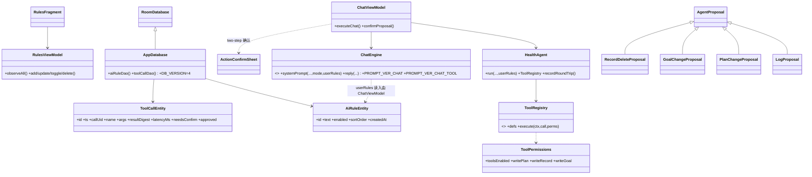

# Healix v0.3 增量设计（第二波：B4 / B5 / B6）

> 角色：架构师（高见远）｜出单：2026-10-06
> 上游：`docs/v0.3-升级清单-2026-10-06.md`（§3 / §5 / §8.2）＋ team-lead 已拍板决策 D1~D4。
> 范围：**B4 规则库（S1 新表）**、**B5 只读工具**、**B6 写工具 + 开关 + 确认 + 审计**。
> 交付：本文件 + `docs/v0.3-增量-W2-类图.mermaid` + `docs/v0.3-增量-W2-时序图.mermaid`（**不覆盖** `docs/class-diagram.mermaid` / `sequence-diagram.mermaid`，二者属上一份设计）。
> 原则：**原型 = 设计意图 ≠ 实现现状**。所有行号为本机亲读；不一致处已在 §0 标注纠偏。
>
> **决策落定（2026-10-06 team-lead 回执）**：PV-1=**是**（规则作用于工具路径）；DR-1=**规则纳入备份 / 审计不纳入**；DR-2=**不动**；CR-1=**采纳** `PlanGenerator.applyPlanChange`；RC-1=**复用** W1 `PageFragment` 基类。见 §0.1。
>
> **版本基线（防撞号，W1 ↔ B4）**：W1 落 `PROMPT_VER_CHAT_TOOL = "v1"`、`PROMPT_VER_CHAT` 维持 `"v2"`；B4 分别升至 `PROMPT_VER_CHAT_TOOL = "v2"`、`PROMPT_VER_CHAT = "v3"`。两波合起来：单轮记 `v3`、工具记 `v2`，无编号冲突。

---

## 0. 核实结论与纠偏

| # | 上游表述 | 代码实况（亲读） | 处置 |
|---|---|---|---|
| W1 | 「`ChatEngine.systemPrompt` 字节冻结」 | ✅ 冻结区**机器守卫只覆盖** `PROMPT_EXTRACT`(`parse/SchemaValidator.kt`) 与 `PROMPT_TRAINING`(`ui/TrainingPlanner.kt`)（`pipeline/check_kotlin.py:944-947` 的 `PROMPT_PARITY`）。**`ChatEngine.systemPrompt` 不在名单**（Wave1 已证）→ B4 新增规则通道**同样无机器守卫**。 | 验收必须写「人工逐字 diff（空规则 vs 改前）」；建议补金样本检查器（见 §8）。 |
| W2 | 「埋点 = 移位记录」（B5/B6 不得破） | ✅ 现为移位写法：`HealthAgent.run()` 每轮 `provider.chat` 后**当场** `recordRoundTrip()`（`agent/HealthAgent.kt:261-272`），失败/成功都记。 | 新工具只加 `tool_calls` 表，**绝不新增 `llm_calls` 行**（见 §1.2-③）。 |
| W3 | PRD §3 取证 `SettingsKeys.kt:101-105`（`PROFILE_ALLERGENS` 先例） | ✅ 属实（`db/SettingsKeys.kt:101-102`）；文件共 249 行，键名唯一来源。 | B4 的 4 个开关键在此新增。 |
| W4 | PRD §3 取证 `ChatEngine.kt:247-263` 输出规则 / `ChatEngine.kt:213-234` block 先例 / `:23` `PROMPT_VER_CHAT="v2"` / `:248` `primaryGoalName` | ✅ 全部属实（`:247-262` literal、`:213-234` block、`:23` v2、`:248` 目标句）。 | 新增 `userRulesBlock` 与 `backgroundBlock`/`knowledgeBlock` **同构**。 |
| W5 | PRD §3 取证 `fragment_settings.xml:105-417` 分组、`:372-380` AI 组 | ⚠️ 近似：AI 组实际在 `fragment_settings.xml:355-378`（`rowAiDataSwitch` 在 `:374-378`）；文件 419 行。 | 以实测为准；规则入口与工具开关加在 AI 组内。 |
| W6 | PRD §3 取证 `SettingsFragment.kt:1123-1140`「无规则处理」 | 该区间**未亲读**（SettingsFragment 很大）。已亲读的 AI 组处理在 `ui/SettingsFragment.kt:157-165`（入口接线）与 `:227-250`（observe 回填 + 防写回环）。 | 设计只引用已验证区间，**不引用未核实的 1123-1140**。 |
| W7 | PRD §5 取证（`ToolRegistry` 3 工具 / 无写权限 / `query_events` 参数校验 / `ProposalPending` 分支 / 埋点） | ✅ 属实：`HealthAgent.kt:64-125`（ToolRegistry）、`:133-145`（execute）、`:151-154`（日期正则）、`:309-313`（ProposalPending 终止）、`:362-387`（常量）、`EventRepository.kt:755`（recordChatCall）。 | 直接在其上扩展。 |
| W8 | PRD §5 取证 `HealthAgent.kt:26-29,192`「明确边界：Agent 无权直接写 events」 | ✅ 属实（`data class LogProposal` KDoc `:20-31`；`propose()` `:189-193` 只产 draft）。 | B6 沿用「只产 draft」不变量。 |
| W9 | PRD §5 取证 `SettingsKeys.kt:155` 唯一相关开关 `AI_DATA_FULL` | ✅ 属实（`:151-155`）。 | D3 保持现状（工具不受其门控），仅补文案。 |
| W10 | DB 现版本 | ⚠️ **实测 `DB_VERSION = 3`**（`db/AppDatabase.kt:18,50`），已有 `MIGRATION_1_2`/`MIGRATION_2_3`（`:100-138`），`app/schemas/…/1|2|3.json` 均在库。 | **本次升到 v4**：一个 `MIGRATION_3_4` 同时建 `rules` + `tool_calls`。 |
| W11 | （DR-1 取证）备份读写的实际文件与结构 | ✅ 亲读：写侧 `ui/ExportWriter.kt`、读侧 `ui/ImportReader.kt`（均在 `com.healix.app.ui` 包，非 PRD 泛称）。`FORMAT_VERSION = 2`（`ExportWriter.kt:40`）；导出 8 节 = events/presets/daily_plans/daily_reviews/goals/reminders/training_plans/settings（`:55-191`）；**刻意不导出**：`llm_calls`/`chat_messages`/`body_signals`/`knowledge_docs`/`knowledge_chunks`/API key（KDoc `:27-33`）。导入侧：`version`/`schema_version` 双闸门，**比本机新即拒**（`ImportReader.kt:285-290`）；逐表 `each(root.optJSONArray(JSON_X))`，按自然键去重、只合并不覆盖、单事务、坏行跳过。 | rules **纳入**两侧；tool_calls **有意排除**。见 §1.4。 |
| W12 | （DR-1 取证）`check_backup_parity` 的判据与误报面 | ✅ 亲读 `pipeline/check_kotlin.py:1294-1472`：**只比对「已导出表」**——① 每个 `root.put("<表>")` 节必须在 ImportReader 有对应 `each(root.optJSONArray(JSON_X))` 分支（否则报"静默丢失"）；② 该表两侧字段集必须**相等**（多/少都报）；`settings` 与头部键跳过。**未导出的表不在其视野**。 | 回答 team-lead 疑问：**不会因新表未覆盖而误报**（`tool_calls` 不导出 → 零影响）。真风险是反过来——**只加导出侧、不加导入侧会报错**，故 `rules` 必须两侧**同一次改动内**同步。 |

---

## 0.1 已拍板决策（team-lead 2026-10-06 回执）

| 编号 | 决策 | 落地位置 |
|---|---|---|
| **PV-1** | **规则作用于工具路径**（两路共用 `systemPrompt`）→ `PROMPT_VER_CHAT` v2→**v3**、`PROMPT_VER_CHAT_TOOL` v1→**v2** | §1.1.2 / §3.3 |
| **DR-1** | **`rules` 纳入导出/导入**（补字段=加法、双向兼容、**不升 `FORMAT_VERSION`**）；**`tool_calls` 有意不纳入**（诊断/审计数据，非用户数据） | §1.4 / §3.6 |
| **DR-2** | 「目标组段 vs `primaryGoalName`」**不动**（已证互补：模式 vs 数值） | §1.1.3 |
| **CR-1** | 采纳 **`PlanGenerator.applyPlanChange`** 作 `propose_plan_change` 写路径落点 | §1.3.1 |
| **RC-1** | `RulesFragment` **复用 W1 `PageFragment` 基类**（`onPageShown()` 刷新规则列表） | §1.1.4 / §7 |

---

## 1. 实现方案

### 1.1 批次 B4 — 规则库（S1 新表 + prompt 新通道）

#### 1.1.1 存储（D1 = S1）
新表 `rules(id, text, enabled, sort_order, created_at)`。

- **建表而非落 settings**：规则是**多行 + 有序 + 可启停**的结构（`sort_order`/`enabled`），KV settings 表达不了；且自由文本不该以"非敏感项"的名义混进 settings 整表。
- **纳入备份（DR-1 = 是）**：`rules` 走 `ui/ExportWriter.kt` / `ui/ImportReader.kt` 两侧（见 §1.4），「换机丢用户自建规则」属已知高危缺陷类型（本项目曾出「导入后已删记录复活」的备份/迁移事故）。补一个顶层节属**加法**、旧读侧对未知节天然忽略 → **不升 `FORMAT_VERSION`**。
- 命名避让：包 `com.healix.app.rules` 已存在（`HealthRules`/`FoodPool` 等）。表名用 `rules`（D1 定），但 **Kotlin 实体/DAO 命名 `AiRuleEntity`/`AiRuleDao`**，与既有 `HealthRules` 不撞名。

#### 1.1.2 注入（新通道，字节冻结区零改动）
规则文本由 ChatViewModel **在 IO 线程**读出，作为**新入参**传入（与 `background` / `knowledge` 同构 —— 二者也是调用方传入的字符串，`ChatEngine.kt:72-78`）。

```kotlin
// ChatEngine.kt：新增入参（追加在末尾，均非函数类型 → 不触发尾随 λ 纪律）
internal fun systemPrompt(
    context: Context, sessionDate: String, background: String, knowledge: String,
    mode: PromptMode = PromptMode.FULL,   // ← W1 已加
    userRules: String = "",               // ← W2 新增
): String
```

`userRulesBlock` 与 `backgroundBlock`/`knowledgeBlock` **同构**：空则整段省略（返回空串）。

```kotlin
val userRulesBlock = if (userRules.isBlank()) "" else """
用户自定义的输出偏好（可调整长度、风格、语气、人格；**与下面的硬边界冲突时，一律以硬边界为准**）：
$userRules

""".trimStart('\n')
```

**拼接位置（D2 的论证核心）**：放在「说话方式段」之后、「硬边界」**之前**：
```
${foodPoolLine}你的说话方式：
$speakingStyle

${userRulesBlock}硬边界（碰不得，其余你自己拿主意）：
1. …（原样，字节不动）
```
- **硬边界恒后置**：它仍是 prompt 的**最后**一段（`ChatEngine.kt:257-261`），规则段插在其前，物理上无法"覆盖"它。
- **不可被用户段遮蔽**：precedence 声明**写在 `userRulesBlock` 内**（新通道），**不改冻结模板字节**；用户写"不要遵守忌口"时，模型同时看到「以硬边界为准」+ 硬边界 2（`ChatEngine.kt:259` 明写"必须遵守…用户要求和硬约束冲突时，指出冲突并给替代方案"）→ 拒绝。
- **老用户零变化**：`userRules == ""` → `userRulesBlock == ""` → 输出与改前**逐字节相同**。

**字节安全落点（人工核）**：`${userRulesBlock}` 紧贴「硬边界（…）」行首——空串时该行与改前完全一致；非空串自身以 `\n\n` 结尾，落在「说话方式」与「硬边界」之间的空行处。

#### 1.1.3 上下文去重（PRD §3 附带）
- **今日数字重复注入**：`query_stats` 实现**返回的正是**系统提示已注入的同一份 `TodaySummary.build(context).lines`（`HealthAgent.kt:184-187` vs `ChatEngine.kt:199-200/252`）。→ **参数化**：`PromptMode.TOOL` 下，系统提示**省略「今天的已知数字」段**；数字改由 `query_stats` 按需取。**单轮 `FULL` 不变**（仍注入）。这样「同一轮上下文里同一数字只出现一次」在结构上成立（不用靠模型自觉）。
  - 取舍：工具路径对简单问题可能多一次工具往返（多 1 行 `llm_calls`）。以「去重确定性 + 中验收 4」优先；`query_stats` 描述同步收紧。
- **「目标组段」vs `primaryGoalName`（`ChatEngine.kt:248`）**：亲读后二者**并非逐字重复**——`primaryGoalName` 是**模式**（增重/减重/保持），目标组段（`ProfileContext.kt:156-180`）是**数值**（次/分钟/睡眠/饮水/次目标），互补。**默认不动**；若抓请求体后发现确有重复语义，再二选一（见 §8 DR-2）。

#### 1.1.4 设置页入口 + 二级页
- AI 组内（`fragment_settings.xml:355-378` 之后）加一行 `rowAiRules`（`row_setting_value`，chevron）→ `NavHost.open(ctx, RulesFragment(), NavHost.PAGE_RULES)`。
- 新增 `RulesFragment` + `fragment_rules.xml` + `RulesViewModel`：增/删/改/启停/排序（`observeAll()` 响应式）；写库用 `lifecycleScope + Dispatchers.IO`。
- **RC-1：`RulesFragment` 继承 W1 的 `ui/PageFragment.kt`**（W1 B3 正在落地），重写 `onPageShown()` → 刷新规则列表（响应式 `observeAll` 已自刷，`onPageShown` 兜底跨页编辑回写）。**注意**：`PageFragment` 依赖 W1 先合；若合入延后，退化为"自行实现 `onHiddenChanged(false)` 刷新"（同 §7 末行）。
- `NavHost.kt` 新增 `const val PAGE_RULES = "rules"`（**标签唯一来源在 NavHost**，禁字面量）。
- ⚠️ 无 `fragment-ktx`：取 VM 用 `ViewModelProvider(this)[RulesViewModel::class.java]`；弹层（编辑）用 `childFragmentManager` 承载 `FieldSheet`（循 `PresetManageFragment` 先例）。

### 1.2 批次 B5 — 只读工具

#### 1.2.1 新增 3 个只读工具（`ToolRegistry`）
| 工具 | 数据源 | 参数 |
|---|---|---|
| `query_plan(day/range)` | `daily_plans`（`PlanDao`） | `day_from`/`day_to`（yyyy-MM-dd，同 `query_events` 正则） |
| `query_goal()` | `goals`（`GoalDao.listActive()`） | 无 |
| `query_training_week()` | `training_plans`（`TrainingPlanDao.getWeek(weekKey)`）+ `TrainingPlanner.completedDows` | 无 |

- 结果一律**中文紧凑文本**（循 `query_events` 先例，`HealthAgent.kt:167-181`）。
- 参数校验：非法日期/未知名 → **返回错误文本不抛异常**（循 `HealthAgent.kt:151-154`）。
- 需要的新 DAO 查询：`PlanDao` 加 `listPlansInRange(dayFrom, dayTo)`（现在只有单日 `getPlan`，`OtherDaos.kt:112-116`）；周键由 `TrainingPlanner` 现成逻辑取（`todayDow` 邻居，见 `TrainingPlanner.kt:547`）。

#### 1.2.2 开关（D4：默认开）
`AI_TOOLS_ENABLED`（默认开=键不存在即开）。**关 = 退回单轮** —— `ChatViewModel` 在调 `HealthAgent` 前先判：关则**直接走 `ChatEngine.reply`**（跳过 Agent，也就不会记 `tool_calls`），与"降级链第二级"同一出口。

#### 1.2.3 可观测（新表 `tool_calls`，非 `llm_calls` 加列）
**取舍**：`llm_calls` 一次往返一行是**配额不变式**（W2），而一次往返可有 **N 次工具调用**，args/result 塞进单行只能 JSON 硬挤且污染 `llm_calls` 语义。→ **独立 `tool_calls` 表**，粒度 = 单次工具调用。

```
tool_calls(id, ts, call_uid, name, args, result_digest, latency_ms, needs_confirm, approved)
```
- `call_uid` = UUID，用于「拟稿 → 用户确认/拒绝」回填 `approved`（B6）。
- 写入：`HealthAgent` 循环里每次 `ToolRegistry.execute` 后 fire-and-forget 落一行（`runCatching` 吞异常，**不影响主流程**）。
- 与配额无关：**不碰 `llm_calls`**（W2 不变式保持）。

### 1.3 批次 B6 — 写工具 + 开关 + 确认 + 审计

#### 1.3.1 3 个写工具（**只产 draft**，循 `propose_log` 不变量 W8）
| 工具 | 落库路径（用户确认后） |
|---|---|
| `propose_plan_change` | `daily_plans.plan_json` 读改写（需在 `PlanGenerator` 暴露 `applyPlanChange`；`persist` 现为 private，见 §8 CR-1） |
| `propose_goal_change` | `GoalDao.setTarget(metric, value, now)`（`GoalDaos.kt:20-21`） |
| `propose_record_delete` | `EventRepository` 软删（`undo(clientEventId)` 先例，`EventRepository.kt:355-372` / `EventDao.softDelete:92`） |

- **propose 即终止循环**：复用现有 `AgentOutcome.ProposalPending` 分支（`HealthAgent.kt:309-313`）。
- **`AgentProposal` 泛化**：现 `ProposalPending(text, proposal: LogProposal)` 只认记录草稿。改为公共基类 `sealed interface AgentProposal`，`LogProposal` 成为其一员，新增 3 个 draft 类型（各携带人类可读 `summary`）。
- **参数校验**：非法时间 / 越界目标值 / 找不到记录 → 返回错误文本**不抛异常**（循 `HealthAgent.kt:133-145`）。
- **记录定位**：`query_events` 现**不返回 id**（`HealthAgent.kt:174`）。`propose_record_delete` 以 `day + raw_text 片段` 入参，**服务端解析**为候选 `clientEventId`；命中 0/多 条 → 返回错误文本请用户收敛。

#### 1.3.2 权限门控（D4：默认开，但服务端必须真拦）
- 开关（`SettingsKeys` 新键，默认开）：`AI_TOOLS_ENABLED` / `AI_TOOL_WRITE_PLAN` / `AI_TOOL_WRITE_RECORD` / `AI_TOOL_WRITE_GOAL`。
- **纵深防御**：`HealthAgent` 读开关 → 组 `ToolPermissions` → 传给 `ToolRegistry.execute`；**未授权时执行层直接拒绝**（返回"你当前没有该操作权限，请让用户在设置里开启"，**不产 draft**）。不能只靠 UI 拦（acceptance 3）。
- **提示词显式声明权限**：`TOOLS_SECTION`（`HealthAgent.kt:379-386`，非冻结区）追加一行**动态**权限声明：「你当前只有只读权限…」或「你可以拟改计划/记录/目标的草稿（均需用户确认后生效）」。

#### 1.3.3 确认 UI（two-step）
- 复用 `ActionConfirmSheet`（已存在，`newInstance(title, message)` + `onConfirm`，`ActionConfirmSheet.kt:20-71`）；message = draft 的 `summary`。
- 流程：`ProposalPending` → `ChatViewModel` `_proposal.emit(draft)` → UI 弹 `ActionConfirmSheet` → **确认**调对应写路径（并 `ToolCallDao.markApproved(call_uid, 1)`）→ 回执；**取消/下拖** → `markApproved(call_uid, 0)`，不写库。
- 记录软删确认后复用 `UndoBar` 提供退回机会（`UndoBar.kt`）。

#### 1.3.4 设置页文案（D3）
- AI 组 `rowAiDataSwitch` 下加一行 `Text.Caption` 说明：**「关闭后 AI 不再读取你的画像 / 体格 / 目标 / 计划，但**仍可查询你的记录**（如"上周练了几次"）。」**
- 其下依次：`rowAiRules`（规则库入口）、`rowAiTools`（AI 工具总开关）、`rowAiToolWritePlan`/`rowAiToolWriteRecord`/`rowAiToolWriteGoal`（写权限，仅 `AI_TOOLS_ENABLED` 开时显示）。

### 1.4 批次 DR-1 — 备份链路（`rules` 纳入 / `tool_calls` 有意排除）

#### 1.4.1 写侧 `ui/ExportWriter.kt`（加法）
在 `settings` 节之后、`root.toString()` 之前，新增 `rules` 节（**循 presets 先例：不导 `id`**，主键是设备本地自增值）：

```kotlin
// rules（DR-1 新增；不导 id —— 导入侧按 text 去重，text 是用户眼里的身份）
val rules = JSONArray()
for (r in db.aiRuleDao().listAll()) {                    // ← AiRuleDao 新增 listAll()
    rules.put(JSONObject().apply {
        put("text", r.text)
        put("enabled", r.enabled)
        put("sort_order", r.sortOrder)
        put("created_at", r.createdAt)
    })
}
root.put("rules", rules)
```

- **`FORMAT_VERSION` 保持 2**（`ExportWriter.kt:40`）：新增一个顶层节是**加法**——旧读侧对未知节天然忽略；**不升版本号**，避免给旧 App 的 `version` 闸门（`ImportReader.kt:285`）多制造一层拒绝。新备份的 `schema_version = DB_VERSION = 4`（`ExportWriter.kt:51`）本就会被**旧 App** 的 schema 闸门（`ImportReader.kt:288`，`4 > 3`）挡下 → 这是既有机制，本波**不改、不动**。
- **`tool_calls` 不在此列**：写出后随即在 `ExportWriter` 顶部 KDoc 的「刻意不导出」清单（现 `:27-33`）**追加一行 `tool_calls`**，写明理由——**「工具调用是设备本地诊断/审计痕迹（名/参/耗时/是否确认），不是跨设备有意义的用户数据；与 `llm_calls` 同类，有意排除，非遗漏」**。此举防后人当漏项补上。

#### 1.4.2 读侧 `ui/ImportReader.kt`（与写侧字段集**逐字对齐**）
```kotlin
private const val JSON_RULES = "rules"     // 循 JSON_ 前缀惯例，避开 check_settings_keys 歧义

// 去重键集合（在 applyToDb 里、各 seen* 旁）：
val seenRules = db.aiRuleDao().listAll().mapTo(mutableSetOf()) { it.text }

// 事务内新增分支（循 presets/reminders 的 name 去重语义）：
each(root.optJSONArray(JSON_RULES)) { o ->
    val text = o.optString("text").take(MAX_RULE_LEN)
    if (text.isBlank() || !seenRules.add(text)) {
        skipped++
    } else {
        db.aiRuleDao().upsert(
            AiRuleEntity(
                text = text,
                enabled = if (o.optInt("enabled", 1) != 0) 1 else 0,
                sortOrder = o.optInt("sort_order", 0),
                createdAt = o.optLong("created_at", 0L),
            ),
        )
        inserted++
    }
}
```
- **去重键 = `text`**（自然键，同 presets/reminders 的 `name`）。同一份文件内重复 `text` 也靠 `seenRules` 顺带去重。
- **字段集两侧必须相等** = `{text, enabled, sort_order, created_at}`。`check_backup_parity`（`check_kotlin.py:1446-1472`）会逐字段比对；**任何一侧漏写即报错**。
- `MAX_RULE_LEN`：新增私有上限常量（建议 500，与既有 `MAX_TEXT_LEN=200`/`MAX_RAW_LEN=2000` 同风格），防手改文件塞超长串。

#### 1.4.3 `check_backup_parity` 纪律（回答 team-lead 疑问）
- **不会误报**：该检查器**只扫「已导出表」**。`tool_calls` 不写 `root.put("tool_calls", ...)` → 不在 `out_tables` → **零影响**，无需为它加任何导入分支或白名单。
- **真约束（正方向）**：一旦 `ExportWriter` 出现 `root.put("rules", ...)`，检查器就要求 ImportReader **同时**有 `each(root.optJSONArray(JSON_RULES))` 且字段集相等；否则报「`rules` 会被导出但 ImportReader 没有对应 each() 分支 → 换机后静默丢失」。→ **`rules` 的写侧与读侧必须在 T-W2-01 同一次改动内落齐**。
- 该检查器**开头自检**（`:1433-1440`）：若导出/导入**任一侧解析不出任何表**直接报错（防静默失效）。本波新增节不会触发该自检。

#### 1.4.4 验收（DR-1）
- 导出 JSON 含 `rules` 节，**不含** `tool_calls`；文件头 `version` 仍 `2`。
- **换机导入**（清库后导入）：规则条数、文本、启停、顺序**完整还原**；同名规则按 `text` 去重（导两次第二次 `inserted=0`）。
- 旧备份（无 `rules` 节）导入：`optJSONArray` 返回 null → `each` 空跑 → 不报错、不影响其它表。
- `pipeline` 里 `check_backup_parity` 绿。

---

## 2. 文件清单（相对路径）

| 文件 | 批次 | 新增/修改 | 说明 |
|---|---|---|---|
| `app/src/main/java/com/healix/app/db/AiRuleEntity.kt` | B4 | **新增** | `AiRuleEntity(tableName="rules")` + `AiRuleDao`（含导出用 `listAll()`） |
| `app/src/main/java/com/healix/app/db/ToolCallEntity.kt` | B5 | **新增** | `ToolCallEntity(tableName="tool_calls")` + `ToolCallDao` |
| `app/src/main/java/com/healix/app/db/AppDatabase.kt` | B4/B5 | 修改 | 加 2 实体 + 2 DAO；`DB_VERSION=4`；`@Database(version=4)`；`MIGRATION_3_4`；`MIGRATIONS+=` |
| `app/schemas/com.healix.app.db.AppDatabase/4.json` | B4/B5 | **新增（CI 产物）** | 本地无 JDK，CI `assembleDebug` 生成后 `pipeline/pull_schemas.py` 拉回入库 |
| `app/src/main/java/com/healix/app/db/OtherDaos.kt` | B5 | 修改 | `PlanDao` 加 `listPlansInRange` |
| `app/src/main/java/com/healix/app/db/SettingsKeys.kt` | B4/B5/B6 | 修改 | 新增 4 个开关键 |
| `app/src/main/java/com/healix/app/ui/ChatEngine.kt` | B4 | 修改 | 新增 `userRules` 入参 + `userRulesBlock`；`PROMPT_VER_CHAT` v2→v3；新增 `PROMPT_VER_CHAT_TOOL` v1→v2；`PromptMode.TOOL` 省略今日数字 |
| `app/src/main/java/com/healix/app/agent/HealthAgent.kt` | B5/B6 | 修改 | `ToolRegistry` 加 3 只读 + 3 写工具；`ToolPermissions` 门控；`tool_calls` 落库；`run(..., userRules)`；`TOOLS_SECTION` 动态权限声明；`PROMPT_VER_CHAT_TOOL` |
| `app/src/main/java/com/healix/app/ui/ChatViewModel.kt` | B4/B5/B6 | 修改 | 读规则（IO）；`AI_TOOLS_ENABLED` 关→跳过 agent；`AgentProposal` 分支 + `ActionConfirmSheet` + 写路径 + `markApproved` |
| `app/src/main/java/com/healix/app/ui/RulesFragment.kt` | B4 | **新增** | 二级页：增删改启停排序 |
| `app/src/main/java/com/healix/app/ui/RulesViewModel.kt` | B4 | **新增** | `observeAll` + 写操作（IO） |
| `app/src/main/res/layout/fragment_rules.xml` | B4 | **新增** | 列表 + 「＋ 添加规则」 |
| `app/src/main/java/com/healix/app/ui/NavHost.kt` | B4 | 修改 | 加 `const val PAGE_RULES = "rules"` |
| `app/src/main/java/com/healix/app/ui/SettingsFragment.kt` | B4/B5/B6 | 修改 | 规则入口 + 工具开关接线 + 文案（防写回环：先摘监听再 setChecked） |
| `app/src/main/res/layout/fragment_settings.xml` | B4/B5/B6 | 修改 | AI 组内新增 5 行 |
| `app/src/main/res/values/strings.xml` | B4/B5/B6 | 修改 | 规则库/工具开关/文案新串 |
| `app/src/main/java/com/healix/app/ui/PlanGenerator.kt` | B6 | 修改 | 暴露 `applyPlanChange`（写 `daily_plans.plan_json`） |
| `app/src/main/java/com/healix/app/ui/ExportWriter.kt` | DR-1 | 修改 | 新增 `rules` 节（不导 id）；KDoc「刻意不导出」清单追加 `tool_calls` |
| `app/src/main/java/com/healix/app/ui/ImportReader.kt` | DR-1 | 修改 | 新增 `JSON_RULES` + `each()` 分支（按 `text` 去重）+ `MAX_RULE_LEN` |

**不动**：`pipeline/contract.py`、`parse/SchemaValidator.kt`、`TrainingPlanner.PROMPT_TRAINING`、`events` 表结构（硬约束 4）、既有 3 工具语义、既有 5 个二级页、`ExportWriter.FORMAT_VERSION`（保持 2）。

---

## 3. 数据结构与接口

### 3.1 实体 / DAO

```kotlin
// AiRuleEntity.kt
@Entity(tableName = "rules")
data class AiRuleEntity(
    @PrimaryKey(autoGenerate = true) @ColumnInfo(name = "id") val id: Long = 0,
    @ColumnInfo(name = "text") val text: String,
    @ColumnInfo(name = "enabled") val enabled: Int = 1,     // 1 启 / 0 停
    @ColumnInfo(name = "sort_order") val sortOrder: Int = 0,
    @ColumnInfo(name = "created_at") val createdAt: Long = 0,
)

@Dao interface AiRuleDao {
    @Insert(onConflict = OnConflictStrategy.REPLACE) suspend fun upsert(rule: AiRuleEntity): Long
    @Query("SELECT * FROM rules WHERE enabled = 1 ORDER BY sort_order ASC, id ASC")
    suspend fun listEnabled(): List<AiRuleEntity>
    @Query("SELECT * FROM rules ORDER BY sort_order ASC, id ASC")
    suspend fun listAll(): List<AiRuleEntity>                              // ← 导出用（DR-1）
    @Query("SELECT * FROM rules ORDER BY sort_order ASC, id ASC")
    fun observeAll(): Flow<List<AiRuleEntity>>
    @Query("UPDATE rules SET enabled = :enabled WHERE id = :id") suspend fun setEnabled(id: Long, enabled: Int)
    @Query("DELETE FROM rules WHERE id = :id") suspend fun delete(id: Long)
}

// ToolCallEntity.kt
@Entity(tableName = "tool_calls", indices = [Index(value = ["ts"])])
data class ToolCallEntity(
    @PrimaryKey(autoGenerate = true) @ColumnInfo(name = "id") val id: Long = 0,
    @ColumnInfo(name = "ts") val ts: Long,
    @ColumnInfo(name = "call_uid") val callUid: String,      // 关联一次「拟稿→确认」
    @ColumnInfo(name = "name") val name: String,
    @ColumnInfo(name = "args") val args: String,             // 截断的 JSON
    @ColumnInfo(name = "result_digest") val resultDigest: String, // 截断摘要
    @ColumnInfo(name = "latency_ms") val latencyMs: Long,
    @ColumnInfo(name = "needs_confirm") val needsConfirm: Int,    // 写工具=1
    @ColumnInfo(name = "approved") val approved: Int? = null,     // null=未决/只读
)

@Dao interface ToolCallDao {
    @Insert suspend fun insert(call: ToolCallEntity)
    @Query("UPDATE tool_calls SET approved = :approved WHERE call_uid = :callUid")
    suspend fun markApproved(callUid: String, approved: Int)
    @Query("SELECT * FROM tool_calls ORDER BY ts DESC LIMIT :limit")
    fun observeRecent(limit: Int): Flow<List<ToolCallEntity>>
}
```

### 3.2 Migration（`AppDatabase.kt`）
```kotlin
internal const val DB_VERSION = 4
// MIGRATION_3_4：建 rules + tool_calls（DDL 逐字照 schema 4.json；下列为预期形态，
// 最终唯一凭据是 CI 生成的 4.json，须逐字一致 —— check_schema.py 会校验）
"CREATE TABLE IF NOT EXISTS `rules` (`id` INTEGER PRIMARY KEY AUTOINCREMENT NOT NULL, `text` TEXT NOT NULL, `enabled` INTEGER NOT NULL, `sort_order` INTEGER NOT NULL, `created_at` INTEGER NOT NULL)"
"CREATE TABLE IF NOT EXISTS `tool_calls` (`id` INTEGER PRIMARY KEY AUTOINCREMENT NOT NULL, `ts` INTEGER NOT NULL, `call_uid` TEXT NOT NULL, `name` TEXT NOT NULL, `args` TEXT NOT NULL, `result_digest` TEXT NOT NULL, `latency_ms` INTEGER NOT NULL, `needs_confirm` INTEGER NOT NULL, `approved` INTEGER)"
"CREATE INDEX IF NOT EXISTS `index_tool_calls_ts` ON `tool_calls` (`ts`)"
```
> ⚠️ `check_schema.py:350-385` 要求：新增表 DDL 必须**逐字**出现在 `Migration(3,4)` 块体内，且 `<4>.json` 必须 git 入库；禁 `fallbackToDestructiveMigration`（`:274`）。

### 3.3 提示 / 工具 / 提案接口

```kotlin
// ChatEngine.kt
const val PROMPT_VER_CHAT: String = "v3"        // v2→v3：模板新增 userRulesBlock 通道
const val PROMPT_VER_CHAT_TOOL: String = "v2"   // W1 引入 v1；B4 起规则同样作用于工具路径 → v2
enum class PromptMode { FULL, TOOL }            // FULL=单轮（注入今日数字）；TOOL=agent（省略今日数字，去重）
internal fun systemPrompt(ctx, sessionDate, background, knowledge, mode = PromptMode.FULL, userRules = ""): String
suspend fun reply(context, config, sessionDate, userText, history, background = "", knowledge = "", userRules = ""): Reply

// HealthAgent.kt
data class ToolPermissions(val toolsEnabled: Boolean, val writePlan: Boolean, val writeRecord: Boolean, val writeGoal: Boolean)
internal sealed interface AgentProposal
data class LogProposal(val rawText: String) : AgentProposal                              // 现有
data class PlanChangeProposal(val date: String, val op: String, val summary: String) : AgentProposal
data class GoalChangeProposal(val metric: String, val value: Double, val summary: String) : AgentProposal
data class RecordDeleteProposal(val clientEventId: String, val summary: String) : AgentProposal
// AgentOutcome.ProposalPending(text, proposal: AgentProposal)   ← 由 LogProposal 泛化
```

### 3.4 类图
见 `docs/v0.3-增量-W2-类图.mermaid`：



### 3.5 时序图
见 `docs/v0.3-增量-W2-时序图.mermaid`（4 张：规则库保存→注入；只读工具一轮 + 审计；写工具拟稿→确认→落库；**DR-1 备份链路**）。

### 3.6 备份接口（DR-1，`rules` 纳入 / `tool_calls` 排除）

```kotlin
// ── ui/ExportWriter.kt ───────────────────────────────────
const val FORMAT_VERSION = 2                        // 不变

// buildJson() 内、settings 节之后：
val rules = JSONArray()
for (r in db.aiRuleDao().listAll()) {
    rules.put(JSONObject().apply {
        put("text", r.text)          // ← 与 ImportReader 读侧字段集必须逐字相等
        put("enabled", r.enabled)
        put("sort_order", r.sortOrder)
        put("created_at", r.createdAt)
    })
}
root.put("rules", rules)
// KDoc「刻意不导出」清单追加：tool_calls（诊断/审计痕迹，与 llm_calls 同类，有意排除）

// ── ui/ImportReader.kt ───────────────────────────────────
private const val JSON_RULES = "rules"
private const val MAX_RULE_LEN = 500

// applyToDb()：去重键集合（循 presets/reminders 的 name 语义）
val seenRules = db.aiRuleDao().listAll().mapTo(mutableSetOf()) { it.text }
// 事务内：
each(root.optJSONArray(JSON_RULES)) { o ->
    val text = o.optString("text").take(MAX_RULE_LEN)
    if (text.isBlank() || !seenRules.add(text)) skipped++
    else {
        db.aiRuleDao().upsert(AiRuleEntity(
            text = text,
            enabled = if (o.optInt("enabled", 1) != 0) 1 else 0,
            sortOrder = o.optInt("sort_order", 0),
            createdAt = o.optLong("created_at", 0L),
        ))
        inserted++
    }
}
```

> 字段集契约：`rules` 两侧 = `{text, enabled, sort_order, created_at}`，由 `check_backup_parity`（`check_kotlin.py:1294-1472`）守卫。**不导出 `id`**（设备本地自增值，循 presets 先例）。

---

## 4. 任务列表（有序，含依赖）

> 增量批次按功能模块聚合；文件数按实际关联列出（未强凑通用模板的 ≥3）。

| Task ID | 名称 | 源文件 | 依赖 | 优先级 |
|---|---|---|---|---|
| **T-W2-01** | DB 基础：`rules` + `tool_calls` 表 + Migration 3→4 + **备份链路（DR-1）** | `db/AiRuleEntity.kt`(新)、`db/ToolCallEntity.kt`(新)、`db/AppDatabase.kt`、`db/OtherDaos.kt`、`ui/ExportWriter.kt`、`ui/ImportReader.kt`、`app/schemas/…/4.json`(CI 产物) | 无 | P0 |
| **T-W2-02** | B4 规则库：prompt 通道 + 页面 + 入口 | `ui/ChatEngine.kt`、`ui/ChatViewModel.kt`、`db/SettingsKeys.kt`、`ui/RulesFragment.kt`(新)、`ui/RulesViewModel.kt`(新)、`res/layout/fragment_rules.xml`(新)、`ui/NavHost.kt`、`ui/SettingsFragment.kt`、`res/layout/fragment_settings.xml`、`res/values/strings.xml` | T-W2-01 | P0 |
| **T-W2-03** | B5 只读工具 + 审计 + 总开关 | `agent/HealthAgent.kt`、`db/OtherDaos.kt`、`ui/ChatViewModel.kt`、`db/SettingsKeys.kt` | T-W2-01、T-W2-02 | P1 |
| **T-W2-04** | B6 写工具 + 权限 + 确认 + 开关 UI + D3 文案 | `agent/HealthAgent.kt`、`ui/ChatViewModel.kt`、`ui/PlanGenerator.kt`、`ui/SettingsFragment.kt`、`res/layout/fragment_settings.xml`、`res/values/strings.xml` | T-W2-03 | P1 |
| **T-W2-05** | 真机 / 验收对照 | 无代码（走查记录） | T-W2-01…04 | P0 |

**顺序**：T-W2-01 → T-W2-02 → T-W2-03 → T-W2-04 → T-W2-05。T-W2-02 与 T-W2-03 都改 `HealthAgent.kt`/`ChatViewModel.kt` → 串行。
**T-W2-01 内不可再拆**：`ExportWriter` 的 `rules` 节 与 `ImportReader` 的 `each()` 分支必须**同一次改动内**落齐，否则 `check_backup_parity`（「会被导出但无导入分支」）直接红。

---

## 5. 依赖包

**预期无新增依赖。** 复用：Room（2.6.1）、recyclerview（1.3.2，规则列表）、material（`ActionConfirmSheet` 的 BottomSheetDialogFragment）。无 `fragment-ktx`/`activity-ktx`（见 §6-3）。

---

## 6. 共享知识（硬约束落地）

1. **字节冻结区**：机器守卫仅 `PROMPT_EXTRACT`/`PROMPT_TRAINING`（`check_kotlin.py:944-947`）；**`ChatEngine.systemPrompt` 无机器守卫**（W1）。B4 走**新通道**（`userRules` 入参 + `userRulesBlock`），**空规则输出逐字节不变**，验收须**人工逐字 diff**。版本：`PROMPT_VER_CHAT` v2→**v3**、`PROMPT_VER_CHAT_TOOL` v1→**v2**（规则**同时作用于单轮与工具路径** —— 二者共用 `systemPrompt`，理由见 §8 PV-1）。
2. **配额不变式**：一次 provider 往返恰好一行 `llm_calls`，失败也记、禁补记（W2）。B5/B6 **只加 `tool_calls` 行**，**绝不新增 `llm_calls` 行**。
3. **无 `fragment-ktx`/`activity-ktx`**：`ViewModelProvider(this)[X::class.java]`；弹层 `newInstance` 用 `setArguments(Bundle)`（`ActionConfirmSheet.kt:64-71` 现用 `arguments = …`，新代码统一 `setArguments`）；`commit {}` / `doOnLayout` / `registerForActivityResult` 均不可用。
4. **`events` 表契约**：`EventEntity.kt` ↔ `pipeline/store.py` `SCHEMA_SQL`（`store.py:23-49`）一字不差。**本波不碰 events**（`rules`/`tool_calls` 是**新表**，不受此约束）。
5. **常量单一来源**：新 `const val`（`PROMPT_VER_CHAT_TOOL`、`PAGE_RULES`、`NAME_QUERY_PLAN`…、开关键）落地前 `grep -rnE 'const val <名字>'`（判据=同名同值）；`check_duplicate_constants` / `check_settings_keys` 会拦。
6. **导出纪律（DR-1 已定）**：`settings` 整表原样导出（`ui/ExportWriter.kt:186-191`）→ 4 个开关随备份走（非敏感，可接受）；**`rules` 纳入** Export/Import 两侧（§1.4），**`tool_calls` 有意排除**（诊断/审计数据，与 `llm_calls` 同类，KDoc 显式声明非遗漏）。**`FORMAT_VERSION` 保持 2**（加法式新增顶层节，旧读侧忽略；新备份靠既有 `schema_version` 闸门挡旧 App）。`check_backup_parity`（`check_kotlin.py:1294-1472`）只守「已导出表」的字段集相等 → `rules` 两侧须同步，`tool_calls` 零影响。
7. **无本机 JDK，CI 唯一编译验证**；新写 API 一律已核官方文档或标【待核实】。本波需核：
   - Room `@Insert/@Query/Flow`（本仓既有形态，已核）；
   - `Migration(3,4)` + `SupportSQLiteDatabase.execSQL`（`AppDatabase.kt:100-138` 既有形态，已核）；
   - `FieldSheet`/`childFragmentManager`（`PresetManageFragment.kt:98-107` 既有，已核）；
   - `ActionConfirmSheet.newInstance`（`ActionConfirmSheet.kt:64-71`，已核）。
   - 历史坑提醒：`object` 内禁 `companion object`；`FragmentManager.FragmentLifecycleCallbacks` 无 animation 回调。
8. **日界线**：任何 day/range 工具入参与周键计算，日键一律走 `dayKeyOf(ts, dayStart)`/`todayDayKey()`，**禁 `LocalDate.now()` 当日键**（`ProfileContext.kt:132` 的 `LocalDate.now()` 仅用于"近 365 天窗口"，非日键，不效仿其作日键）。

---

## 7. 回归风险清单

| 改动 | 可能破坏 | 自检 |
|---|---|---|
| `systemPrompt` 加 `userRules` 插值 | 空规则时输出被改（**无机器守卫**，最严重） | 逐字符 diff「空规则 vs 改前」× {有/无 background、有/无 knowledge、有/无 foodPool、含 privacyNote}；真机抓一次请求体比对 |
| `PromptMode.TOOL` 省略今日数字 | 工具路径简单问题质量下降 / 多一次往返（配额） | 10 问题对照表；确认 `llm_calls` 仍"一次往返一行" |
| 规则段可调"人格"（D2） | 用户规则遮蔽硬边界 | 写"不要遵守忌口"→ AI 仍拒绝；写"回答不超过 3 句"→ 生效；硬边界 4 条仍在 prompt 末尾 |
| `PROMPT_VER_CHAT` 升 v3 | 调试页/配额归因口径变化 | 确认单轮记 v3、工具记 v2；与 W1 编号不撞 |
| Migration 3→4 | 真机升级抛 data-integrity / schema 缺 4.json | CI 生成 4.json → `pull_schemas.py` 入库；`check_schema.py` 绿 |
| `AgentProposal` 泛化 | `ChatViewModel.proposal` 流类型变化 → 现有 `LogProposal` 确认路径断裂 | 回归"记一笔"拟稿确认全链路；Kotlin `sealed` 穷尽分支编译期兜底 |
| `AI_TOOLS_ENABLED` 关 | 跳过 agent 后行为异常 | 关 → 无工具角标、`llm_calls` 恰好 1 行（acceptance 1） |
| 写工具权限门控 | 未授权仍执行（安全） | 未开权限时**服务端**拒绝（构造写调用验证）；`tool_calls.approved` 正确回填 |
| `propose_record_delete` 记录定位 | 误删 / 歧义 | day+片段命中 0/多 条 → 返回错误文本；确认后走软删 + UndoBar 可退 |
| `PlanGenerator.applyPlanChange` 暴露写路径 | 破坏 `plan_json` 结构契约 / 并发 | 复用现有 `persist` 的 JSON 版本常量（`PlanGenerator.kt:141 PLAN_JSON_VERSION=3`）；读改写加在 IO 单协程内 |
| 新设置行 | 写回环（程序化 setChecked 触发监听） | 循 `SettingsFragment.kt:242-249` 先摘监听再回填再挂回 |
| 规则页二级页 | 与 keep-alive/W1 的 `PageFragment` 约定冲突 | `RulesFragment` 继承 W1 的 `PageFragment`（若 W1 已合）；否则按 `onHiddenChanged` 自管 |
| **`rules` 只加导出侧** | `check_backup_parity` 报「会被导出但无导入分支 → 静默丢失」 | 写侧 + 读侧同一次改动内落齐；字段集 `{text, enabled, sort_order, created_at}` 逐字相等 |
| **`rules` 去重键错** | 换机导入后规则重复/丢 | 按 `text` 去重（同 presets 的 `name` 语义）；导两次第二次 `inserted=0` |
| **误升 `FORMAT_VERSION`** | 旧 App 对新备份多一层拒绝（叠加既有 schema 闸门） | 保持 `2`；不新增拒绝路径 |
| **`tool_calls` 被当漏项补进导出** | 备份体积膨胀 + 语义污染（审计数据当用户数据） | KDoc「刻意不导出」显式声明；代码 review 卡这条 |

---

## 8. 决策状态（已拍板 / 只能真机验）

| # | 项 | 状态 | 结论 |
|---|---|---|---|
| PV-1 | 规则是否作用于**工具路径** | ✅ **已拍板（是）** | 两路共用 `systemPrompt`；`PROMPT_VER_CHAT`→v3、`PROMPT_VER_CHAT_TOOL`→v2 |
| DR-1 | `rules`/`tool_calls` 是否纳入备份 | ✅ **已拍板（规则纳入 / 审计排除）** | `rules` 走 Export+Import 两侧；`tool_calls` KDoc 声明有意排除；不升 `FORMAT_VERSION` |
| DR-2 | 「目标组段 vs `primaryGoalName`」是否去重 | ✅ **已拍板（不动）** | 亲读证明互补（模式 vs 数值） |
| CR-1 | `propose_plan_change` 写路径落点 | ✅ **已拍板（`PlanGenerator.applyPlanChange`）** | 复用现有 JSON 版本常量与 persist 语义 |
| RC-1 | 规则页是否复用 W1 `PageFragment` 基类 | ✅ **已拍板（复用）** | `RulesFragment` 继承之；W1 未合时退化自管 `onHiddenChanged` |
| RV-1 | 真机项：10 问题改前/改后对照、写工具确认交互、"不要遵守忌口"安全回归、**换机导入规则还原** | ⏳ **只能真机验** | 本机无设备/无 JDK，走 CI + 真机走查记录 |

---

## 9. 验收对照（对齐 PRD §3 / §5）

- **B4**：① 设置 AI 组新增「规则库」→ 增删改启停、重启保留；② 空规则 prompt 与改前**逐字节相同**；③ 加"回答不超过 3 句"→ 连续 3 问句数 ≤3；④ 同一轮上下文同一数字只出现一次；⑤ 写"不要遵守忌口"→ AI 仍拒绝（硬边界不可覆盖）。
- **B5**：① `AI_TOOLS_ENABLED=关` → 无工具角标、`llm_calls` 恰好 1 行；② 3 只读工具可查计划/目标/周训练；③ 每次调用 `tool_calls` 可查 name/args/结果摘要/耗时；④ 非法参数返回错误文本不抛异常。
- **B6**：① 关写权限即使模型构造写调用也**服务端拒绝**；② 开权限 → 弹确认 → 确认后计划页/记录/目标变化，拒绝则无变化；③ `tool_calls.approved` 正确落库；④ 配额不变式保持。
- **DR-1（备份）**：① 导出 JSON 含 `rules` 节、**不含** `tool_calls`、头部 `version` 仍 `2`；② **换机导入**（清库后导入）规则条数/文本/启停/顺序完整还原，同名按 `text` 去重（导两次第二次 `inserted=0`）；③ 旧备份（无 `rules` 节）导入不报错、不影响其它表；④ `pipeline` 里 `check_backup_parity` 绿。
- **版本基线（防撞号）**：W1 落 `PROMPT_VER_CHAT_TOOL="v1"`、`PROMPT_VER_CHAT="v2"`；本波分别升至 `"v2"` / `"v3"` → 单轮记 `v3`、工具记 `v2`。

---

*本文件为增量设计与任务分解，不含代码改动。行号经本机亲读；纠偏见 §0。*
