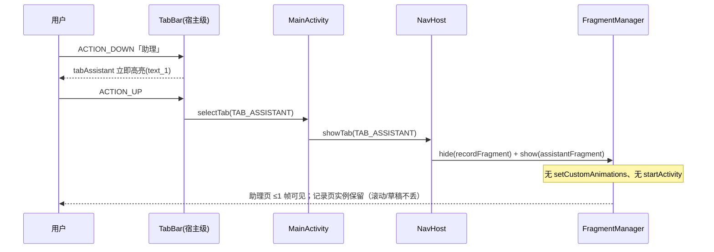
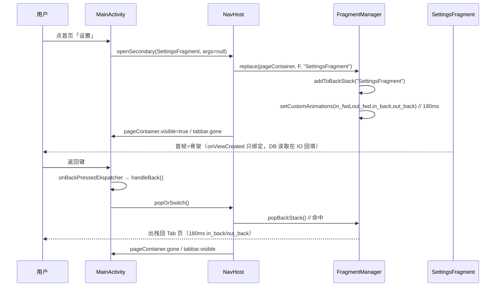
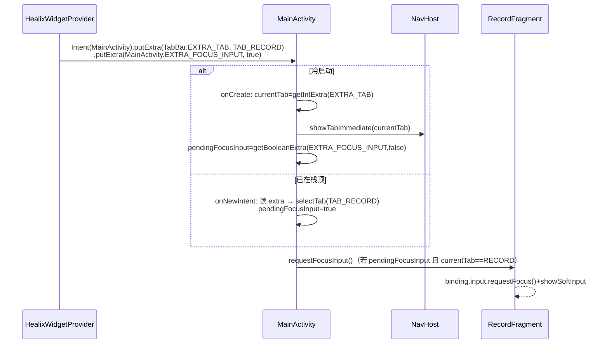
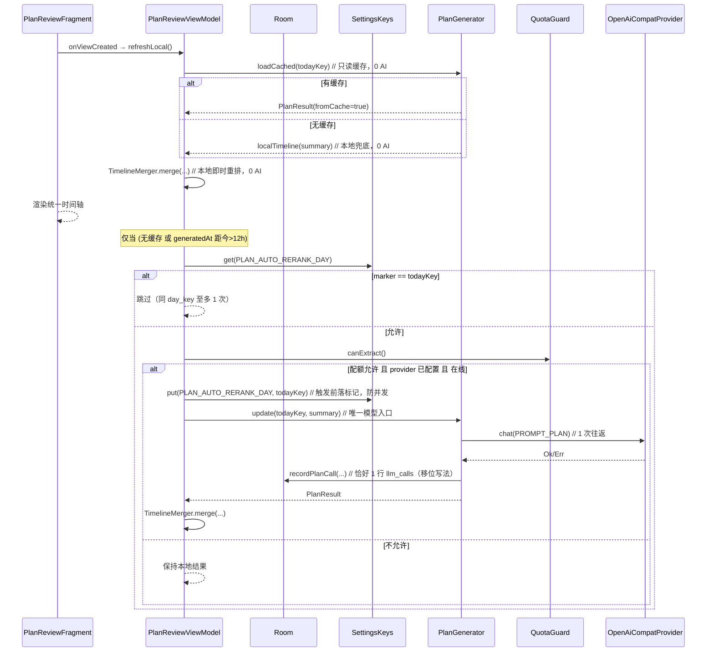
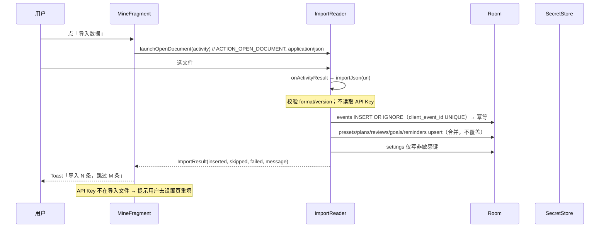
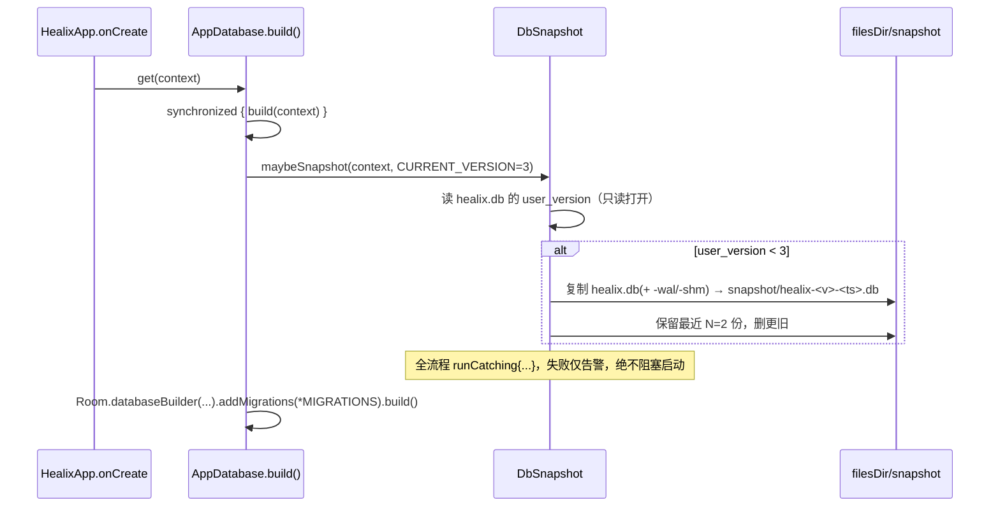
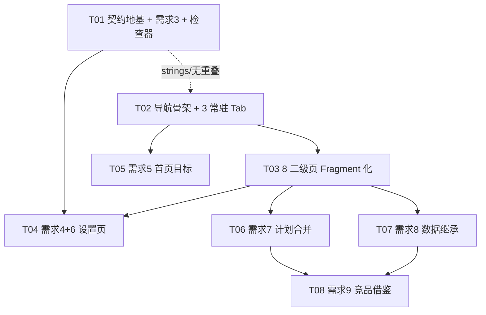

# Healix v8 增量架构设计

> 作者：架构师 高见远
> 日期：2026-10-05
> 输入：`docs/v8/PRD-增量.md`、`docs/v8/调研-竞品功能借鉴.md`、`docs/v8/调研-数据继承方案.md` + 交付总监 7 条已拍板方向
> 适用范围：Healix v8 增量（9 项修复与优化，一轮全做）
> 本文件已把「实现方案 / 文件清单 / 数据结构与接口 / 调用流程 / 有序任务列表（Wave）/ 依赖包 / 共享知识 / 待明确事项」合并为**一份**交付物。

---

## 〇、交付总监已拍板方向（不得推翻，本设计只优化机制细节）

| # | 方向 | 本设计落点 |
|---|---|---|
| 1 | 导航 = 手写 `FragmentManager`，**禁止** `androidx.navigation` | §1.1 / §A |
| 2 | 单宿主 `MainActivity`；底部 3 Tab 为常驻 Fragment（`add`+`show/hide`，零动画）；二级页 `replace+addToBackStack+setCustomAnimations` | §1.1 / §A / §4 |
| 3 | 删除 `ChatActivity` 并入常驻 `AssistantFragment`；IME 守卫由宿主统一承担 | §A.2 / §A.4 |
| 4 | 隐私栏只删 UI，`HIDE_KCAL/HIDE_WEIGHT` 与全部消费方保留 | §C.4 / §6 |
| 5 | 需求 7 去掉手动「更新」；本地即时重排 0 AI；后台自动重排 12h + 同 day_key 至多 1 次 | §E |
| 6 | 需求 8 导入 = 合并去重；迁移前自动 DB 快照 | §F |
| 7 | `SettingsKeys.GOAL_SETUP_DONE = "goal_setup_done"`，登记进 `db/SettingsKeys.kt` | §D.2 / §1.2 |

---

# 第一部分：系统设计

## 1. 实现方案与框架选型

### 1.1 导航方案（需求 1 / 2）

**结论：手写 `FragmentManager`，不引入 `androidx.navigation`。**

理由（对齐拍板 #1）：
- 项目**无 Compose、无 ViewPager、无 Navigation**，引入 Navigation 需在 CI 新增联网拉包（`navigation-fragment-ktx`/`navigation-ui-ktx`），违背"CI 不新增依赖最稳"；
- 本项目转场是**三套自定义语义**（Tab 互切零动画 / 二级页进出 180ms 位移 / 返回 180ms 位移），Navigation 的 `navAnim` 强绑资源与 Action，反而要绕开框架默认行为；
- 返回栈语义很简单（恒一层：二级页 ↔ 宿主），手写 `FragmentManager` 无认知负担。

**宿主结构（双容器，解决「replace 会连常驻 Tab 一起销毁」的矛盾）**：

```
MainActivity（唯一 Activity）
 └─ FrameLayout(hostRoot, fitsSystemWindows, bg)
     ├─ FrameLayout(id=tabContainer)      ← 常驻 3 Tab Fragment：add 一次，此后 show/hide
     ├─ FrameLayout(id=pageContainer, gone) ← 二级页：replace + addToBackStack
     └─ include(id=tabbar, layout=view_tabbar, layout_gravity=bottom)  ← 宿主级常驻
```

- 二级页进入：`fragmentTransaction.replace(pageContainer, f, tag).addToBackStack(tag).setCustomAnimations(in_fwd,out_fwd,in_back,out_back)`，同时 `pageContainer.visibility=VISIBLE`、`tabbar.visibility=GONE`（等价旧 `TabBar` 白名单显隐）；
- 二级页返回：`popBackStack()`；栈空 → `pageContainer.visibility=GONE`、`tabbar.visibility=VISIBLE`、Tab 内容保持离开时状态（因 Tab Fragment 从未被销毁）；
- Tab 互切：`hide(current)` + `show(target)`，**零动画、零窗口转场**（拍板 #2）。

**为什么双容器而非单容器**：单容器下 `replace` 会把 3 个常驻 Tab Fragment 一并 detach/销毁，与"记录页保持离开时滚动位置与输入状态"（PRD 需求 2 验收项 4）直接冲突；双容器让 Tab（`add/show/hide`）与二级页（`replace`）各自独立生命周期，两套语义互不污染。

### 1.2 数据层（需求 5 / 7 / 8）

- **不改 `events` 表 schema**：本设计所有新数据均由"已有表 + 已有/新增只读 `@Query` + settings 键"承载，Room `version` 保持 **3**，**不新增 Migration**（详见 §B 结论）。
- 新增 settings 键（唯一事实来源 `db/SettingsKeys.kt`）：`GOAL_SETUP_DONE`、`PLAN_AUTO_RERANK_DAY`。
- `GoalDao` 新增**归档/恢复**写接口（只改数据行 `status`，不碰 schema）：`archiveGoal` / `restoreGoal`。
- 新增 `ImportReader`（与 `ExportWriter` 同目录、同 SAF 纪律）。
- `AppDatabase` 增加"迁移前自动 DB 快照"（打开库之前，私有目录保留最近 N 份）。

### 1.3 架构模式

沿用既有 **MVVM（ViewModel + StateFlow + Room Flow）**：
- 每个 Fragment 持有/复用 ViewModel（与现 Activity 一致，`HealixApp.from(requireContext())` 注入）；
- Fragment `onViewCreated` **只做 `binding` 绑定与点击接线**；所有 DB/设置读取走 `viewModelScope + Dispatchers.IO`，通过 `repeatOnLifecycle(STARTED)` 订阅 `StateFlow` 回填（首帧不阻塞，见 §A.6）。
- 弹窗沿用 `FieldSheet` / `ActionConfirmSheet` / `EventEditSheet`（`BottomSheetDialogFragment`）。

### 1.4 静态检查器（本项目唯一防线）

本机无 JDK/SDK，编译只在 CI；`pipeline/check_kotlin.py`、`check_resources.py`、`pipeline/tests/test_norm.py` 必须全绿。本设计对检查器的改动只有一处：**需求 3 防回归规则加进 `check_resources.py`**（§B.3）。其余需求**不新增检查器**（避免引入需自证的新规则带来的假阳性风险）。

---

## 2. 文件清单

> 约定：`M` = 修改，`A` = 新增，`D` = 删除。相对路径基于仓库根。

### 2.1 新增（A）

| 路径 | 说明 |
|---|---|
| `app/src/main/java/com/healix/app/ui/RecordFragment.kt` | 记录页常驻 Tab（原 `activity_main.xml` pageHome 内容 + `MainActivity` 记录逻辑） |
| `app/src/main/java/com/healix/app/ui/AssistantFragment.kt` | 助理页常驻 Tab（原 `ChatActivity` 全部逻辑 + `ChatAdapter` 迁入） |
| `app/src/main/java/com/healix/app/ui/MineFragment.kt` | 我的页常驻 Tab（原 `MinePage.kt` 迁入） |
| `app/src/main/java/com/healix/app/ui/SettingsFragment.kt` | 设置二级页（原 `SettingsActivity`） |
| `app/src/main/java/com/healix/app/ui/PlanReviewFragment.kt` | 计划二级页（原 `PlanReviewActivity`） |
| `app/src/main/java/com/healix/app/ui/PersonalInfoFragment.kt` | 个人信息二级页（原 `PersonalInfoActivity`） |
| `app/src/main/java/com/healix/app/ui/KnowledgeBaseFragment.kt` | 知识库二级页（原 `KnowledgeBaseActivity`） |
| `app/src/main/java/com/healix/app/ui/ResourceFragment.kt` | 资源清单二级页（原 `ResourceActivity`） |
| `app/src/main/java/com/healix/app/ui/PresetManageFragment.kt` | 预设管理二级页（原 `PresetManageActivity`） |
| `app/src/main/java/com/healix/app/ui/DebugFragment.kt` | 调试二级页（原 `DebugActivity`；`LlmCallAdapter` 一并迁入） |
| `app/src/main/java/com/healix/app/ui/StatusDetailFragment.kt` | 状态详情二级页（原 `StatusDetailActivity`） |
| `app/src/main/java/com/healix/app/ui/NavHost.kt` | 手写导航助手（Tab show/hide、二级页 replace/pop、返回栈 tag 约定、tabbar 显隐） |
| `app/src/main/java/com/healix/app/ui/ImeGuard.kt` | IME 守卫（自绑于 Fragment root；回调宿主切 tabbar 显隐 + 归零输入条抬升） |
| `app/src/main/java/com/healix/app/ui/GoalSetupSheet.kt` | 首次进入目标引导弹窗（复用 `FieldSheet` 风格，非系统 AlertDialog） |
| `app/src/main/java/com/healix/app/ui/AddGoalSheet.kt` | 目标组"添加/恢复"弹窗（列出可恢复的归档目标 + 可补齐的固定指标） |
| `app/src/main/java/com/healix/app/ui/TimelineEntry.kt` | 需求 7 统一时间轴条目模型 + 合并排序纯函数 |
| `app/src/main/java/com/healix/app/ui/MedicalSummary.kt` | 需求 9「就医准备材料」本地摘要渲染（有/无 AI 两路） |
| `app/src/main/java/com/healix/app/ui/ImportReader.kt` | 需求 8 导入（SAF OPEN_DOCUMENT + 合并去重 + 结果统计） |
| `app/src/main/java/com/healix/app/db/DbSnapshot.kt` | 需求 8 迁移前 DB 快照（纯文件拷贝，`filesDir/snapshot/` 保留最近 N 份） |
| `app/src/main/res/layout/fragment_record.xml` | 由 `activity_main.xml` 的 `pageHome` 子树抽出 |
| `app/src/main/res/layout/fragment_assistant.xml` | 由 `activity_chat.xml` 抽出（去掉 tabbar include） |
| `app/src/main/res/layout/fragment_mine.xml` | 由 `view_mine_page.xml` 抽出（根 id 改 `mineRoot`） |
| `app/src/main/res/layout/item_swipe_row.xml` | 可左滑的设置/目标行（`swipeWrap` + `row_setting_value` + 删除位，供 `SwipeController` 复用） |
| `app/schemas/com.healix.app.db.AppDatabase/3.json` | Room schema v3（CI 生成 → `pull_schemas.py` 拉回提交） |

> 说明：8 个二级页布局 `activity_*.xml` 建议**重命名为 `fragment_*.xml`**（同步改 ViewBinding 类名 `ActivityXxxBinding → FragmentXxxBinding`），与"无 Activity"架构一致；若追求最小改动也可保留原文件名（Fragment 仍可 inflate `ActivityXxxBinding`），见 §待明确事项 Q5。

### 2.2 修改（M）

| 路径 | 改动 |
|---|---|
| `app/src/main/AndroidManifest.xml` | 删除 9 个 `<activity>` 声明（`ChatActivity` 及 8 个二级页），`MainActivity` 保留 |
| `app/src/main/java/com/healix/app/ui/MainActivity.kt` | 改写为**导航宿主**（见 §A.1）；承接 `EXTRA_TAB` / `EXTRA_FOCUS_INPUT` / SAF 回传 / `OnBackPressedCallback` |
| `app/src/main/java/com/healix/app/ui/TabBar.kt` | 改写：`openSecondary` → Fragment 导航；`chatTo` 删除；`bindImeGuard` 迁出为 `ImeGuard` |
| `app/src/main/java/com/healix/app/ui/SettingsViewModel.kt` | 需求 4：删 `ensureReminderDefaultsIfEmpty()` 与 `init` 调用；目标归档/恢复转发 |
| `app/src/main/java/com/healix/app/ui/MainViewModel.kt` | 需求 5：主目标名/次目标序列对外暴露 |
| `app/src/main/java/com/healix/app/ui/PlanReviewViewModel.kt` | 需求 7：合并时间轴、自动重排、生命周期调整 |
| `app/src/main/java/com/healix/app/ui/PlanGenerator.kt` | 需求 7：自动重排接线与节流标记（**prompt 字节冻结，不得改 `PROMPT_PLAN`/`PROMPT_VER_PLAN` 语义**） |
| `app/src/main/java/com/healix/app/ui/ExportWriter.kt` | 需求 8：导出补 `goals`/`reminders`/`training_plans`/`knowledge_*` + `schema_version` 头 |
| `app/src/main/java/com/healix/app/db/AppDatabase.kt` | 需求 8：`build()` 打开库前调用 `DbSnapshot.maybeSnapshot()` |
| `app/src/main/java/com/healix/app/db/SettingsKeys.kt` | 新增 `GOAL_SETUP_DONE`、`PLAN_AUTO_RERANK_DAY` |
| `app/src/main/java/com/healix/app/db/GoalDaos.kt` | 新增 `archiveGoal` / `restoreGoal` / `listAllWithArchived`（只读）/ 归档项查询 |
| `app/src/main/res/layout/activity_main.xml` | 改为双容器宿主结构（`tabContainer`/`pageContainer`/`tabbar`） |
| `app/src/main/res/layout/activity_settings.xml` | 需求 4/6：删隐私组与 4 处 `btnApply`/`btnTest` 改为 `AppCompatButton`；目标组 5 个 `<include>` → 动态容器 |
| `app/src/main/res/layout/sheet_field_edit.xml` | 需求 3：`btnConfirm` → `AppCompatButton` |
| `app/src/main/res/layout/sheet_confirm.xml` | 需求 3：`btnConfirm` → `AppCompatButton` |
| `app/src/main/res/layout/sheet_action_confirm.xml` | 需求 3：`btnConfirm` → `AppCompatButton` |
| `app/src/main/res/layout/activity_knowledge.xml` | 需求 3：按钮 → `AppCompatButton` |
| `app/src/main/res/layout/activity_plan_review.xml` | 需求 3：按钮 → `AppCompatButton`；需求 7：三 Tab 收敛 |
| `app/src/main/res/anim/in_fwd.xml` `out_fwd.xml` `in_back.xml` `out_back.xml` | 时长 `400 → 180` |
| `app/src/main/res/values/strings.xml` | 需求 4/5/7/8/9 新增文案；需求 6 预删 `group_privacy` 等（见 §6 待确认） |
| `pipeline/check_resources.py` | 需求 3：新增"禁止 `<Button` 使用 `Widget.Healix.Button/TextButton`"规则 |
| `.github/workflows/ci.yml` | 需求 8：新增"当前 version 的 schema JSON 必须存在"检查（**必须在 `3.json` 提交之后再加**） |

### 2.3 删除（D）

| 路径 | 原因 |
|---|---|
| `app/src/main/java/com/healix/app/ui/ChatActivity.kt` | 并入 `AssistantFragment.kt`（`ChatAdapter` 一并迁入） |
| `app/src/main/java/com/healix/app/ui/MinePage.kt` | 并入 `MineFragment.kt` |
| `app/src/main/java/com/healix/app/ui/SettingsActivity.kt` | → `SettingsFragment.kt` |
| `app/src/main/java/com/healix/app/ui/PlanReviewActivity.kt` | → `PlanReviewFragment.kt` |
| `app/src/main/java/com/healix/app/ui/PersonalInfoActivity.kt` | → `PersonalInfoFragment.kt` |
| `app/src/main/java/com/healix/app/ui/KnowledgeBaseActivity.kt` | → `KnowledgeBaseFragment.kt` |
| `app/src/main/java/com/healix/app/ui/ResourceActivity.kt` | → `ResourceFragment.kt` |
| `app/src/main/java/com/healix/app/ui/PresetManageActivity.kt` | → `PresetManageFragment.kt` |
| `app/src/main/java/com/healix/app/ui/DebugActivity.kt` | → `DebugFragment.kt` |
| `app/src/main/java/com/healix/app/ui/StatusDetailActivity.kt` | → `StatusDetailFragment.kt` |
| `app/src/main/res/anim/in_tab.xml` | Fragment 方案下 Tab 切换零动画 → **孤儿资源**（结论见 §A.5） |
| `app/src/main/res/anim/hold.xml` | 同上 |
| `app/src/main/res/layout/activity_chat.xml` | 抽出为 `fragment_assistant.xml` |
| `app/src/main/res/layout/view_mine_page.xml` | 抽出为 `fragment_mine.xml` |

> ⚠️ `check_resources.py` **不扫描 `res/anim/`**（其 `check_references` 只查 layout 与 `R.*`；未声明 anim 类别）→ 删除 `in_tab.xml`/`hold.xml` **不会**报"未引用资源"。`check_kotlin.py:835 check_manifest_classes()` 只校验 Manifest 类是否存在，**不校验 anim**。结论：**可安全删除**（见 §A.5）。

---

## 3. 数据结构与接口（类图）

```mermaid
classDiagram
    direction TB

    class MainActivity {
        -binding: ActivityMainBinding
        -nav: NavHost
        -currentTab: Int
        -askedNotifPermission: Boolean
        -pendingFocusInput: Boolean
        +onCreate(Bundle)
        +onNewIntent(Intent)
        +onActivityResult(int,int,Intent)
        +onResume()
        +selectTab(Int)
        +openSecondary(fragment, tag, args)
        +setTabbarVisible(Boolean)
        +handleBack()
    }

    class NavHost {
        +TAB_RECORD/TAB_ASSISTANT/TAB_MINE
        +showTab(Int)
        +openSecondary(Fragment, Bundle?)
        +popOrSwitch()
        +backStackEmpty(): Boolean
        +setOnTabChanged(cb)
        +currentTab(): Int
    }

    class ImeGuard {
        +bind(root, inputBar, onIme: (Boolean)->Unit)
        +unbind()
    }

    class RecordFragment
    class AssistantFragment
    class MineFragment
    class SettingsFragment
    class PlanReviewFragment
    class PersonalInfoFragment
    class KnowledgeBaseFragment
    class ResourceFragment
    class PresetManageFragment
    class DebugFragment
    class StatusDetailFragment

    class MainViewModel {
        +todayDayKeyFlow: StateFlow~String~
        +events: StateFlow~List~EventEntity~~
        +homeStatus: StateFlow~HomeStatus~
        +hideKcal: StateFlow~Boolean~
        +homeGoal(): StateFlow~HomeGoal~
        +subGoals(): StateFlow~List~SubGoal~~
        +refresh()
        +scanSignals()
        +acknowledgeSignals()
    }

    class SettingsViewModel {
        +values: StateFlow~SettingsValues~
        +goals: StateFlow~List~GoalEntity~~
        +reminders: StateFlow~List~ReminderEntity~~
        +setPrimaryGoal(Int)
        +setGoalTarget(metric, Double)
        +archiveGoal(metric)
        +restoreGoal(metric)
        +deleteReminder(Long)
        +put(key, value)
    }

    class PlanReviewViewModel {
        +timeline: StateFlow~List~TimelineEntry~~
        +planMeta: StateFlow~PlanMeta~
        +refreshLocal()
        +maybeAutoRerank()
        +logSuggestion(entry)
        +undo(clientEventId)
    }

    class PlanGenerator {
        <<existing>>
        +loadCached(todayKey): PlanResult?
        +localTimeline(summary): PlanResult
        +update(todayKey, summary): PlanResult
    }

    class GoalDao {
        <<interface>>
        +observeActive(): Flow~List~GoalEntity~~
        +listActive(): List~GoalEntity~~
        +getByMetric(metric): GoalEntity?
        +setTarget(metric, value, now)
        +setPrimary(metric, now)
        +countActive(): Int
        +archiveGoal(metric, now)
        +restoreGoal(metric, now)
        +listArchived(): Flow~List~GoalEntity~~
    }

    class SettingsKeys {
        <<object>>
        +GOAL_SETUP_DONE = "goal_setup_done"
        +PLAN_AUTO_RERANK_DAY = "plan_auto_rerank_day"
        +HIDE_KCAL
        +HIDE_WEIGHT
        +GOAL_SOURCE_SEEN
        +GOAL_STATEMENT
    }

    class ImportReader {
        +launchOpenDocument(activity)
        +onActivityResult(ctx, req, res, uri): ImportResult
        +importJson(ctx, uri): ImportResult
    }
    class ImportResult {
        +inserted: Int
        +skipped: Int
        +failed: Int
        +message: String
    }

    class ExportWriter {
        <<existing>>
        +buildJson(ctx): String
    }

    class DbSnapshot {
        +maybeSnapshot(ctx, currentVersion)
        -keepRecent(N)
    }

    class TimelineEntry {
        +dayIndex: Int
        +sortKey: String
        +timeLabel: String
        +type: String
        +title: String
        +detail: String
        +meta: String
        +source: String
        +canLog: Boolean
        +done: Boolean
    }
    class TimelineMerger {
        <<object>>
        +merge(planItems, trainingDays, completedDows, today): List~TimelineEntry~
    }

    class MedicalSummary {
        <<object>>
        +buildLocal(ctx, fromDay, toDay): String
        +buildWithAi(ctx, fromDay, toDay): String
    }

    MainActivity --> NavHost : owns
    MainActivity --> ImeGuard : owns
    NavHost --> RecordFragment : show/hide
    NavHost --> AssistantFragment : show/hide
    NavHost --> MineFragment : show/hide
    NavHost --> SettingsFragment : replace
    NavHost --> PlanReviewFragment : replace
    NavHost --> StatusDetailFragment : replace
    RecordFragment --> MainViewModel
    RecordFragment --> GoalSetupSheet
    AssistantFragment --> ChatViewModel
    MineFragment --> ImportReader
    MineFragment --> MedicalSummary
    SettingsFragment --> SettingsViewModel
    SettingsFragment --> AddGoalSheet
    PlanReviewFragment --> PlanReviewViewModel
    PlanReviewViewModel --> PlanGenerator
    PlanReviewViewModel --> TimelineMerger
    PlanReviewViewModel --> TimelineEntry
    MainViewModel ..> SettingsKeys
    SettingsViewModel ..> GoalDao
    SettingsViewModel ..> SettingsKeys
    SettingsFragment --> GoalDao
    ImportReader --> ExportWriter : format 兼容
    DbSnapshot ..> AppDatabase
    PlanReviewViewModel ..> SettingsKeys
```



> 完整版见 `docs/v8/class-diagram.mermaid`（含全部二级 Fragment 与数据实体）。

**关键接口签名（新增/变更）**

```kotlin
// db/SettingsKeys.kt（新增，唯一事实来源）
const val GOAL_SETUP_DONE = "goal_setup_done"
const val PLAN_AUTO_RERANK_DAY = "plan_auto_rerank_day"

// db/GoalDaos.kt — GoalDao 新增（只改数据行，不碰 schema）
@Query("UPDATE goals SET status = 'archived', updated_at = :now WHERE metric = :metric")
suspend fun archiveGoal(metric: String, now: Long)

@Query("UPDATE goals SET status = 'active', updated_at = :now WHERE metric = :metric")
suspend fun restoreGoal(metric: String, now: Long)

@Query("SELECT * FROM goals WHERE status = 'archived' ORDER BY is_primary DESC, id ASC")
fun observeArchived(): Flow<List<GoalEntity>>

@Query("SELECT * FROM goals WHERE status = 'archived' ORDER BY is_primary DESC, id ASC")
suspend fun listArchived(): List<GoalEntity>

// db/EventDao.kt — 需求 5 长期序列：复用既有查询，不新增 @Query
//   近 7 日睡眠逐日：listByTypeInRange("sleep", from, to) 后按 day_key 分组
//   近 30 日体重逐日：weightRowsInRange(from, to) 后按 day_key 取末条
//   （两法已存在；详见 §D.5 结论：无需新 SQL）

// ui/TimelineEntry.kt（需求 7）
data class TimelineEntry(
    val dayIndex: Int, val sortKey: String, val timeLabel: String,
    val type: String, val title: String, val detail: String, val meta: String,
    val source: String, val canLog: Boolean, val done: Boolean,
)
object TimelineMerger {
    fun merge(plan: List<TimelineItem>, training: TrainingPlan?,
              completedDows: Set<Int>, todayDow: Int): List<TimelineEntry>
}

// ui/ImeGuard.kt
object ImeGuard {
    fun bind(root: View, inputBar: View, onIme: (visible: Boolean) -> Unit)
    fun unbind(root: View)
}

// ui/ImportReader.kt
object ImportReader {
    fun launchOpenDocument(activity: Activity)
    fun onActivityResult(context: Context, requestCode: Int, resultCode: Int, uri: Uri?): Boolean
    fun importJson(context: Context, uri: Uri): ImportResult
}
data class ImportResult(val inserted: Int, val skipped: Int, val failed: Int, val message: String)

// db/DbSnapshot.kt
object DbSnapshot {
    fun maybeSnapshot(context: Context, currentVersion: Int)
}
```

---

## 4. 程序调用流程（时序）

### 4.1 Tab 切换（需求 2，零动画）



### 4.2 进入二级页 + 返回（需求 1，180ms）



### 4.3 桌面小工具「记一笔」→ Tab 选择 + 聚焦速记框（外部入口承接）



### 4.4 需求 7 自动重排（配额不变式：一次往返恰好 1 行 llm_calls）



### 4.5 需求 8 导入（合并去重）



### 4.6 迁移前自动 DB 快照



> 完整版见 `docs/v8/sequence-diagram.mermaid`。

---

## 5. 依赖包列表

**新增依赖：0 个。**

结论：本设计**不引入任何新第三方/Gradle 依赖**。全部能力由现有依赖覆盖：
- 导航：手写 `FragmentManager`（`androidx.appcompat` 已提供 `AppCompatActivity`/`supportFragmentManager`）；
- 动画：`setCustomAnimations` + 既有 `res/anim/*.xml`；
- 导入：`ActivityResultContracts.OpenDocument`（`androidx.activity`，随 appcompat 传递引入）或 `startActivityForResult`（沿用 `ExportWriter` 现写法，**零新增**）；
- 摘要/合并/节流：纯 Kotlin + `org.json`（Android 内置）；
- DB 快照：`java.io.File` 拷贝（零依赖）。

> 若工程师主张为"SAF 导入"引入 `androidx.documentfile`，**否决**：`ACTION_OPEN_DOCUMENT` + `contentResolver.openInputStream(uri)` 已足够，无需 DocumentFile 树。

---

## 6. 共享知识（跨文件约定）

1. **契约冻结**：`pipeline/contract.py` ↔ `parse/SchemaValidator.kt`；`PROMPT_EXTRACT` 字节冻结，`PROMPT_VER` 仅在其变化时递增；`ChatEngine.systemPrompt`、`TrainingPlanner.PROMPT_TRAINING` **字节冻结**。需求 7 的 `PROMPT_PLAN`/`PROMPT_VER_PLAN` 只在 `PlanGenerator.kt` 内，**不改其文本**。
2. **events 表**：`db/EventEntity.kt` ↔ `pipeline/store.py` SCHEMA_SQL 一字不差；本设计**不动 events 表**（§B 给结论），`version` 保持 3，**不新增 Migration**。
3. **兜底默认值**唯一来源 `db/GoalEntities.kt` 的 `GoalDefaults`；**settings 键名**唯一来源 `db/SettingsKeys.kt`；禁私有副本（`check_kotlin.py` `check_settings_keys` / `check_duplicate_constants`）。
4. **日界线**：读设置必经 `parse/SchemaValidator.kt dayStartHourOf(raw)`；日键一律 `dayKeyOf(ts, dayStart)` / `todayDayKey()`；**禁 `LocalDate.now()` 当日键**（`MainViewModel.kt:135-139` 是正例）。
5. **埋点不变式**：`QuotaGuard` 按 `llm_calls` 行数计配额 → 一次往返恰好 1 行；"HTTP 通但解析失败"**移位**记录，**禁补记**（沿用 `PlanGenerator.kt:259-299` 写法）。
6. **模型调用收敛唯一入口**；读缓存 / 本地兜底**绝不触网**。
7. **设计规范 v3**：无卡片、无阴影、无渐变、全局唯一强调色 `accent`；字重只有 400/500；圆角 8dp（进度线/Tab 下划线/accent 竖线例外）。**禁游戏化**（`check_no_gamification`）。
8. **Fragment 约定**：
   - Tab Fragment tag 常量 = 类名（`"RecordFragment"` 等）；二级页 `addToBackStack(tag)`，tag = 类名；
   - 二级页参数走 `arguments: Bundle`（禁 Intent extra 携带业务参数）；
   - Fragment `onDestroyView` 必须 `_binding = null`（防泄漏）；
   - 所有 `repeatOnLifecycle` 用 `viewLifecycleOwner.lifecycleScope`，不用 `lifecycleScope`（后者 Fragment 生命周期比 View 长）。
9. **静态检查器已知盲区（务必规避）**：
   - suspend 转发一律**块体** `{ call() }`，禁 `= call()`；
   - 公开签名里的类型必须 public；
   - 嵌套空容器写**显式类型参数**（如 `emptyList<GoalEntity>()`）；
   - **顶层 `const` 非类成员不能用 `类名.X`**（须 import 后裸用）；companion 内 `const val` 用 `Outer.X` 合法，但 companion 内**类型声明**不能用外层类名限定。
10. **外部入口承接**：仅 `HealixWidgetProvider` 通过 Intent 启动 `MainActivity`（`QuickInputReceiver` 走 `AppEventBus`、`BootReceiver` 启前台服务，**均不启动 Activity**——已核实，见 §A.3）。

---

# 第二部分：逐条技术点方案

## A. Fragment 化完整改造面（需求 1 / 2）

### A.1 宿主与 3 常驻 Tab

- `MainActivity` 只做：`setContentView(host)`、`add` 三个 Tab Fragment 到 `tabContainer`、绑定宿主级 `TabBar`、注册 `OnBackPressedCallback`、承接外部 Intent、SAF 回传、通知权限。
- `NavHost`（object 持有对 `FragmentManager` 与容器的弱引用，或作为 `MainActivity` 的内部实现）提供 `showTab(Int)` / `openSecondary(Fragment, Bundle?)` / `popOrSwitch()` / `backStackEmpty()`。
- `TabBar.bind` 改为纯"高亮 + 点击回调"，不再 `startActivity`；`chatTo` **删除**；`openSecondary(activity, intent)` **删除**，调用点全部改 `NavHost.openSecondary(fragment, args)`。

### A.2 9 个 Activity 逐个 Fragment 化

| 原 Activity | 新 Fragment | 布局复用 | ViewBinding | 原成员处置 |
|---|---|---|---|---|
| `ChatActivity` | `AssistantFragment` | `activity_chat.xml` → `fragment_assistant.xml`（去 tabbar include） | `FragmentAssistantBinding` | `binding`→`_binding`；`overridePendingTransition` **删**；`finish()` 重写 **删**；`ChatAdapter` 迁入 |
| `PlanReviewActivity` | `PlanReviewFragment` | `activity_plan_review.xml` → `fragment_plan_review.xml` | `FragmentPlanReviewBinding` | `btnBack`→`NavHost.pop`；`finish()` 重写 **删**；`vm` 用 `by viewModels()` 或 `HealixApp.from` |
| `SettingsActivity` | `SettingsFragment` | `activity_settings.xml` → `fragment_settings.xml` | `FragmentSettingsBinding` | `finish()` 重写 **删**；`KEY_*` 常量随迁 |
| `PersonalInfoActivity` | `PersonalInfoFragment` | 同上规律 | `FragmentPersonalInfoBinding` | `onPause` 保存兜底改 `onStop`（Fragment）；`finish()` 删 |
| `KnowledgeBaseActivity` | `KnowledgeBaseFragment` | 同上 | `FragmentKnowledgeBaseBinding` | `finish()` 删 |
| `ResourceActivity` | `ResourceFragment` | 同上 | `FragmentResourceBinding` | `finish()` 删 |
| `PresetManageActivity` | `PresetManageFragment` | 同上 | `FragmentPresetManageBinding` | `finish()` 删 |
| `DebugActivity` | `DebugFragment` | 同上 | `FragmentDebugBinding` | `LlmCallAdapter` 迁入；`finish()` 删 |
| `StatusDetailActivity` | `StatusDetailFragment` | 同上 | `FragmentStatusDetailBinding` | `EXTRA_DEFAULT_TAB` → `arguments`；`finish()` 删 |

- **`overridePendingTransition` 全部删除**：转场改由 `setCustomAnimations` 承担；`finish()` 重写一并删除（Fragment 无 `finish`）。
- **`vm`**：仍用 `HealixApp.from(requireContext())` 构造（与现状一致），或 `private val vm: XxxViewModel by viewModels { ... }`；二选一，团队内统一（推荐后者以随 View 生命周期自动清理，但需自定义 Factory）。
- **`binding`**：`private var _binding: XxxBinding? = null` + `get() = _binding!!`，`onDestroyView` 置 null（防泄漏，与既有 `FieldSheet`/`EventDocSheet` 一致）。

### A.3 外部入口逐一承接（最易漏）

1. **`TabBar.openSecondary` 全部调用点**——已核实共 11 处，全部改为 `NavHost.openSecondary`：
   - `MainActivity.kt:107`（设置）、`:110`（计划）、`:118`（状态详情，带 `EXTRA_DEFAULT_TAB`）、`:130`（未配置→设置）；
   - `MinePage.kt:53`（状态详情）、`:65`（资源）、`:73`（预设）、`:81`（知识库）、`:94`（个人信息）、`:112`（设置）、`:119`（调试）。
2. **`HealixWidgetProvider`（唯一带 extra 启动 `MainActivity` 的外部入口）**：
   - `logIntent`：`EXTRA_TAB=TAB_RECORD` + `EXTRA_FOCUS_INPUT=true` → 宿主 `selectTab(RECORD)` + `RecordFragment.requestFocusInput()`；
   - `openIntent`：仅 `EXTRA_TAB=TAB_RECORD` → `selectTab(RECORD)`，不聚焦；
   - `EXTRA_TAB` 语义与 `TabBar.EXTRA_TAB` 常量**保持不变**（跨进程契约）。
3. **`QuickInputReceiver` / `BootReceiver`**：**修正任务书**——两者**不启动 `MainActivity`**（已核实：前者走 `AppEventBus.emit` + `QuickInputService.showRecorded`；后者只 `QuickInputService.start`）。故 `EXTRA_TAB`/`EXTRA_FOCUS_INPUT` 承接面**只有宿主**，无需为 receiver 改语义。
4. **`MainActivity.onNewIntent` / `onCreate` 的 `getIntExtra(EXTRA_TAB, ...)`**：保留读 extra，改为驱动 `selectTab`（`showTabImmediate` 冷启动 / `selectTab` 热路径）。
5. **`MainActivity.onActivityResult` 的 SAF 回传**：导出（`ExportWriter`）与导入（`ImportReader`）共用一个 `onActivityResult` 分发；因两入口（导出在 `MineFragment`、导入在 `MineFragment`）都在常驻 Tab 内，用宿主的 `startActivityForResult` + 宿主分发（沿用 `ExportWriter` 现写法，零新增 launcher 时序约束）。`REQUEST_CODE` 区分（导出 `4011`、导入新码）。
6. **`StatusDetailActivity.EXTRA_DEFAULT_TAB`、`MainActivity` 的 `TAB_BODY/TAB_EXERCISE`**：改走 Fragment `arguments`（`StatusDetailFragment.newInstance(defaultTab)`）；`TAB_BODY`/`TAB_EXERCISE` 常量迁至 `StatusDetailFragment`（或共享对象），不再作为 Activity 常量。

### A.4 IME 守卫迁移（确定性解析方案）

**问题**：`hide()` 的 Fragment 视图仍 attach，宿主的 `findViewById(@id/input)` 可能命中**隐藏的那个** → 非确定性。

**方案（确定性）**：改为 **每个 Tab Fragment 自绑**：
- 新增 `ui/ImeGuard.kt`：
  ```kotlin
  object ImeGuard {
      fun bind(root: View, inputBar: View, onIme: (Boolean) -> Unit) {
          val lp = inputBar.layoutParams as ViewGroup.MarginLayoutParams
          val raisePx = lp.bottomMargin
          ViewCompat.setOnApplyWindowInsetsListener(root) { _, insets ->
              val imeVisible = insets.getInsets(WindowInsetsCompat.Type.ime()).bottom > 0
              onIme(imeVisible)
              lp.bottomMargin = if (imeVisible) 0 else raisePx
              inputBar.layoutParams = lp
              insets
          }
      }
  }
  ```
- `RecordFragment` / `AssistantFragment` 各自在 `onViewCreated` 对**自己的 root** 调 `ImeGuard.bind`，`onIme` 回调 → `(requireActivity() as MainActivity).setTabbarVisible(!visible)`。
- **确定性依据**：`hide()` 使 Fragment root 变 `View.GONE`；**GONE 的 View 不参与 WindowInsets 分发**，其监听器不会触发 → 只有**当前可见** Tab 的守卫生效，天然唯一，无需遍历查 id。
- **tabbar 承载**：`@id/tabbar` 位于**宿主布局**（常驻），由宿主的 `setTabbarVisible` 控制；输入条抬升（`@dimen/tab_raise`）由各 Fragment 自己的 `inputBar` 承担（`fragment_record.xml` / `fragment_assistant.xml` 各含输入条，`marginBottom=@dimen/tab_raise`）。
- **API 29 限制**：ime insets 精确上报需 API 30+（minSdk 29，目标机型 API 34）；API 29 上行为退回现状（tabbar 随键盘上移），与既有 `TabBar.bindImeGuard` 限制一致，不回归。

### A.5 返回栈语义 + 窗口转场清理

**返回栈（`OnBackPressedCallback` 顺序）**：
1. `if (!nav.backStackEmpty()) { nav.popBackStack(); return }`（二级页出栈）；
2. `else if (currentTab != TAB_RECORD) { selectTab(TAB_RECORD); return }`（Tab 平级返回记录页）；
3. `else finish()`（记录页再返回才退出 App）。
- `addToBackStack` tag 约定 = Fragment 类名（如 `"SettingsFragment"`）；`popBackStack()` 无参出栈顶。

**窗口转场清理**：
- `in_fwd.xml` / `out_fwd.xml` / `in_back.xml` / `out_back.xml`：`android:duration 400 → 180`。
- **`in_tab.xml` / `hold.xml`：删除**。理由：
  - Tab 切换改 `show/hide` 零动画，二级页改 `setCustomAnimations`，两文件**再无引用**（原引用点 `TabBar.chatTo`、`TabBar.bind` 的 assistant 分支、`MainActivity.showTab` 的代码动画均删除/替换）；
  - **`check_resources.py` 不扫描 `res/anim/`**（`check_references` 仅查 layout 与 `R.*`；未声明 anim 类别）；`check_kotlin.py` 亦不校验 anim 引用 → **不会报"未引用资源"**；
  - release `shrinkResources false`，孤儿只会占极小体积 → 直接删除最干净。
- ⚠️ 删除前须确认全库无 `R.anim.in_tab` / `R.anim.hold` 残留引用（改完 `TabBar`/`MainActivity` 后 grep 为 0）。

### A.6 首帧不卡：主线程读库点清单与改造方向

| # | 主线程读库点 | 现状 | 改造方向 |
|---|---|---|---|
| 1 | `SettingsViewModel.kt:137-144 init`（`ensureGoalDefaultsIfEmpty`/`ensureReminderDefaultsIfEmpty`/`reload`） | `viewModelScope.launch`（默认 **Main.immediate**）内先补齐再 reload；`reload` 内 `settings.listAll()` 等 suspend 会切 Room executor，但**状态组装与首次 emit 在主线程** | 保持 `viewModelScope.launch(Dispatchers.IO)`；`SettingsFragment.onViewCreated` 只订阅 `values`（先给默认 `SettingsValues()` 渲染骨架，IO 完成回填） |
| 2 | `PersonalInfoActivity.kt:323 observe()` | `repeatOnLifecycle(STARTED)`（**Main**）内 `vm.values.collect` 回填 | 拆出：`values` 由 IO 侧构建（已由 #1 承担），`onViewCreated` 只订阅 |
| 3 | `PlanReviewActivity.kt:87 observe()` | `repeatOnLifecycle`（Main）内 `vm.plan.collect` | `PlanReviewViewModel.reload()` 已在 `Dispatchers.IO`；`onViewCreated` 只订阅 `timeline` |
| 4 | `TodaySummary.kt:153 build()`（`runBlocking`） | 调用点已在 IO（`PlanReviewViewModel`/`Widget`）；但 `MinePage`/`CoroutineScope` 误用会阻塞主线程 | 统一：**任何 `TodaySummary.build` 调用点必须在 `Dispatchers.IO`**；`Fragment` 侧一律经 ViewModel 暴露 `StateFlow` |
| 5 | `MinePage.observeResourceCount()` / `observePersonalInfo()` | `(activity as LifecycleOwner).lifecycleScope`（Main）内 `ResourceStore.filledCount` / `weightRowsInRange` → **真实主线程读库** | 迁 `MineFragment` 时改为 `viewLifecycleOwner.lifecycleScope.launch(Dispatchers.IO)` + `withContext(Main)` 回填 |
| 6 | `MainActivity.onCreate` 的 `binding.list.layoutManager` 等 | 结构绑定（非读库） | 迁入 `RecordFragment.onViewCreated`；`binding.input.postDelayed(300ms)` 聚焦改在 `onViewCreated` 后延时（保持"打开即弹键盘"） |

- **深嵌套大布局**：`activity_settings.xml`(≈14KB)/`activity_plan_review.xml`(≈23KB)/`activity_status_detail.xml`(≈20KB)。Fragment 化**不会自动**减少 inflate 成本 → 需按 PRD 验收项做**扁平化/按需膨胀**：目标组/提醒组/训练日容器改**动态渲染容器**（本就计划），大页（计划/状态）用 `ViewStub` 或延迟填充区块。低风险做法：先把"必显区块"直接 inflate，把"Tab 切换才显示"的区块（如状态页 4 段、计划页 3 组）延迟到切换时填充。

### A.7 `check_manifest_classes()`

`pipeline/check_kotlin.py:835 check_manifest_classes()` 会校验 Manifest 声明的类是否存在 → **删除 `.kt` 与删除 Manifest `<activity>` 必须同一次提交**（否则或"类不存在"或"声明残留"）。已写入任务 T02/T03 的验收点。

---

## B. 需求 3（P0 按钮不可见）

**根因**（PRD 已定位）：主题 parent `Theme.MaterialComponents.Light.NoActionBar` → 布局里 `<Button>` 被自动替换为 `MaterialButton`，**`MaterialButton` 忽略 `android:background`** → 底层 `@drawable/bg_btn_primary`（accent 底）失效变透明；`textColor=#FFFFFF` 白字压白底 → 不可见。

**修复策略**：显式声明 `androidx.appcompat.widget.AppCompatButton`（绕过 Material 的自动 inflate 替换，尊重 `android:background`），**不改全局主题**（影响面最小）。

### B.1 逐文件逐行改动清单（7 处）

| # | 文件:行 | 原标签 | 改为 |
|---|---|---|---|
| 1 | `sheet_field_edit.xml:65` | `<Button android:id="@+id/btnConfirm" style="@style/Widget.Healix.Button" …>` | `<androidx.appcompat.widget.AppCompatButton … 同属性 …/>` |
| 2 | `sheet_confirm.xml:93` | `<Button android:id="@+id/btnConfirm" style="@style/Widget.Healix.Button" …>` | `<androidx.appcompat.widget.AppCompatButton …/>` |
| 3 | `sheet_action_confirm.xml:67` | `<Button android:id="@+id/btnConfirm" style="@style/Widget.Healix.Button" …>` | `<androidx.appcompat.widget.AppCompatButton …/>` |
| 4 | `activity_settings.xml:94` | `<Button android:id="@+id/btnApply" style="@style/Widget.Healix.Button" …>` | `<androidx.appcompat.widget.AppCompatButton …/>` |
| 5 | `activity_settings.xml:117` | `<Button android:id="@+id/btnTest" style="@style/Widget.Healix.TextButton" …>` | `<androidx.appcompat.widget.AppCompatButton …/>` |
| 6 | `activity_knowledge.xml:105` | `<Button style="@style/Widget.Healix.Button" …>` | `<androidx.appcompat.widget.AppCompatButton …/>` |
| 7 | `activity_plan_review.xml:425` | `<Button style="@style/Widget.Healix.Button" …>` | `<androidx.appcompat.widget.AppCompatButton …/>` |

- 只改**起始/结束标签名**（`<Button`→`<androidx.appcompat.widget.AppCompatButton`，`</Button>`→`</androidx.appcompat.widget.AppCompatButton>`），属性（`style`/`text`/`layout_*`）**全部不动** → ViewBinding 字段名（`btnConfirm` 等）**不变**，Kotlin 侧零改动。
- **全项目 `grep "<Button"` 目标为 0**（验收项）。

### B.2 静态检查器新增规则（`pipeline/check_resources.py`）

在 `check_references()` 内或新增 `check_plain_material_button()`，扫描 `res/layout/*.xml`：

```python
def check_plain_material_button() -> None:
    """禁止 <Button 使用 Widget.Healix.Button / Widget.Healix.TextButton。
    主题为 MaterialComponents 时 <Button> 被替换为 MaterialButton，忽略 android:background，
    导致 accent 底失效、白字压白底不可见（需求 3 P0）。载体必须显式 AppCompatButton。"""
    tag_re = re.compile(r'<Button\b[^>]*?>', re.S)
    style_re = re.compile(r'style\s*=\s*"@style/Widget\.Healix\.(?:Button|TextButton)"')
    for xml in sorted((RES / "layout").glob("*.xml")):
        text = xml.read_text(encoding="utf-8")
        for m in tag_re.finditer(text):
            if style_re.search(m.group(0)):
                line = text[:m.start()].count("\n") + 1
                errors.append(
                    f"{xml.relative_to(ROOT)}:{line}: <Button style=Widget.Healix.*> 会被 "
                    f"MaterialComponents 替换为 MaterialButton（忽略 android:background）→ "
                    f"按钮不可见。改用 <androidx.appcompat.widget.AppCompatButton>"
                )
```

并在 `main()` 注册该检查。

### B.3 项目纪律：检查器必须"注入坏例自证"

本项目的硬性纪律（源自 `check_kotlin.py` 里 `check_view_binding` 曾静默失效的教训）：**任何新增检查器规则，必须在本地用一个坏例证明它会报错，再删掉坏例**。工程任务验收点包含：
- 临时把某处改回 `<Button style="@style/Widget.Healix.Button">` → 运行 `python3 pipeline/check_resources.py` → **必须报错**（贴出报错行）；
- 还原后 → **必须全绿**。
- 不通过此自证，视为检查器无效（等同没有防线）。

---

## C. 需求 4（提醒/目标栏改造）

### C.1 删 `ensureReminderDefaultsIfEmpty()`

- 删 `SettingsViewModel.kt:222-242` 的方法实现；
- 改 `init`（`:140-141`）：删除 `ensureReminderDefaultsIfEmpty()` 调用，仅保留 `ensureGoalDefaultsIfEmpty()` + `reload()`；
- ⚠️ **老用户已存在的默认提醒不删**（只停止预置行为，PRD 验收项）。
- `check_undefined_self_calls` 会提示遗留调用 → 一并删净。

### C.2 目标组动态渲染

- 布局 `activity_settings.xml:225-253`：删 5 个 `<include>`（`rowGoalPrimary/Weight/Train/Sleep/Water`），改为动态容器：
  ```xml
  <LinearLayout android:id="@+id/goalContainer" ... orientation="vertical"/>
  <include android:id="@+id/rowGoalAdd" layout="@layout/row_setting_value" .../>  <!-- 「添加目标」 -->
  ```
- 渲染同 `renderReminders()`（`SettingsActivity.kt:312-327`）同构：`vm.goals.collect { renderGoals(it) }`，逐条 `item_swipe_row.xml` inflate 后加入容器。
- 主目标行（`metric == GoalMetrics.PRIMARY`）**左滑不出删除位**（`isPrimary==1` 判定）。
- 行点击 → 现有 `choosePrimaryGoal()` / `editGoalWeight()` 等编辑逻辑保留（改为按 metric 分发）。
- 空值时行显示兜底（`GoalDefaults` 口径不变）。

### C.3 `GoalDao` 新增（归档/恢复，不碰 schema）

```kotlin
@Query("UPDATE goals SET status = 'archived', updated_at = :now WHERE metric = :metric")
suspend fun archiveGoal(metric: String, now: Long)
@Query("UPDATE goals SET status = 'active', updated_at = :now WHERE metric = :metric")
suspend fun restoreGoal(metric: String, now: Long)
@Query("SELECT * FROM goals WHERE status = 'archived' ORDER BY is_primary DESC, id ASC")
fun observeArchived(): Flow<List<GoalEntity>>
```
- **归档 = `status='archived'`**（写数据行），**不物理删除、不动 schema、不升 version**。`observeActive()` 只查 `status='active'` → 归档项自动从列表消失（其余消费方 `MainViewModel`/`PlanGenerator`/`TrainingPlanner` 读 `getByMetric` 带 `status='active'` → 自动跳过）。
- 「添加目标」弹窗（`AddGoalSheet`）：列 `observeArchived()` 可恢复项 + 未创建的固定指标 → 选中 `restoreGoal(metric)`（或 `upsert` 补齐）。边界遵循 PRD 推荐：**仅恢复已归档 + 补齐固定指标集，不引入用户自定义指标**。
- 复用现有 `observeActive` / `setTarget` / `setPrimary`，不改其签名。

### C.4 左滑删除复用 `SwipeController` + 5 秒撤销 `UndoBar`

- 新增 `item_swipe_row.xml`：外层 `swipeWrap`（可平移）+ 内容 `row_setting_value` + 下层「删除」按钮位（复用 `item_event.xml` 的 `swipewrap` 结构）。
- 接入方式（对齐 `SwipeController` 现约束）：
  - `SettingsFragment` 持有 `private lateinit var swipe = SwipeController(requireContext())`（全局单开）；
  - 每行 `swipeWrap.setOnTouchListener { v, ev -> swipe.onTouch(v, ev); false }`；
  - 点「删除」前 `if (!swipe.clickAllowed()) return`，随后 `swipe.closeAll()`；
  - 宿主提供根触摸监听：`binding.root.setOnTouchListener { _, e -> if (e.actionMasked==ACTION_DOWN) swipe.closeIfOutside(null); false }`（收起其它行）。
- **提醒删除**：`vm.deleteReminder(id)` → `UndoBar.bind(...)`，撤销 = 原位恢复（提醒是物理删，需**保留被删 `ReminderEntity` 快照**，撤销时 `upsert` 回——与原记录 id/字段一致）。
- **目标删除**：`vm.archiveGoal(metric)` → `UndoBar` → 撤销 `restoreGoal(metric)`（Room Flow 自动回插，顺序按 `is_primary DESC, id ASC`）。
- ⚠️ `UndoBar` 与 `SwipeController` 均为既有组件，本次只**接入**，不改其内部实现（避免影响首页列表）。

---

## D. 需求 5（首页主目标 + 次目标图表 + 首次引导）

### D.1 布局落点（`activity_main.xml` → `fragment_record.xml`）

顶部区（`dateLabel` 行之下、`presetScroll` 之上）插入两段：

```
[56dp 日期行 + 设置按钮]
[View 1dp 分隔]
── 新增：主目标行（48dp）──
  TextView(goalPrimaryText, 15sp text_1)      TextView(goalAdjust, 13sp accent)「去调整 ›」
  TextView(goalStatementText, 13sp text_2, 可空)
── 新增：次目标进度区（标题 + 3 项）──
  TextView(caption)「次目标进度」
  ├─ 本周训练次数：2dp ProgressBar(progressLine 复用) + 文案「N/M」
  ├─ 近 7 日睡眠：TrendChartView(sleepChart7)
  └─ 近 30 日体重：TrendChartView(weightChart30)
[预设横条]
[汇总区 summaryBlock]
…
```
- 层级：与既有内容同属 `pageHome`（抽出为 `fragment_record.xml`）线性流，**无卡片/无底色**（设计规范 v3）。
- 次目标项整块可点 → `NavHost.openSecondary(StatusDetailFragment.newInstance("exercise"|"sleep"|"weight"))`。
- **隐私联动**：`HIDE_WEIGHT==true` 时体重项**不显示数字**（图表折线可保留形状，数字行整块 GONE，口径同 `StatusDetailActivity.renderWeight`）。

### D.2 `SettingsKeys.GOAL_SETUP_DONE`

- 在 `db/SettingsKeys.kt` 登记：`const val GOAL_SETUP_DONE = "goal_setup_done"`（**唯一来源**，缺此则 `check_settings_keys` 会拦裸字符串）。
- 与 `ensureGoalDefaultsIfEmpty()` **共存**：后者保留为"兜底预置"（保证下游 `MainViewModel`/`PlanGenerator`/`TrainingPlanner` 永远有值可读）；`GOAL_SETUP_DONE` 只区分"系统预置过"vs"用户设过"。
- 判据：
  - **新用户弹引导** = `GOAL_SETUP_DONE != "true"` **且** 从未用户设置过（`goal_setup_done` 键不存在）；
  - **老用户不弹** = `GOAL_SETUP_DONE == "true"` **或** 已有 active 主目标且非默认（保守判据见 §待明确 Q2：`countActive()>0` 不足以判"用户设过"——因系统也会预置；推荐仅以 `GOAL_SETUP_DONE` 为判据，老用户首次升级后**补写标记**以避免误弹，见 Q2）。
- 引导完成 → `setPrimaryGoal(modeIndex)` + 写 `GOAL_SETUP_DONE="true"`；跳过 → 仅写标记（不反复骚扰），首页「主目标」行**始终**提供「去调整」入口。
- `GOAL_SOURCE_SEEN` 继续独立使用，互不影响。

### D.3 引导弹窗载体

- 复用 `ui/FieldSheet` 风格（`BottomSheetDialogFragment`），新建 `GoalSetupSheet`：选择主目标（增重/减重/保持）+ 目标体重（可跳过）。**避免系统 `AlertDialog`**（规避需求 3 的按钮坑，且贴合"无底色容器"规范）。
- 触发点：`RecordFragment.onViewCreated` 后（首帧渲染完成）判断并 `show`，避免阻塞首帧。

### D.4 主目标展示字段

- 第一行：`主目标 · {增重|减重|保持}`（来自 `goals.metric='primary'` 的 `targetValue` 编码 0/1/2）+「去调整 ›」；
- 第二行（有则显示）：`SettingsKeys.GOAL_STATEMENT`；
- **不显示分数/评分**（禁游戏化 + 不给黑箱分）。

### D.5 次目标聚合数据来源（先核实现有查询）

| 指标 | 目标值来源 | 实际值来源（**已核实可复用**） | 图形 |
|---|---|---|---|
| 本周训练次数 | `SESSIONS_PER_WEEK` | `MainViewModel.buildSummaryLine` 已算 `countByTypeInRange("exercise", monday, day)`（`MainViewModel.kt:235-243`） | 2dp `progress_line` |
| 近 7 日睡眠 | `SLEEP_H` | `EventDao.listByTypeInRange("sleep", from7, today)`（**已存在**）→ Kotlin 按 `day_key` 分组取当日 `sleepH` | `TrendChartView` 折线 |
| 近 30 日体重 | `WEIGHT_KG` | `EventDao.weightRowsInRange(from30, today)`（**已存在**，已过滤 `weight_kg>0` 与软删）→ 按 `day_key` 取末条 | `TrendChartView` 折线 |

**结论：无需新增 `@Query`**——两法均已存在，逐日序列在 Kotlin 侧聚合（注意**日界线纪律**：`from`/`today` 用 `dayKeyOf`/`todayDayKey()` 计算，禁 `LocalDate.now()` 当日键；`fromDay = today.minusDays(6)` 等日期运算用 `LocalDate.parse(dayKey).minusDays(n)`）。
- `MainViewModel` 新增 `homeGoal: StateFlow<HomeGoal>` 与 `subGoals: StateFlow<List<SubGoal>>`，内部走 `Dispatchers.IO`；`SubGoal` 含 `values: List<Double>`（给 `TrendChartView`）+ `done/goal` 文本 + `hidden`（体重隐私）。
- 数据不足 3 点 → 沿用 `TrendChartView` 占位文案（`TrendChartView.kt:157-162`）。
- 不选饮水（无 event 数据源）、不选训练分钟（无结构化字段）。

---

## E. 需求 7（训练/计划合并时间轴 + 自动更新）

### E.1 UI 层合并算法

- `TimelineEntry`（PRD 建议字段，见 §3）：统一轴 = **本周（周一→周日）**；`dayIndex 0..6`（周一=0）排序第一键；今天内部按 `HH:mm` 展开。
- `TimelineMerger.merge(plan, training, completedDows, todayDow)`：
  - 训练日条目：`dayIndex = dow-1`、`timeLabel=""`（隐藏时间列）、`sortKey=""`（排当天最前）、`type="exercise"`、`done = completedDows.contains(dow)`、`source="training"`、`canLog=false`；
  - 计划条目：`dayIndex = todayDow-1`、`timeLabel = item.time`、`sortKey = item.time`、`source="plan"`、`canLog = type∈{meal,exercise} && 属于今天 && 时间未过`；
  - 排序：`(dayIndex, sortKey)`。
- **不新增数据库表/列**（纯 UI 层合并）→ 不触碰 events schema、不需 Migration。

### E.2 三文字 Tab 收敛

- 「训练」并入「计划」轴（训练日与今日计划条目**同轴渲染**）；「回顾」Tab 保留给结论（`vm.review`）。
- `PlanReviewFragment` 的两个可见 Tab：**计划（含训练）** | **回顾**；`activity_plan_review.xml` 的 `tabTraining` 与 `trainingGroup` 删除，`renderTraining*` 相关逻辑迁入时间轴渲染。
- `updateRefreshVisibility` / `btnTrainingRetry` / `btnGenerate` 处置：**训练空态**下若需生成整周计划，保留一个**低调文字入口**（非主按钮）；常规路径不再有「更新」/「刷新」主按钮（拍板 #5 彻底去掉手动「更新」）。

### E.3 自动重排接线点 + 配额不变式

| 触发 | 动作 | AI |
|---|---|---|
| 打开页面（`PlanReviewFragment.onViewCreated`） | `loadCached` → 无缓存 `localTimeline` | 0 |
| 数据变化（Room Flow / 记一笔 / 训练直写） | 本地重算 `TimelineMerger` 并重渲染 | 0 |
| 跨日 / 回前台 | 重算 `todayKey`（`dayKeyOf`）→ 重读缓存 | 0 |
| **自动重排**（无缓存 **或** `generatedAt` 距今 **> 12h**）且 provider 已配置 且 配额允许 且 **同 day_key 未触发过** | `PlanGenerator.update()` | **恰好 1 行 `llm_calls`** |

- **节流标记**：`SettingsKeys.PLAN_AUTO_RERANK_DAY`（新键，值 = `day_key`，如 `"2026-10-05"`）。触发**前**先 `put(PLAN_AUTO_RERANK_DAY, todayKey)`（先落标记再调网，防并发/重复触发），日志键随 `day_key` 天然跨日失效。
- **配额不变式**：沿用 `PlanGenerator.kt:259-299` 的**移位记录**写法（一次 `provider.chat` 往返 → 恰好 1 行 `llm_calls`；HTTP 通但 JSON 无效 → 改记 `STATUS_SCHEMA_INVALID`，**禁补记**）。本地路径（`localTimeline` / `loadCached`）**绝不触网**。
- 触发时机：`onViewCreated` 后异步判断（不阻塞首帧）；判断在 `Dispatchers.IO`。

### E.4 `PlanReviewViewModel` 生命周期/取消点调整

- Fragment 化后，VM 随 Fragment 的 `viewLifecycleOwner`？—— 否：**VM 用 `activityViewModels()` 或 `by viewModels()`**。
  - 推荐 `private val vm: PlanReviewViewModel by viewModels()`（**Fragment 作用域**）：随 `PlanReviewFragment` 销毁而 `onCleared()`，`viewModelScope` 取消在途自动重排 → 避免"退到后台仍在跑 20s 请求"。但因二级页 `replace+addToBackStack` 返回时会**重建** Fragment → 再次 `onViewCreated` 会新生 VM（旧 VM 随旧 Fragment 销毁）。需注意：**返回栈回退到计划页会重建**，导致缓存/滚动丢失——故计划页重复进入时依赖 `loadCached` + settings 标记恢复（无状态重建，可接受）。
  - 备选 `activityViewModels()`（宿主作用域）：跨进出保留，但与"二级页轻量"语义不符。
  - **推荐 `by viewModels()`（Fragment 作用域）** + `onViewCreated` 每次重建数据。
- 取消点：`viewModelScope` 随 `onCleared()` 取消 → 自动重排在途请求终止；`QuotaGuard` 行数不受影响（移位写法已保证单行）。

---

## F. 需求 8（数据继承）

### F.1 `ImportReader` + 逐表冲突策略

**入口**：「我的」页 `MineFragment` 数据组，「导出备份」旁新增「导入数据」（`row_setting_value` 风格）。载体 SAF `ACTION_OPEN_DOCUMENT`（`type=application/json`），**不申请存储权限**。

**写库前版本校验**：读文件头 `format=="healix-backup"` 与 `version`/`schema_version`；`schema_version > 当前` → 提示"请先升级 App"，中止。

**逐表结论与冲突策略**：

| 表 | 是否导入 | 冲突策略 |
|---|---|---|
| `events` | ✅ | `INSERT OR IGNORE`（`client_event_id` UNIQUE）→ **幂等去重**，不产生重复行 |
| `presets` | ✅ | 按主键/唯一性 upsert（合并，保留现有） |
| `daily_plans` | ✅ | 按 `date` upsert |
| `daily_reviews` | ✅ | 按 `date` upsert |
| `settings`（非敏感） | ✅ | 只写非敏感键；**`HIDE_*` 等保留键按导入值覆盖**（用户可再改），API Key 不在其中 |
| `goals` | ✅ | 按 `metric` 合并：缺失则插入；已存在则保留现有（**不覆盖用户当前目标**） |
| `reminders` | ✅ | upsert（合并去重，避免重复提醒） |
| `training_plans` | ✅（**扩展导出**） | 按 `week_key` upsert |
| `knowledge_docs` / `knowledge_chunks` | ⚪（建议**本期不导出/不导入**） | 涉及 PDF 原文件 URI（跨设备失效），导入无意义 → 列为待明确 Q4 |
| `llm_calls` / `chat_messages` / `body_signals` | ❌ | 埋点/会话/信号是**派生/本机**数据，不迁移 |

- **API Key**：不在导出文件、不在导入 → 导入后提示用户到设置页重填（`SecretStore` 纪律不破）。
- **结果反馈**：`ImportResult(inserted, skipped, failed, message)` → Toast「导入 N 条，跳过 M 条」；失败给明确原因（格式不符 / 版本不兼容）。
- `ExportWriter` 扩展导出 `goals`/`reminders`/`training_plans` + 头加 `schema_version: 3`（供导入判兼容）。

### F.2 迁移前自动 DB 快照

- **实现位置**：`db/AppDatabase.kt` 的 `companion.build(context)`，**在 `Room.databaseBuilder(...).build()` 之前**调用 `DbSnapshot.maybeSnapshot(context, CURRENT_VERSION)`。
- **实现**（`db/DbSnapshot.kt`）：
  1. 拼 DB 路径：`context.getDatabasePath("healix.db")`；
  2. 若文件不存在 → 直接返回（全新安装，无需快照）；
  3. 只读打开读 `user_version`：`SQLiteDatabase.openDatabase(path, null, OPEN_READONLY).use { it.version }`（或读 header 偏移 60 的 4 字节，二者等价，取简单者）；
  4. 若 `user_version < CURRENT_VERSION` → 复制 `healix.db`、`healix.db-wal`、`healix.db-shm` 到 `filesDir/snapshot/healix-<user_version>-<ts>.db*`；
  5. 保留最近 **N=2** 份（按文件名时间戳排序，删更旧）。
- **并发安全**：`build()` 已被 `AppDatabase.get()` 的 `synchronized(this)` + `@Volatile instance` 包住单例初始化，无并发进入 `build()` → 快照无需额外锁。
- **失败降级**：整段 `runCatching { ... }` 包裹；**快照失败只告警（若接入日志）绝不抛异常、不阻塞启动**（`build()` 继续走 Room 打开，缺 Migration 仍由 Room 抛 `IllegalStateException`——保持"宁可崩溃不静默删库"）。
- `AndroidManifest.xml` 的 `allowBackup=false` / `data_extraction_rules.xml` **保持不变**（已核实，确认不动）。

### F.3 schema 3.json 缺失

- **现状**（已核实）：`app/schemas/com.healix.app.db.AppDatabase/` 只有 `1.json`/`2.json`，而 DB `version=3`。
- **补齐路径**：
  1. 任意一次成功 CI（`ci.yml` 已有 "上传 Room schema" 产物 `healix-room-schema`）会由 KSP 生成 `3.json`；
  2. 用 `python pipeline/pull_schemas.py <github_token>` 拉回并提交（脚本已存在，含 302 重定向免鉴权处理）；
  3. `git add app/schemas && commit`（迁移历史必须入库）。
- **CI 加检查的正确顺序**（关键，勿颠倒）：
  - **先**提交 `3.json`（否则加检查立即红）；
  - **再**在 `ci.yml`（或 `check_kotlin.py`）加"当前 version 的 schema JSON 必须存在"检查（读 `AppDatabase` 的 `version=3` → 断言 `app/schemas/.../3.json` 存在）。
  - 顺序颠倒的正确做法：**T07 内部两步走**——Step1 提交 schema；Step2 同任务内再加检查（同一次提交可包含两步，只要 `3.json` 已在此次提交中）。

---

## G. 需求 9（竞品借鉴落地，P1 三项）

> 数据来源、UI 落点、是否 AI、是否零成本逐项给出；与前面需求冲突者明确说明。

### G.1 恢复度驱动训练（Fitbod/Hevy 借鉴）

- **数据来源**：`rules/MuscleRecovery.kt`（已有）+ `TrainingPlanner.completedDows()`（已有）→ 纯本地。
- **UI 落点**：需求 7 的**统一时间轴**训练日条目右侧显示「上次练距今 N 天 · 恢复度 X%」（15sp `text_2`，无卡片）；未恢复肌群在详情里给替代建议。
- **是否 AI**：**不需要**（纯本地规则；AI 仅在用户主动重排时润色）。
- **零成本**：✅（复用需求 7 的本地重算路径）。
- **合规**：禁 `1RM`/力量总分/评分（`check_no_gamification` + 旧研究已否决），只展示"距今 N 天/组数"等可核对事实。
- **实现**：`TimelineEntry.meta` 追加一段恢复度文本（在 `TimelineMerger` 内向 `MuscleRecovery` 取值）。

### G.2 「上次值」记忆回显（Hevy/MyFitnessPal 借鉴）

- **数据来源**：`events` 按 `type` + 字段倒序取最近一条（已有字段，**不加列**）。
- **UI 落点**：确认/编辑弹窗（`sheet_confirm.xml` / `sheet_field_edit.xml` / `EventEditSheet`）字段为空时，把"最近一条同 `type` 记录的同名字段值"作为 **hint**（`text_3` 灰字占位）预填；用户确认即用。
- **是否 AI**：**不需要**。
- **零成本**：✅。
- **纪律**：预填只作 hint，**不伪造数据**（用户不确认则不落库）。
- **实现**：新增轻量查询（`EventDao` 增 `latestByType(type)` 或在 ViewModel 侧用 `listByTypeInRange` 取末条；优先复用，避免新 SQL——见 T08）。

### G.3 就医准备材料摘要（Bearable 借鉴，最高价值）

- **数据来源**：`events`（症状/`type=illness`/体重/睡眠/饮食/运动）+ `body_signals` + 非敏感 `settings`（全部已有）。
- **UI 落点**：「我的」页数据组，与「导出备份」并列（不占记录页）。动作序列：选时间窗（近 1/3/6 个月）→ 生成一页可读摘要 → 复用 SAF `ACTION_CREATE_DOCUMENT` 保存为文本。
- **是否 AI**：**可选**（有则措辞更顺，无则纯本地模板；**两路都必须可用**）。未配置 provider → 纯本地排版。
- **零成本**：✅（无 AI 也可用；有 AI 时仅 1 次对话调用，用户主动触发）。
- **边界**：不输出诊断、不输出风险百分比、不宣称因果（延续旧研究 R6 + `check_resources.py` 的信号文案禁用清单）。
- **实现**：新增 `ui/MedicalSummary.kt`（`buildLocal` + `buildWithAi`），入口在 `MineFragment`，导出复用 `ExportWriter` 的 SAF 管道。

---

# 第三部分：任务分解

> **Wave 分组说明**：同一 Wave 内若两任务改同一文件 → **必须串行**并按下述顺序提交（共享 worktree，禁并发写同文件）。每任务验收点均含"CI 三项全绿"隐含项（`check_kotlin.py` / `check_resources.py` / `test_norm.py`）。

## 依赖包（新增）列表

**新增依赖：0 个**（论证见 §5）。

## 任务列表

### Wave 1 — 地基（可并行：两任务文件集不重叠）

> ⚠️ 注意：标准流程的"最多 5 任务"上限在本项目**不适用**——交付总监明确要求按 Wave 分解 9 项需求的完整改造（含 9 个 Activity Fragment 化），单 Wave 单任务无法在"3 文件最小粒度"内闭环。故按 Wave 组织，共 8 个任务、4 个 Wave。

| ID | 任务名 | 源文件 | 依赖 | 优先级 |
|---|---|---|---|---|
| **T01** | 数据契约地基 + 需求 3 按钮修复 + 防回归检查 | `db/SettingsKeys.kt`(+2 键)、`db/GoalDaos.kt`(+archive/restore/observeArchived)、`sheet_field_edit.xml`、`sheet_confirm.xml`、`sheet_action_confirm.xml`、`activity_knowledge.xml`、`activity_plan_review.xml`、`activity_settings.xml`(仅 btnApply/btnTest)、`pipeline/check_resources.py` | — | P0 |
| **T02** | 导航骨架：宿主 + 3 常驻 Tab Fragment + ImeGuard + TabBar 改写 + 转场时长 | `MainActivity.kt`、`activity_main.xml`、`TabBar.kt`、`ImeGuard.kt`(新)、`NavHost.kt`(新)、`fragment_record.xml`/`fragment_assistant.xml`/`fragment_mine.xml`(新)、`RecordFragment.kt`/`AssistantFragment.kt`/`MineFragment.kt`(新)、`res/anim/*.xml`(4 改 180ms + 删 in_tab/hold)、`ChatActivity.kt`(删)、`MinePage.kt`(删)、`AndroidManifest.xml`(删 ChatActivity) | — | P0 |

**T01 验收点**：
- 7 处 `<Button>` 全改为 `AppCompatButton`，`grep "<Button"` 为 0；
- `check_resources.py` 新规则**注入坏例自证**（见 §B.3）通过；
- `SettingsKeys` 新键登记、`GoalDao` 新 `@Query` 语法通过 `check_dao_columns`；
- `python3 pipeline/check_kotlin.py && python3 pipeline/check_resources.py` 全绿。

**T02 验收点**：
- `MainActivity` 为唯一 Activity 载体 + `tabContainer`/`pageContainer` 双容器 + 宿主 `tabbar`；
- 3 常驻 Tab Fragment 用 `add` 一次、`show/hide` 切换，**无 `startActivity`、无 `overridePendingTransition`**；
- `ChatActivity` 类与 Manifest 声明**同帧删除**（`check_manifest_classes` 绿）；
- `in_fwd/out_fwd/in_back/out_back` 时长 180ms；`in_tab/hold` 删除且 `grep R.anim.in_tab/R.anim.hold` 为 0；
- ImeGuard 自绑于 Fragment root，tabbar 显隐由宿主统一；`check_kotlin.py`/`check_resources.py` 绿。

> T01 与 T02 **可并行**（文件集不重叠）。但 `AndroidManifest.xml`：T02 删 `ChatActivity`，T03 删其余 8 个 → **同一文件，跨 Wave 串行（T02 先）**。

### Wave 2 — 二级页 Fragment 化 + 首页目标（T03、T05 可并行；与 strings.xml 需串行）

| ID | 任务名 | 源文件 | 依赖 | 优先级 |
|---|---|---|---|---|
| **T03** | 8 个二级页 Fragment 化 + 入口承接 + Manifest 清理 | 8 个 `XxxFragment.kt`(新)、`activity_*.xml`→`fragment_*.xml`(重命名)、`AndroidManifest.xml`(删 8 声明)、`MainActivity.kt`(`openSecondary` 调用点)、`MineFragment.kt`(7 处 `openSecondary` 调用点)、`RecordFragment.kt`(2 处)、`StatusDetailFragment` args、`PlanReviewViewModel` 生命周期 | T02 | P0 |
| **T05** | 需求 5：首页主目标 + 次目标图表 + 首次引导 | `fragment_record.xml`、`MainViewModel.kt`、`SettingsViewModel.kt`(只读目标)、`GoalSetupSheet.kt`(新)、`strings.xml` | T02 | P1 |

**串行约束**：T03 与 T05 若都要改 `strings.xml` → **串行提交：T03 先，T05 后**。（T03 尽量复用既有字符串，新增仅限 Fragment 标题等。）

**T03 验收点**：
- 9 个 Activity 全部 Fragment 化并从 Manifest 移除（`check_manifest_classes` 绿）；
- 11 处 `TabBar.openSecondary` 调用点全部改为 `NavHost.openSecondary`；
- `StatusDetailFragment` 默认段走 `arguments`；返回键/`onBackPressed` 语义按 §A.5；
- `binding` 在 `onDestroyView` 置 null；`repeatOnLifecycle` 用 `viewLifecycleOwner.lifecycleScope`；
- 首帧只绑定、DB 回填在 IO（§A.6 六处改造）。

**T05 验收点**：
- 首页顶部可见主目标一行 + 「去调整」入口；次目标 3 项（训练进度线 / 睡眠折线 / 体重折线）；
- 首次进入且未完成引导时弹 `GoalSetupSheet`，完成/跳过后不再弹；老用户不弹（判据见 §D.2）；
- `HIDE_WEIGHT==true` 时体重项不显示数字；
- 日界线纪律：日键用 `dayKeyOf`/`todayDayKey()`，无 `LocalDate.now()` 当日键；
- 200% 字号下首页不被挤坏。

### Wave 3 — 设置页改造 + 计划合并 + 数据继承（依赖 T03；组内 strings.xml 串行 T04→T06→T07）

| ID | 任务名 | 源文件 | 依赖 | 优先级 |
|---|---|---|---|---|
| **T04** | 需求 4 + 需求 6：提醒/目标栏改造 + 删隐私栏 | `SettingsFragment.kt`、`SettingsViewModel.kt`、`activity_settings.xml`(目标组动态 + 删隐私组)、`item_swipe_row.xml`(新)、`AddGoalSheet.kt`(新)、`strings.xml` | T03 | P1 |
| **T06** | 需求 7：训练/计划合并时间轴 + 自动更新 | `PlanReviewFragment.kt`、`PlanReviewViewModel.kt`、`PlanGenerator.kt`、`TimelineEntry.kt`(新)、`activity_plan_review.xml`、`item_plan_timeline.xml`(复用)、`SettingsKeys.PLAN_AUTO_RERANK_DAY`、`strings.xml` | T03 | P1 |
| **T07** | 需求 8：导入 + 导出扩展 + 迁移快照 + schema 补齐 + CI 检查 | `ImportReader.kt`(新)、`ExportWriter.kt`、`db/AppDatabase.kt`、`db/DbSnapshot.kt`(新)、`MineFragment.kt`(导入入口)、`app/schemas/.../3.json`、`.github/workflows/ci.yml`、`strings.xml` | T03 | P0 |

**串行约束**：T04、T06、T07 均会追加 `strings.xml` → **严格串行提交：T04 → T06 → T07**。（同一 Wave 内不同文件可并行，但 `strings.xml` 是共同写点，必须串行。）

**T04 验收点**：
- `ensureReminderDefaultsIfEmpty()` 实现与调用**均删**；老用户已有提醒不被删；
- 首次安装设置页提醒栏为空 + 「添加提醒」；目标栏由 `goalDao().observeActive()` 动态渲染，无硬编码行；
- 主目标行左滑**无**删除位；次目标左滑删除 = `status='archived'`；「添加目标」可恢复；5 秒撤销生效；
- 隐私组（`group_privacy`/`rowHideKcal`/`rowHideWeight`）布局/绑定/渲染**全删**，`HIDE_KCAL/HIDE_WEIGHT` 及消费方**保留**；
- `SwipeController`/`UndoBar` 仅接入、未改内部。

**T06 验收点**：
- 计划页仅一条按周铺开的统一时间轴（训练日与今日计划同轴）；**无「更新」主按钮**；
- 打开页面 / 数据变化 / 跨日三场景 **0 次 AI 调用**（`QuotaGuard.usedExtractToday()` 前后不变）；
- 自动重排路径一次往返恰好 1 行 `llm_calls`（不变式保持）；同 `day_key` 至多触发 1 次（`PLAN_AUTO_RERANK_DAY` 标记）；
- 本地兜底有来源提示（`plan_source_estimated`）；「记一笔」仍只对 `meal/exercise` 显示；
- `PROMPT_PLAN`/`PROMPT_VER_PLAN` **字节不变**；`PlanReviewViewModel` 用 `by viewModels()`（Fragment 作用域）。

**T07 验收点**：
- 导入幂等：`events` 按 `client_event_id` 去重，重复导入无重复行；**不改 schema 版本**；结果可见（成功/跳过条数）；
- `events`/`presets`/`daily_plans`/`daily_reviews`/非敏感 `settings`/`goals`/`reminders`/`training_plans` 逐表合并，冲突策略按 §F.1；
- API Key 绝不进导出文件与系统备份；`allowBackup=false` / `data_extraction_rules.xml` 不变；
- 迁移前快照：`version` 升级时复制到 `filesDir/snapshot/` 保留最近 2 份；**快照失败降级不阻塞启动**；
- `3.json` 提交 → **其后**加 CI"当前 version schema 必须存在"检查（顺序见 §F.3）。

### Wave 4 — 竞品借鉴落地

| ID | 任务名 | 源文件 | 依赖 | 优先级 |
|---|---|---|---|---|
| **T08** | 需求 9：恢复度训练 / 上次值回显 / 就医材料摘要 | `TimelineEntry.kt`(扩展 meta)、`MuscleRecovery` 复用、`EventEditSheet.kt`/`sheet_confirm.xml`/`sheet_field_edit.xml`(上次值 hint)、`MedicalSummary.kt`(新)、`MineFragment.kt`(就医入口)、`strings.xml` | T06、T07 | P1 |

**T08 验收点**：
- 三功能均可指到数据来源（已有表/键）；**无需 AI 也可用**（本地降级路径存在）；
- 无卡片/阴影/渐变；不引入游戏化（`check_no_gamification` 绿）；
- 恢复度文本仅含可核对事实（无 `1RM`/评分）；
- `strings.xml` 串行（在本 Wave 内唯一写入者，仍建议前序 Wave 完成后开始）。

## 任务依赖图



> 说明：T01 与 T02 无共享文件，可并行；T03/T05 可并行（T05 用 T02 的 `RecordFragment`）；T04/T06/T07 并行需串行 `strings.xml`。

---

## 待明确事项（只列真正需交付总监/用户拍板）

| # | 事项 | 建议 | 需谁拍板 |
|---|---|---|---|
| Q1 | 「自动重排」节流阈值：PRD 表述 6h/12h 不一致 | 按交付总监口径 **> 12h**；同 `day_key` 至多 1 次 | 已由总监决定，仅确认 |
| Q2 | 老用户（升级前已用）首次进入是否弹目标引导 | 推荐：**升级后首启补写 `GOAL_SETUP_DONE="true"`**（视为"已设过"，不弹），仅全新安装弹一次。否则老用户会被无意义地弹一次引导 | 总监/用户 |
| Q3 | 需求 6 隐私开关失去 UI 入口后不可再改，是否需要在「我的」页兜底 | 推荐：**不新增入口**（保持最后设置），符合用户主动要求 | 总监/用户 |
| Q4 | 需求 8 是否导出/导入 `knowledge_docs/chunks` | 推荐：**本期不迁移知识库**（PDF 原文件 URI 跨设备失效，导入无意义），列 P2 | 总监 |
| Q5 | 二级页布局是否重命名 `activity_*.xml → fragment_*.xml` | 推荐：**重命名**（与无 Activity 架构一致，ViewBinding 类名同步改）；若求最小改动可保留原名 | 总监（影响 T03 工作量） |
| Q6 | 需求 7 训练空态的「生成本周计划」低调入口是否保留 | 推荐：**保留**（异常路径可自救，非主按钮）；常规路径零手动 | 总监/用户 |
| Q7 | `3.json` 补齐与 CI 检查的提交顺序 | 见 §F.3：**先提交 `3.json` 再启用检查**；两步可同一次提交内完成 | 无需拍板，按 §F.3 执行 |

---

## 附：本次设计**未触碰**的硬约束（自检通过）

- ✅ `events` 表 schema **未动**，Room `version` 保持 3，**无新 Migration**（归档走数据行；次目标序列复用现有查询）。
- ✅ `pipeline/contract.py` ↔ `SchemaValidator.kt` 契约未动；`PROMPT_EXTRACT`/`PROMPT_TRAINING`/`ChatEngine.systemPrompt` **字节冻结**未动；`PROMPT_PLAN`/`PROMPT_VER_PLAN` 未改。
- ✅ `GoalDefaults` / `SettingsKeys` 仍为唯一来源（新键只加在 `SettingsKeys.kt`）。
- ✅ 日界线：新查询/新聚合一律 `dayKeyOf`/`todayDayKey()`；无 `LocalDate.now()` 当日键。
- ✅ 埋点不变式：自动重排沿用移位写法，一次往返恰一行。
- ✅ 设计规范 v3 + 禁游戏化：新 UI 无卡片/阴影/渐变，唯一强调色，无 streak/评分。
