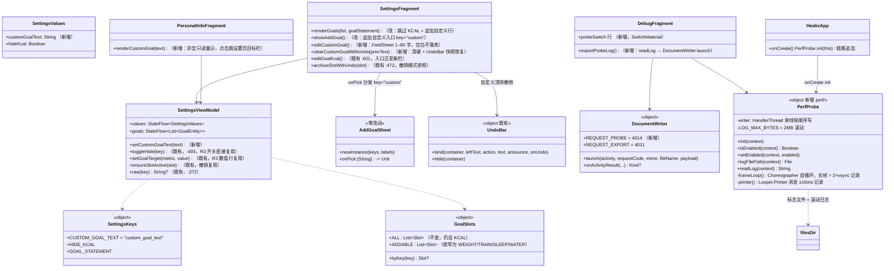
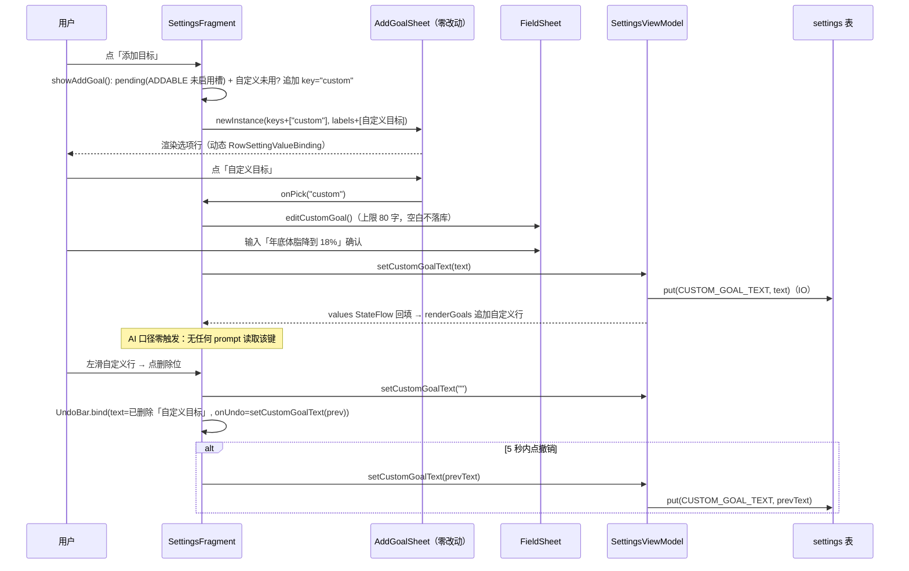
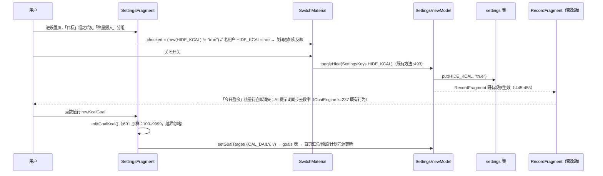
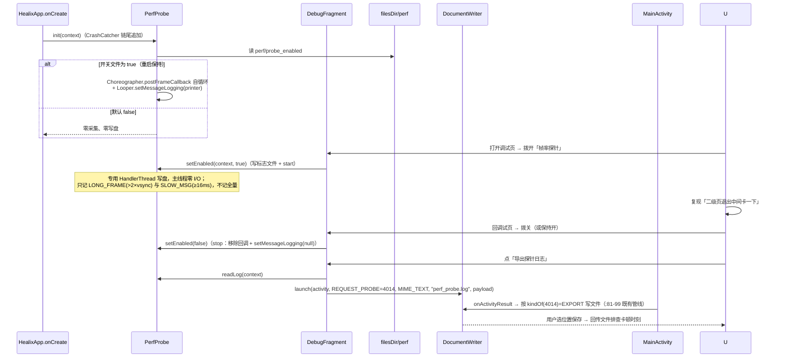

# Healix 清单3 增量架构设计

> 作者：架构师 高见远
> 日期：2026-10-05
> 输入：`docs/v8/PRD-清单3-2026-10-05.md`（唯一需求源，Q1/Q2/Q3 已拍板）+ `docs/v8/未做3-2026-10-05.md` + `docs/v8/架构设计-增量.md`（增量风格参照）
> 基线：commit `b0a351b`（CI #54 ✅）；本设计所有「现状」均经实码核实，引用给 `文件:行号`
> 范围：R1 文本型自定义目标 / R2 弹层白底修复（P0）/ R3 设置「热量摄入」独立栏 / R4 帧率探针 / R5 验收条目

---

# 第一部分：系统设计

## 1. 实现方案

### 1.0 五项特别核实的结论（设计依据，全部实码核实）

| # | 事项 | 结论（file:line） |
|---|---|---|
| 1 | **第 7 处弹层是哪个** | 全项目共 **7 个** `BottomSheetDialogFragment`：ActionConfirmSheet / AddGoalSheet / EventEditSheet / FieldSheet / GoalDetailSheet / GoalSetupSheet / **KnowledgeDocSheet**。前 6 个布局根 = GrabberLayout（`sheet_confirm.xml` 是 `EventEditSheet` 的布局，`EventEditSheet.kt:62` 用 `SheetConfirmBinding` inflate；6 个布局：sheet_action_confirm / sheet_add_goal / sheet_confirm / sheet_field_edit / sheet_goal_detail / sheet_goal_setup）；`KnowledgeDocSheet.kt:27` 用 `sheet_knowledge_doc.xml`，**不用 GrabberLayout**。→ 主题级修复一处覆盖全部 7 处（GrabberLayout 与否无关，只要走 BottomSheetDialog 容器） |
| 2 | **R1 撤销先例** | `ui/UndoBar.kt:31`（object，`bind(container, leftText, action, text, announce, onUndo)`，5 秒，`WeakHashMap` 按容器计时）。设置页已有两个同型先例：**目标槽位** `SettingsFragment.archiveSlotWithUndo`（`SettingsFragment.kt:472-482`，onUndo = `vm.ensureSlotActive(slot)` 恢复）与**提醒** `deleteReminderWithUndo`（`:658-668`，物理删 + 整条快照 `vm.restoreReminder` 插回）。自定义目标清除 = **第三种：清 settings 键 + 文本快照恢复**（`UndoBar.bind` 的 container 复用 `binding.undoBar/undoLeft/undoAction`，同一页面单开） |
| 3 | **R3 落位与开关接入** | `fragment_settings.xml`：目标组止于「添加目标」`rowGoalAdd`（`:317-321`），提醒组分隔线起于 `:327-331` → **「热量摄入」分组插在两者之间**。开关接入 = **复用现成方法 `SettingsViewModel.toggleHide(SettingsKeys.HIDE_KCAL)`**（`SettingsViewModel.kt:493`，注释 `:488-491` 明说「将来若在别处恢复入口，直接调本方法即可」——本项正是恢复入口）。`SwitchMaterial` 全项目首次引入（无 Switch 先例）→ 新布局 `row_setting_switch.xml`；material 库已在依赖（`BottomSheetDialogFragment` 在用） |
| 4 | **R4 挂载点** | ⚠️ **`DebugActivity` 已不存在**（v8 T03 迁为 `DebugFragment`，`DebugFragment.kt:25` 自述）。入口：`MineFragment.kt:157` `NavHost.open(requireContext(), DebugFragment(), NavHost.PAGE_DEBUG)`。探针启停挂 **`HealixApp.onCreate`**（`HealixApp.kt:44-53`，现有 install 链尾部追加一行 `PerfProbe.init(this)`）+ DebugFragment 手动开关；导出**复用 `DocumentWriter` 管线**（`DocumentWriter.kt:35`，SAF 唯一写文件管道，`ExportWriter.kt:204-212` 同款用法） |
| 5 | **`custom_goal_text` 导出取舍** | **结论：允许随 settings 整表带出，零代码改动，无反例。** 导出侧 `ExportWriter.kt:186-191` settings 全表写出、无过滤闸门；导入侧 `ImportReader.kt:459-474` settings **全键合并**（逐键 EXISTS 判重，无白名单）→ 新键自动随备份往返。敏感性评估：与 `GOAL_STATEMENT`（`SettingsKeys.kt:179`）同类自由文本，非密钥/非位置/非联系人，不落在「API key 不落 settings」不变式的保护范围内 → **放行** |

### 1.1 R1｜文本型自定义目标（独立新键，AI 口径零触碰）

**存储选型（PRD 关键发现成立）**：`GOAL_STATEMENT`（`SettingsKeys.kt:179`）已被 AI 口径消费（`PlanGenerator.kt:380` 计划 prompt、`TrainingPlanner.kt:502-507` 训练 prompt）→ 自定义**次目标**落**独立新键**：

```kotlin
// db/SettingsKeys.kt（唯一登记处，进 check_settings_keys）
/** 自定义次目标（文本型）。空 = 未使用。⚠️ 刻意不进任何 AI prompt 读取集合。 */
const val CUSTOM_GOAL_TEXT = "custom_goal_text"
```

**边界保证（结构性，非纪律性）**：`MainViewModel` / `PlanGenerator` / `TrainingPlanner` 的读取集合 = `GOAL_STATEMENT` + `goals` 表 + events 聚合；`custom_goal_text` 在集合之外 → **`ChatEngine.systemPrompt` / `TrainingPlanner.PROMPT_TRAINING` / `PlanGenerator` 的 prompt 常量字节级零改动**（`PROMPT_VER` 不递增）。首页三卡读 `goals` 表，天然「按无该行兜底」，零改动。

**槽位与上限口径（裁决，见 §待明确 Q2）**：
- `GoalSlots.ADDABLE`（`GoalEntities.kt:147`）在 R3 收窄为 `listOf(WEIGHT, TRAIN, SLEEP, WATER)`（4 项）；
- **`GoalSlots.ALL` 保持不动**（仍含 KCAL，6 个 DB 槽位全集）——`updateGoalAddEntry` 的「已达上限 6 项」文案用 `GoalSlots.ALL.size`（`SettingsFragment.kt:388`），数字恰好仍为 6，字节不变；
- 满员判据改为：**4 个固定槽位全部启用 且 自定义已使用** → 入口置灰（`SettingsFragment.kt:380-392` 改判定）；
- 老用户的 `kcal_daily` active 数据行**不占次目标槽位**（已收编至「热量摄入」栏，UI 不渲染该行，数据行继续驱动首页/预警/计划）。

**交互实现（三处，全部最小改动）**：

1. **「添加目标」弹层自定义入口——`AddGoalSheet.kt` 零改动**。该弹窗纪律是「自身不读库，槽位由宿主经 arguments 传入」（`AddGoalSheet.kt:21-24`）且动态渲染 `RowSettingValueBinding`（`:61-70`）→ 宿主 `showAddGoal()`（`SettingsFragment.kt:485-498`）在 `keys/labels` 末尾追加自定义项（key 约定常量 `"custom"`，仅当自定义未使用时追加）；`onPick` 分发：`key == "custom"` → 打开 FieldSheet 输入，否则 `vm.ensureSlotActive(slot)`。空态兜底 `:55-59` 因 keys 恒含自定义项而不触发。
2. **自定义文本输入**：复用主目标自定义态的完整先例 `chooseCustomGoalText()`（`SettingsFragment.kt:528-546`）→ 新写 `editCustomGoal()`：FieldSheet 单行文本，`InputType.TYPE_CLASS_TEXT`、上限 80（沿用 `GOAL_STATEMENT_MAX`，`:939`），**空白输入不落库**（同 `:542-543` 口径），确认后 `vm.setCustomGoalText(text)`。
3. **目标组渲染**：`renderGoals()`（`SettingsFragment.kt:308-378`）在固定槽位行之后追加自定义行（仅 `customGoalText` 非空时）：label = `R.string.custom_goal_label`，value = 文本本身，`actDelete` 可见 → 左滑清除。清除 = `vm.setCustomGoalText("")` + `UndoBar.bind`（onUndo = `vm.setCustomGoalText(快照文本)`）。行点击 = 再次 `editCustomGoal()`（与其它目标行「点行编辑」一致，一个事实一个入口）。

**SettingsViewModel**：`SettingsValues` 增加 `customGoalText: String` 字段（与 `hideKcal` 同位组装，`SettingsViewModel.kt:302` 附近 reload 处）；新增 `setCustomGoalText(text: String)`（IO 协程 put + reload，写法对齐 `toggleHide` :493-500）。

**个人信息页展示**（PRD 用户故事「设置页与个人信息页都能看到」）：`fragment_personal_info.xml` 在 `rowGoalStatement` 之后 include `row_setting_value`（id `rowCustomGoal`）；`PersonalInfoFragment` 观察到非空时显示文本（只读，点击同样跳设置页目标栏，`PersonalInfoFragment.kt:83-85` 同款），空则 GONE。

### 1.2 R2｜弹层白底修复（P0，一处修 7 处）

**根因复核成立**：`GrabberLayout.kt:72` 把拖拽位移设在自身；`BottomSheetDialog` 外层容器 `design_bottom_sheet` 自带不透明白底（默认 `colorSurface`）；两份 `themes.xml` 均无 BottomSheet 条目（已逐行核实）。

**修法**：主题级 `bottomSheetStyle` 透明化。⚠️ 项目纪律：`values-night/themes.xml` 是**整份重定义**（style 不跨资源限定符合并，`values-night/themes.xml:6` 注释自证）→ **白天/夜间两份 `Theme.Healix` 都必须加同一条目**：

```xml
<!-- 两份 themes.xml 的 <style name="Theme.Healix"> 内各加一行 -->
<item name="bottomSheetStyle">@style/Widget.Healix.BottomSheet</item>

<!-- values/themes.xml 定义一次即可（style 本身无颜色令牌，两主题共用） -->
<style name="Widget.Healix.BottomSheet" parent="Widget.MaterialComponents.BottomSheet.Modal">
    <item name="android:background">@android:color/transparent</item>
    <item name="android:backgroundTint">@android:color/transparent</item>
</style>
```

- 各弹层自己的 `bg_sheet` 圆角卡片（GrabberLayout 内层）不透明、随拖移动 → 视觉仅「容器白底消失」，无副作用；
- 遮罩 dim、点遮罩关闭、圆角卡片均不受影响（纯容器背景属性）；
- 纯视觉层，**零 Kotlin 改动**。

### 1.3 R3｜设置「热量摄入」独立栏（方案 A，零新增 settings 键）

**布局**（`fragment_settings.xml`，插在 `:321` 与 `:327` 之间）：

```
<View 1dp 分隔线 + <TextView group_kcal_intake（Text.Caption 样式，与其它组标题同构）>
<include id=rowKcalSwitch layout=@layout/row_setting_switch/>   ← 新布局：label + SwitchMaterial
<include id=rowKcalGoal   layout=@layout/row_setting_value/>    ← label=setting_kcal_goal，value=unit_kcal(...)
```

- `row_setting_switch.xml`（**新文件**）：`LinearLayout`（`Widget.Healix.SettingRow` 风格）+ label TextView + `com.google.android.material.switchmaterial.SwitchMaterial`（thumb/track 走 Material 默认着色，accent 主题色自动生效，符合设计规范 v3「唯一强调色」；无渐变无阴影）。
- **开关读写**：`checked = (raw(HIDE_KCAL) != "true")`（键不存在 = 显示，与 `SettingsViewModel.kt:302` 的 `hideKcal` 组装口径一致）；`onCheckedChange` → `vm.toggleHide(SettingsKeys.HIDE_KCAL)`（`:493` 现成，写 `"true"/"false"`，IO 协程）。**零新增键**，`ExportWriter` / `ImportReader` 零改动。
- **下游联动零改动**：记录页热量行消费方（`RecordFragment.kt:445-453`、`fragment_record.xml:274`）与 §14.3 提示词去数字（`ChatEngine.kt:237,267`）读的正是 `HIDE_KCAL` → 开关一拨即刻生效；AI 提示词行为不变。
- **数值行**：`editGoalKcal()`（`SettingsFragment.kt:601-612`）**函数原样保留**，仅入口从目标组动态行换到新栏 `rowKcalGoal` 点击；值域 `KCAL_MIN..KCAL_MAX = 100..9999`（`:978-979`）不变，越界忽略；数据落 `goals` 表 `kcal_daily`（`kcalTargetOf` 三级取值，`GoalEntities.kt:213-218`）→ 首页汇总/预警/计划口径自动同源。
- **目标组收编**：`renderGoals()` 渲染循环**跳过 `GoalSlots.KCAL` 槽位**（一行 `if (slot == GoalSlots.KCAL) return@forEach` + 注释）；`GoalSlots.ADDABLE` 收窄（`GoalEntities.kt:147`）；`goalValueText` / `goalLabelRes` / `editGoal` 的 KCAL 分支**保留不删**（`byKey` 回调与 `GoalSlots.ALL` 语义仍需要，且删了会触发 `check_undefined_self_calls` 连锁）。
- **老用户升级**：`kcal_daily` 数据行原样保留继续驱动一切读取方（`kcalTargetOf` 不动）；旧 `HIDE_KCAL=true` 用户开关呈关闭态、记录页仍隐藏——键复用天然成立。

### 1.4 R4｜帧率探针（独立诊断模块，零业务耦合）

**定位重申**：非用户功能；默认关闭；**绝无任何模型调用**（纯被动观察，不依赖网络栈，与 `QuotaGuard`/provider 零交集）。

**新文件 `perf/PerfProbe.kt`**（新包 `com.healix.app.perf`，业务文件中仅 `HealixApp` / `DebugFragment` 触碰）：

```kotlin
object PerfProbe {
    /** 进程启动时调用：读开关文件，启用则自启（满足「重启保持」）。 */
    fun init(context: Context)
    fun isEnabled(context: Context): Boolean          // filesDir/perf/probe_enabled 标志文件
    fun setEnabled(context: Context, enabled: Boolean) // 写标志文件 + start()/stop()
    fun logFilePath(context: Context): File            // filesDir/perf/perf_probe_YYYYMMDD.log
    fun readLog(context: Context): String              // DebugFragment 导出用
}
```

**采集实现**：
1. **长帧**：`Choreographer.getInstance().postFrameCallback` 自循环，相邻帧间隔 > 阈值（`frameIntervalNanos` 动态取 vsync，默认 2×，60Hz ≈ 33ms）记一条 `LONG_FRAME <耗时>ms`；
2. **主线程消息耗时**：`Looper.getMainLooper().setMessageLogging(Printer)`，按 `>>>>> Dispatching to` / `<<<<< Finished to` 前缀配对，起止差 ≥ 16ms 记 `SLOW_MSG <target类名> <what> <耗时>ms`；`stop()` 时 `setMessageLogging(null)` 还原。
3. **落盘**：专用 `HandlerThread("perf-probe")` 单线程顺序写（主线程零 I/O，压低观察者效应）；行格式 `<HH:mm:ss.SSS> <TAG> <detail>`；`filesDir/perf/perf_probe_YYYYMMDD.log`，单文件 > 2MB 轮转覆写（删最旧）。
4. **只记违例不记全量**（长帧/慢消息才落盘）——既控制体积又减少 Printer 自身开销。

**开关状态持久化裁决（见 §待明确 Q3）**：用 **filesDir 标志文件**（`perf/probe_enabled`），**不用 settings 键**——诊断工具状态不是用户配置，进 settings 表会触碰 `check_settings_keys` 与导出纪律两条红线，而标志文件一行代码都不用碰它们。

**DebugFragment 接入**（`DebugFragment.kt` + `fragment_debug.xml`）：调试页底部加两行——「帧率探针」开关行（`SwitchMaterial`，T03 引入后此处复用）+「导出探针日志」行；导出 = `PerfProbe.readLog()` → `DocumentWriter.launch(activity, DocumentWriter.REQUEST_PROBE, MIME_TEXT, "perf_probe.log", payload)`（`DocumentWriter.kt:58-72` 管线原样复用）。

**DocumentWriter 最小扩展**：加 `const val REQUEST_PROBE = 4014`（与 4011/4012/4013 错开，`:38-41` 同款纪律）；`kindOf`（`:101-105`）把 4014 映射到既有 `Kind.EXPORT`（复用宿主导出提示语，`MainActivity.onActivityResult` 分发零改动）。

### 1.5 R5｜个人信息页目标行验收

零代码。唯一真机验收条目：个人信息 → 点目标行 → 落在设置页目标配置栏位置（`PersonalInfoFragment.kt:77-84` + `SettingsFragment.kt:946-951 focusGoal`，均已实现）。挂进 T05 验收文档。

### 1.6 架构模式

沿用既有 **MVVM（ViewModel + StateFlow + Room Flow）**，本批次零新增框架、零新增 Gradle 依赖。弹窗沿用 `FieldSheet`（`BottomSheetDialogFragment`）。

---

## 2. 文件清单

> `M` = 修改，`A` = 新增。相对路径基于仓库根。

| # | 路径 | M/A | 改动 |
|---|---|---|---|
| 1 | `app/src/main/res/values/themes.xml` | M | R2：+`Widget.Healix.BottomSheet` style；`Theme.Healix` 加 `bottomSheetStyle` 条目 |
| 2 | `app/src/main/res/values-night/themes.xml` | M | R2：`Theme.Healix`（整份重定义纪律）加同一条目 |
| 3 | `app/src/main/java/com/healix/app/db/SettingsKeys.kt` | M | R1：登记 `CUSTOM_GOAL_TEXT = "custom_goal_text"`（本批次唯一新 settings 键） |
| 4 | `app/src/main/java/com/healix/app/db/GoalEntities.kt` | M | R3：`GoalSlots.ADDABLE` 收窄为 4 项（移除 KCAL）；`ALL` 不动 |
| 5 | `app/src/main/res/values/strings.xml` | M | 本批次全部新文案**一次登记**（见 §7 T01 清单，解耦后续任务） |
| 6 | `app/src/main/java/com/healix/app/ui/DocumentWriter.kt` | M | R4：+`REQUEST_PROBE = 4014`，`kindOf` 映射到 `Kind.EXPORT` |
| 7 | `app/src/main/java/com/healix/app/ui/SettingsFragment.kt` | M | R1：`showAddGoal` 追加自定义项 + `editCustomGoal()` + 自定义行渲染/左滑清除/撤销；R3：新栏开关行+数值行接线、`renderGoals` 跳过 KCAL、`updateGoalAddEntry` 满员判据改口径 |
| 8 | `app/src/main/java/com/healix/app/ui/SettingsViewModel.kt` | M | R1：`SettingsValues.customGoalText` 字段 + `setCustomGoalText()` |
| 9 | `app/src/main/java/com/healix/app/ui/PersonalInfoFragment.kt` | M | R1：`rowCustomGoal` 只读展示（非空可见，点击跳设置页目标栏） |
| 10 | `app/src/main/res/layout/fragment_personal_info.xml` | M | R1：`rowGoalStatement` 后 include `row_setting_value`（id `rowCustomGoal`） |
| 11 | `app/src/main/res/layout/fragment_settings.xml` | M | R3：`rowGoalAdd`（:321）与提醒组（:327）之间插入「热量摄入」分组（分隔线 + 组标题 + 开关行 + 数值行） |
| 12 | `app/src/main/res/layout/row_setting_switch.xml` | A | R3：新行布局（label + SwitchMaterial，SettingRow 风格） |
| 13 | `app/src/main/java/com/healix/app/perf/PerfProbe.kt` | A | R4：探针全量实现（Choreographer + Looper Printer + 滚动落盘 + 标志文件开关） |
| 14 | `app/src/main/java/com/healix/app/HealixApp.kt` | M | R4：`onCreate` 链尾 `PerfProbe.init(this)`（`CrashCatcher` 之后，:48-52 段内追加） |
| 15 | `app/src/main/java/com/healix/app/ui/DebugFragment.kt` | M | R4：探针开关行（SwitchMaterial）+「导出探针日志」行（`DocumentWriter.launch`） |
| 16 | `app/src/main/res/layout/fragment_debug.xml` | M | R4：底部两行（开关 + 导出） |
| 17 | `docs/v8/验收-清单3-2026-10-05.md` | A | T05：本批次 5 项 checklist + R5 真机验收条目 |

**零改动清单（负面清单，防顺手改）**：`AddGoalSheet.kt`（自定义入口经宿主传 key，零改动）、`PlanGenerator.kt` / `TrainingPlanner.kt` / `ChatEngine.kt` / `MainViewModel.kt`（AI 与首页口径）、`ExportWriter.kt` / `ImportReader.kt`（备份管线）、`RecordFragment.kt` / `ChatEngine.kt:237`（HIDE_KCAL 消费方）、`GrabberLayout.kt`、`UndoBar.kt` / `SwipeController.kt`（既有组件只接入不改内部）、`pipeline/contract.py`、`parse/SchemaValidator.kt`、Room schema（version 不动、无 Migration）、AndroidManifest.xml（无新组件需声明；`PerfProbe` 是普通 Kotlin 类非四大组件）。

---

## 3. 数据结构与接口（类图）



**关键签名（新增/变更，全部对齐既有写法）**

```kotlin
// db/SettingsKeys.kt —— 本批次唯一新 settings 键（进 check_settings_keys）
const val CUSTOM_GOAL_TEXT = "custom_goal_text"

// db/GoalEntities.kt
val ADDABLE: List<Slot> = listOf(WEIGHT, TRAIN, SLEEP, WATER)   // KCAL 移出（R3）

// ui/SettingsViewModel.kt
data class SettingsValues(..., val customGoalText: String = "")  // reload 组装处读取
fun setCustomGoalText(text: String)  // 空白→""；IO 协程 put + reload（对齐 toggleHide 写法）

// ui/DocumentWriter.kt
const val REQUEST_PROBE = 4014   // kindOf → Kind.EXPORT（复用导出提示）

// perf/PerfProbe.kt —— 新包，唯一诊断模块
object PerfProbe { /* 见 §1.4 */ }
```

---

## 4. 程序调用流程（时序）

### 4.1 R1 添加自定义目标 → 展示 → 左滑清除 → 撤销



### 4.2 R3 「热量摄入」开关联动链



### 4.3 R4 探针启停 + 采集 + 导出



---

## 5. Anything UNCLEAR（待明确事项）

| # | 事项 | 本设计裁决 / 建议 | 需谁确认 |
|---|---|---|---|
| Q1 | 老用户 `kcal_daily` active 数据行是否占「次目标 5」槽位 | **裁决：不占位**。PRD 拍板「已创建数据行保留、仅 UI 收编」→ kcal 行的唯一 UI 归属是「热量摄入」栏；次目标 5 = 4 固定 + 1 自定义（UI 可见口径）。`updateGoalAddEntry` 满员判据据此改为「4 固定全启用 且 自定义已用」；「已达上限 6 项」文案数字（`GoalSlots.ALL.size`）恰好仍为 6，字节不变 | 主理人确认 |
| Q2 | R4 开关持久化载体 | **裁决：filesDir 标志文件**（`perf/probe_enabled`），不用 settings 键——诊断工具状态非用户配置；进 settings 会触碰 `check_settings_keys` + 导出纪律红线，收益为零 | 主理人确认 |
| Q3 | 个人信息页自定义目标展示形态 | 按用户故事设计为 `rowGoalStatement` 后追加只读行（非空才显示）；若评审认为个人信息页不必展示，砍掉 `PersonalInfoFragment.kt` + `fragment_personal_info.xml` 两处改动即可，其余不受影响 | 主理人确认 |
| Q4 | 自定义目标行点击行为 | PRD 未指定 → 裁决「点行 = 再次编辑」（FieldSheet 回显，与其它目标行一致）；只要求的左滑清除/撤销不受影响 | 低风险，知会即可 |
| Q5 | 假设声明 | ① `SwitchMaterial` 在 `Theme.MaterialComponents` 下自动着色 accent，无需额外 style；② 长帧阈值用 `Choreographer.frameIntervalNanos` 动态 2×（高刷屏自适应），PRD「2×vsync」口径一致；③ `fragment_debug.xml` 底部有空间加两行（未逐行核实该布局剩余空间，工程师实现时若拥挤可放进既有滚动区末尾） | 无需拍板 |

---

# 第二部分：任务分解

## 6. 依赖包

**新增依赖：0 个。**

- `SwitchMaterial`：`com.google.android.material:material` 已在依赖（`BottomSheetDialogFragment` 在用），零新增；
- Choreographer / Looper Printer / HandlerThread：Android 框架 API，零依赖；
- 导出：复用既有 `DocumentWriter`（SAF），零依赖。

## 7. 任务列表（按实现顺序，≤5 任务，T01 为基础设施）

### T01｜基础设施：R2 主题修复 + 数据契约 + 全量文案预登记（P0，无依赖）

| 源文件 | 改动 |
|---|---|
| `app/src/main/res/values/themes.xml` | `Widget.Healix.BottomSheet` style + `Theme.Healix` 加 `bottomSheetStyle` |
| `app/src/main/res/values-night/themes.xml` | 同条目（整份重定义纪律，必须重复写） |
| `app/src/main/java/com/healix/app/db/SettingsKeys.kt` | `CUSTOM_GOAL_TEXT` 登记 |
| `app/src/main/java/com/healix/app/db/GoalEntities.kt` | `ADDABLE` 收窄为 4 项（移除 KCAL） |
| `app/src/main/res/values/strings.xml` | **本批次全部新文案一次登记**（解耦 T02–T04，后续任务只引用不新增）：`group_kcal_intake`（热量摄入）、`kcal_show_toggle`（记录页显示热量盈余）、`add_goal_custom`（自定义目标）、`custom_goal_label`（自定义目标，行标签）、`debug_probe`（帧率探针）、`debug_probe_export`（导出探针日志）、`debug_probe_on/off`（开/关态说明）。复用不新增：`undo_deleted`、`setting_kcal_goal`、`unit_kcal`、`goal_limit_reached`、`value_not_set` |
| `app/src/main/java/com/healix/app/ui/DocumentWriter.kt` | `REQUEST_PROBE = 4014` + `kindOf` 映射 |

**验收点**：两份 themes.xml 均含 `bottomSheetStyle`；`check_kotlin.py`（`check_settings_keys` / `check_duplicate_constants`）/ `check_resources.py` 全绿；`grep -r "custom_goal_text"` 仅 `SettingsKeys.kt` 一处裸字符串。

### T02｜R1 文本型自定义目标全链路（P1，依赖 T01）

| 源文件 | 改动 |
|---|---|
| `app/src/main/java/com/healix/app/ui/SettingsFragment.kt` | `showAddGoal()` 追加 `key="custom"` 项 + onPick 分发；`editCustomGoal()`（FieldSheet，80 字，空白不落库）；`renderGoals()` 追加自定义行 + 左滑清除 + `UndoBar` 快照恢复 |
| `app/src/main/java/com/healix/app/ui/SettingsViewModel.kt` | `SettingsValues.customGoalText` 字段（reload 组装）+ `setCustomGoalText()` |
| `app/src/main/java/com/healix/app/ui/PersonalInfoFragment.kt` | 自定义目标只读展示（非空可见，点击跳设置页目标栏） |
| `app/src/main/res/layout/fragment_personal_info.xml` | `rowGoalStatement` 后 include `row_setting_value`（id `rowCustomGoal`） |

**验收点**：弹层出现「自定义目标」入口，1–80 字保存后目标组出现行；左滑清除 + 撤销恢复；4 固定 + 自定义全启用（6 项）入口置灰、清任一恢复；`AddGoalSheet.kt` **零 diff**；`PlanGenerator`/`TrainingPlanner`/`ChatEngine`/`MainViewModel` **零 diff**（AI prompt 逐字节不变）；导出 JSON 含 `custom_goal_text` 且导入恢复（`ExportWriter`/`ImportReader` 零 diff）；Room version 不动。

### T03｜R3 「热量摄入」独立栏（P1，依赖 T01；与 T02 共写 SettingsFragment.kt → 串行 T02 → T03）

| 源文件 | 改动 |
|---|---|
| `app/src/main/res/layout/row_setting_switch.xml` | 新布局：label + SwitchMaterial（SettingRow 风格） |
| `app/src/main/res/layout/fragment_settings.xml` | `rowGoalAdd`（:321）与提醒组（:327）之间插入「热量摄入」分组 |
| `app/src/main/java/com/healix/app/ui/SettingsFragment.kt` | 开关行接线（`toggleHide(HIDE_KCAL)`）、数值行接线（`editGoalKcal()` 入口迁移）、`renderGoals` 跳过 KCAL、`updateGoalAddEntry` 满员判据改口径（见 Q1） |

**验收点**：开关关→记录页「今日盈余」行（含计划条）立即消失、开→恢复；重启保持；数值行 100–9999 越界忽略、首页口径同步；目标组 kcal 行消失、添加列表无 kcal；老用户数据行无损、旧 `HIDE_KCAL=true` 开关呈关闭态；**零新增 settings 键**（`grep check`：`hide_kcal` 写入仅 `toggleHide` 一处）；`ChatEngine.kt:237` 零 diff。

### T04｜R4 帧率探针（P1，依赖 T01；文件集与 T02/T03 不重叠可并行）

| 源文件 | 改动 |
|---|---|
| `app/src/main/java/com/healix/app/perf/PerfProbe.kt` | 新模块全量实现（§1.4） |
| `app/src/main/java/com/healix/app/HealixApp.kt` | `onCreate` 链尾 `PerfProbe.init(this)` |
| `app/src/main/java/com/healix/app/ui/DebugFragment.kt` | 探针开关行（SwitchMaterial，默认关）+ 导出行（`DocumentWriter.launch(REQUEST_PROBE)`） |
| `app/src/main/res/layout/fragment_debug.xml` | 底部两行 |

**验收点**：默认关闭时零采集零写盘；开启后二级页进出一次日志含长帧行 + 同刻慢消息行、时间戳可对齐；导出可分享（SAF 保存成功）；开关重启保持；单文件 ≤ 2MB 滚动；探针代码仅在 `perf/PerfProbe.kt` + 三处一行级接线（`HealixApp`/`DebugFragment`/`DocumentWriter`），业务零耦合；全路径无任何模型调用（`llm_calls` 零新增行）。

### T05｜R5 验收条目 + 集成回归 + 状态同步（P2，依赖 T01–T04）

| 源文件 | 改动 |
|---|---|
| `docs/v8/验收-清单3-2026-10-05.md` | 新建：5 项 PRD checklist 汇总成可勾选验收单（R2 七弹层逐处截图回归项 / R1 六条 / R3 七条 / R4 五条 / R5 一条真机条目） |
| `docs/v8/未做3-2026-10-05.md` | 状态更新：2-1 标注「帧率探针已落地（清单3 2-1），待真机采集回传定位」 |

**验收点**：`check_kotlin.py` / `check_resources.py` / `test_norm.py` CI 三项全绿；R5 真机条目（个人信息 → 点目标行 → 落在设置页目标配置栏）列入验收单。

## 8. 共享知识（跨文件约定，工程师必读）

1. **契约冻结**：`ChatEngine.systemPrompt` / `TrainingPlanner.PROMPT_TRAINING` / `PlanGenerator` 各 prompt 常量 / `PROMPT_VER` **字节冻结**——T02/T03/T04 的 diff 里**不允许出现**这四个文件的任何一行；`pipeline/contract.py` ↔ `parse/SchemaValidator.kt` 不触碰。
2. **键名纪律**：settings 键唯一来源 `db/SettingsKeys.kt`；本批次仅 `CUSTOM_GOAL_TEXT` 一个新键，`readLog` 标志文件**不走** settings（诊断状态≠用户配置）。禁止任何任务顺手加键（`check_settings_keys` 会拦裸字符串，但拦不住「把诊断状态塞进现有键」这种偷懒）。
3. **兜底值**：`GoalDefaults` 不动；`kcalTargetOf` 三级取值（`GoalEntities.kt:213-218`）不动——R3 只动 UI 入口，不动数据链。
4. **槽位口径**（Q1 裁决）：`GoalSlots.ALL` 不动（DB 全集，`ALL.size=6` 供文案）；`ADDABLE` = 4 固定；次目标 5 = 4 固定 + 1 自定义（UI 口径）；kcal 数据行不占次目标位。
5. **UndoBar 语义**：5 秒、单条顶旧、`onUndo` 恢复——自定义目标用**文本快照恢复**（键清除型），与提醒的整条快照（`SettingsFragment.kt:658-668`）、目标槽位的 `ensureSlotActive`（`:472-482`）并列第三种模式，不改动 `UndoBar.kt` 本身。
6. **Fragment 纪律**：本模块无 `fragment-ktx`/`activity-ktx`——禁 `by viewModels()`、`commit {}`、`registerForActivityResult`；VM 取用 `ViewModelProvider`；`DocumentWriter` 走宿主 `startActivityForResult` + `onActivityResult` 分发（`:23-26` 注释即原因）；弹层传参必须 `setArguments`。
7. **埋点不变式**：探针零模型调用；所有既有 `QuotaGuard` 路径零触碰。
8. **设计规范 v3**：开关行/分组标题与既有组同构（`Text.Caption` + 1dp 分隔线）；无卡片、无阴影、无渐变；`SwitchMaterial` 主题色自动 accent，不加自绘样式。
9. **两份 themes.xml 必须同步改**：`values-night` 是整份重定义，只改 `values` 一份 = 夜间模式白底 bug 原样复现。
10. **T02 → T03 串行**：共写 `SettingsFragment.kt`（共享 worktree 禁并发写同文件）；T04 与 T02/T03 文件集无重叠可并行；`strings.xml` 已由 T01 一次登记，后续任务**只引用**。

## 9. 任务依赖图

```mermaid
graph TD
    T01[T01 基础设施：R2 主题 + 键/槽位契约 + 全量文案] --> T02[T02 R1 自定义目标全链路]
    T01 --> T03[T03 R3 热量摄入独立栏]
    T01 --> T04[T04 R4 帧率探针]
    T02 --> T05[T05 R5 验收 + 集成回归]
    T03 --> T05
    T04 --> T05
    T02 -.共写 SettingsFragment.kt 串行.-> T03
```

---

## 附：硬约束自检

- ✅ `ChatEngine.systemPrompt` / `PROMPT_TRAINING` / `PROMPT_PLAN` / `PROMPT_VER` 字节冻结（负面清单明确零 diff）。
- ✅ 唯一新 settings 键 `custom_goal_text`（R1 拍板项），导出侧结论已给（§1.0-5，无反例放行）；R3 零新增键。
- ✅ Room version 不动、无 Migration、无 schema 变更（R1 文本走 settings，零 schema）。
- ✅ 无 fragment-ktx 依赖、无新四大组件（Manifest 零 diff）、弹层传参走 arguments。
- ✅ 探针零模型调用、默认关闭、独立包零业务耦合。
- ✅ 设计规范 v3：无卡片/阴影/渐变，唯一 accent，SwitchMaterial 主题着色。
- ✅ `GoalDefaults` / `SettingsKeys` 唯一来源纪律保持；`UndoBar`/`SwipeController`/`GrabberLayout` 只接入不改内部。
