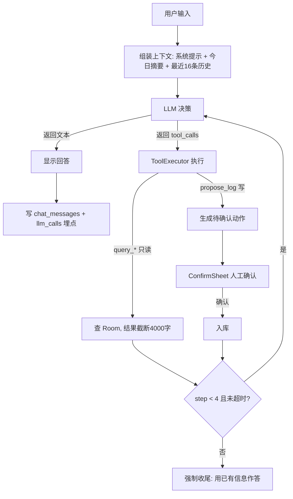

# Healix 功能补充与套壳选型

配套：`总方案.md`、`UI设计方案.md`  
日期：2026-10-03

---

## 〇、先纠正一个命名：这不是 Agent，是 Chaining 工作流

按模式库判定（硬约束 C3）：**分支能否事先穷举？**

| 现有管线环节                    | 能否用 if/else 写死  |
| ------------------------- | --------------- |
| 输入 → 云端抽取 → 后处理 → 入库 → 展示 | ✅ 能，全程无分支依赖中间结果 |
| 计划生成 → 缺口更新               | ✅ 缺口是减法，本地算术    |
| 「记一笔」按钮 → 复用速记管线          | ✅ 固定函数调用        |

结论：**Healix = Prompt Chaining（两级链路：抽取链 + 计划链），不是 Agent。**

这不丢人，反而是对的选择 —— 理由：

- 无 Tools（除了"写自己的 SQLite"这一个，且不由模型决定何时调用）
- 无自主循环（不可预知的分支不存在）
- 上一版方案里最值钱的判断之一就是这个：把不确定性压到"一次 LLM 调用 + 一层确定性后处理"里

**如实告知的义务到此完成。** 下面所有补充都不引入 Agent 复杂度。保持 Chaining 结构，只做两件事：补确定性缺口，抄成熟产品的功能清单。

---

## 一、工程正确性缺口（漏了一定出 bug，优先于任何新功能）

现有方案覆盖了"happy path"，这 9 项是真实使用中必然踩到的。

### 1.1 待处理队列：离线时输入绝不能丢

**缺口**：方案假设输入时一定有网。实际场景 —— 电梯、地下车库、信号差的食堂 —— App 唯一高频使用的时间点恰恰常在这几处。

**做法**：

```
表 events 加列：
  parse_status  TEXT NOT NULL DEFAULT 'pending'   -- pending | done | failed
  retry_count   INTEGER NOT NULL DEFAULT 0
  last_error    TEXT
```

流程改为：

1. 用户输入 → **立即以 `pending` 入库**，UI 立刻显示（raw_text 原样）
2. 后台协程尝试调 AI；成功 → 回填字段、置 `done`、刷新 UI（Room Flow 自动推）
3. 失败 → `retry_count++`，走 WorkManager 退避重试（约束 `NetworkType.CONNECTED`）
4. 重试 5 次仍失败 → 置 `failed`，用户可手动点「重试」，或**不重试也能继续用**（这一条仍是有效记录，只是没结构化）

**价值**：数据零丢失 + 输入延迟从"等 AI 1.5 秒"降到 0 毫秒。这是本 App 感知提升最大的一处改动，且完全不依赖 AI。

### 1.2 Android 14 前台服务必须声明 type

**缺口**：目标机 Magic6 Pro 是 Android 14（API 34）。常驻通知依赖前台服务，而 API 34 起 `startForeground()` 必须匹配 Manifest 中声明的 `android:foregroundServiceType`，否则抛异常。方案的第十节完全没提这件事。

**做法**：

```xml
<uses-permission android:name="android.permission.FOREGROUND_SERVICE" />
<uses-permission android:name="android.permission.POST_NOTIFICATIONS" />   
<uses-permission android:name="android.permission.REQUEST_IGNORE_BATTERY_OPTIMIZATIONS" />

<service
    android:name=".notify.QuickInputService"
    android:exported="false"
    android:foregroundServiceType="specialUse" />
```

⚠️ `specialUse` 在部分国产 ROM 上会被忽略，且 Google Play 上架需审批；自用不受影响，但**具体 type 取值与机型行为请对着官方文档再确认一遍** —— `[待核实: Android Developers > Foreground service types 官方页]`

配套：首启检查三件事 —— API key 是否已填、通知权限是否授予、是否在电池优化白名单。缺任一则在设置页显示引导，不阻塞主流程。

### 1.3 幂等：RemoteInput 会重复投递

**缺口**：通知栏 RemoteInput 走 PendingIntent 广播，系统重投递 / 用户快速点两次 → **同一句话记两遍**。健康数据统计最忌讳这个。

**做法**：

```sql
client_event_id TEXT NOT NULL UNIQUE   -- 录入瞬间生成的 UUID
```

入库用 `@Insert(onConflict = OnConflictStrategy.IGNORE)`，插入返回 `-1` 即视为重复，UI 不报错、不出新行。幂等键的另一个好处：后续"编辑后重新抽取"可以用同一 id 覆盖更新，而不是新增一条。

### 1.4 记录日归属：跨零点算哪天

**缺口**：现有只有 `ts`。"凌晨 1 点吃了夜宵"按自然日算法会算进第二天 —— 而用户的主观认知是"今天的"。反过来，早上 6 点的早餐也算"今天的"。直接按 ts 分组会让"今日摄入"在深夜突然清零，极其困惑。

**做法**：

```sql
day_key TEXT NOT NULL   -- yyyy-MM-dd，写入时按"自定义日界线"计算
```

```kotlin
// 日界线默认 4:00 —— 04:00 之前的记录归入前一天
// 实现：把本地时间整体减 4 小时后取日期，无需任何边界分支
fun dayKeyOf(ts: Long, dayStartHour: Int = 4): String =
    Instant.ofEpochMilli(ts).atZone(ZoneId.systemDefault())
        .toLocalDateTime()
        .minusHours(dayStartHour.toLong())
        .toLocalDate()
        .toString()
```

验证三条用例：凌晨 1:00 吃夜宵 → 减 4h = 前一天 21:00 → 归前一天 ✅；早上 6:00 → 减 4h = 2:00，仍当天 ✅；中午 12:00 → 减 4h = 8:00，当天 ✅。日界线小时数放进设置页，默认 4。

索引：`events(day_key)` —— 这是最高频查询条件。

### 1.5 一条输入 → 多条事件

**缺口**：现有 schema 一条输入 = 一条 event。但真实口语是复合的：

> "中午吃了牛肉面加鸡蛋，还称了下体重 58.2"

这是 `meal` + `body` 两条。强行塞进一条，要么丢字段，要么语义错乱。

**做法**：AI 输出改为 `{"events": [ {...}, {...} ]}`，Dao 支持批量插入。后处理层对每个元素独立做类型强转与兜底 —— **单条坏不影响其他条**。

⚠️ 这会改动现有 prompt 与后处理，属于破坏性改动。**建议在 P1 阶段就定下来**（成本最低），若已进 P2 才改，要连同 20 条用例重跑。

### 1.6 编辑与撤销

**缺口**：UI 方案写了通知栏"5 秒内撤销"，但列表项没有编辑/删除入口 —— 而 AI 抽错是常态（实测约 16–17/20 合 schema）。

**做法**：

```sql
updated_at INTEGER
deleted_at INTEGER          -- 软删除，NULL 表示未删
origin      TEXT            -- user | ai_suggestion  「记一笔」来源可追溯
```

- 列表项左滑或长按 → 编辑（复用 ConfirmSheet）/ 删除
- 编辑 kcal 后「今日计划」的缺口立刻重算 —— 免费的正确性提升
- 软删除 + 30 天后清理，避免误删不可恢复

### 1.7 本地兜底：AI 不能是唯一热源

**缺口**：现有架构把 AI 放进了关键路径 —— 没有它，App 就退化成一个不能记账的记账本。这是整套方案里风险集中度最高、却最容易被忽略的一处。

| 场景         | 当前方案行为 | 应有行为                               |
| ---------- | ------ | ---------------------------------- |
| API key 未填 | 空白     | 降级到本地规则：食物库查表 → 有则填 kcal，无则标记"未估算" |
| 五次重试全失败    | 失败提示   | 同上，记录进 insights 后可手动重试             |
| 用户想立刻看数字   | 等 1.5s | 先把 pending 行显示出来                   |

**做法**：写一个独立的 `LocalFallbackEstimator`（纯 Kotlin 函数，无网络依赖）：

- 输入：`raw_text` + 内置食物热量速查表（起步 50 条：主食/常见食堂菜/水果/饮料，份量按北方日常）
- 输出：`type`（关键词匹配）、`kcal`（查表命中则填，未命中填 0 并标记"未估算"）
- AI 恢复后（`pending` → `done`）用 AI 结果覆盖本地估算，UI 显示"已更新"

验收标准一句话：**断网装上 App，也能完成"记录 → 查看 → 缺口计算 → 导出"全流程，只是没有复盘建议。**

### 1.8 调用预算护栏

**缺口**：「刷新计划」按钮可被连点。虽然不是 Agent 循环，但"异常 → 连点 → 累计大量调用"存在可能，且每次等待 1.5 秒以上的体验也差。

**做法**：本地计数 —— 每日 AI 调用上限默认 20 次（可在设置页调），超出后走本地 fallback，UI 显示"今日 AI 配额已用尽"。

### 1.9 API key 换成 EncryptedSharedPreferences

现有方案写的是"用 EncryptedSharedPreferences **更佳**"。这里直接定为**强制项**：

- `settings` 表不存 key（SQLite 明文可被 root / 备份导出读到）
- key 存 `EncryptedSharedPreferences`（AES-256-GCM + Keystore 托管密钥）
- 日志与报错信息里**绝不打印 key**，甚至不打印长度（防侧信道）

---

## 二、可借鉴的成熟功能（对标 FitBuddy feature list）

以下四项 Healix 现在没有，但每一项都直接抬日常使用率和数据质量。

### 2.1 食物预设 / 常用餐一键记录 ★最高性价比

**对标**：FitBuddy "Presets — bookmark meals for one-tap logging"

学校食堂吃饭的人，一周吃的就那六七样。每次都要打字，摩擦极大。

**做法**：新增 `presets` 表（name / foods_json / kcal / use_count / last_used_at）。列表按 use_count 倒序取前 6 个，放在输入区上方横向滚动。**点一下 = 一条记录**，完全不打字、不调 AI。

这是"让产品从玩具变成日用品"的那条线 —— 它的价值高于任何一个 AI 功能。

### 2.2 Region pack：把中餐常识塞进 prompt ★直接提升准确率

**对标**：FitBuddy "Region packs — personalise AI prompts, staples, portion language, and log examples"

现有 prompt 让模型估算"牛肉面"热量，模型大概率按通用值给。但**分量语言是分地区的** —— "一碗面""一份饭""一个小碗""二两"在中国语境下有明确默认量，模型不知道你在太原。

**做法**：prompt 里加一段静态常量：

```
分量默认参考（中国北方日常）：
- 一碗牛肉面 ~500g（面 200g + 汤 250g + 配料 50g）→ 约 550-650 kcal
- 一份盖浇饭（米饭 300g + 菜）→ 约 650-800 kcal
- 一个肉包子 ~100g → 约 230 kcal
- 二两米饭 = 100g 熟米 → 约 116 kcal

kcal 估算优先按「当地常见分量」而不是「标准 100g」。
```

这段不用任何外部数据，就是一段常量字符串，直接并入 1.5 节改造后的新 prompt。**预期准确率提升肉眼可见**。热量数字本身是常识校准而非编造 —— 只是把"一碗面"的分量定义写清楚，估算交给模型。

### 2.3 份量编辑 → 热量实时重算

**对标**：FitBuddy "Meal review — tweak ingredient weights with live macro recalc"

现有 ConfirmSheet 只能改最终 kcal 数字。若 AI 抽出了 foods 列表，让每个食材带 g/份，用户改数字 → kcal 本地重算。这是"可控感"的来源 —— 用户会更愿意信任这个数字。

（这条依赖 2.2 的食材级抽取，成本中等，优先级落到 P2 之后。）

### 2.4 加密导出备份

**缺口**：数据只存手机本地，**手机丢了 = 全部历史归零**。

**做法**：设置页一个「导出」→ `ACTION_CREATE_DOCUMENT` 让用户选 Downloads 路径 → 写 JSON（events + daily_plans + presets + 版本头）。可选再做 AES-256-GCM 加密 + gzip。

最低限度：**哪怕只做明文 JSON 导出也行**，比没有强 10 倍。配合 SAF，不用申请任何存储权限。

---

## 三、可观测性（自用 App 的排障唯一手段）

P1 阶段的 Python 竖切片在电脑上能看日志，装到手机上就是黑盒。加一张表，成本极低，收益极大。

```sql
CREATE TABLE llm_calls (
  id            INTEGER PRIMARY KEY AUTOINCREMENT,
  ts            INTEGER,
  purpose       TEXT,     -- extract | plan | review
  event_id      INTEGER,  -- 关联的 event，可能为 NULL
  model         TEXT,
  prompt_ver    TEXT,     -- ★ prompt 版本号
  attempts      INTEGER,  -- 重试次数
  latency_ms    INTEGER,
  status        TEXT,     -- ok | retry_exhausted | schema_invalid | http_error
  http_code     INTEGER,
  input_tokens  INTEGER,
  output_tokens INTEGER,
  error_head    TEXT      -- 错误信息前 200 字，脱敏后
);
```

**prompt_ver 是这里面最关键的一列。** prompt 一定会改（改一版 prompt 就可能引入新的抽取问题），没有版本号就无法回答"为什么上周抽得比现在准"。

设置页加一个「调试」分组：显示今日调用次数、失败率、P95 延迟、最近 20 条调用记录。这是你自己在手机上唯一的排障入口。

---

## 四、套壳选型：四个候选，三层借用

### 4.1 先说结论

> **不建议 fork 任何一个整包。建议「抄功能清单 + 抄单模块代码」，不抄架构。**

理由很直接：

| 候选                                  | 与 Healix 的核心冲突                               |
| ----------------------------------- | -------------------------------------------- |
| 几乎所有活跃 Android 项目都是 Jetpack Compose | Healix 定的是 XML + ViewBinding（为了 agent 生成可靠性） |
| 它们是"通用营养追踪器"                        | Healix 是"口语速记 + 增重"，体积差 3–5 倍，多余部分全是负债       |

强行换 Compose 去套壳，是把"确定的东西"（你已验证的 Python 管线 / 已定的 UI 规范）换成"不确定的东西"，违反先跑通竖切片的原则。

### 4.2 候选清单（均已核实，非凭记忆）

| 项目                         | 事实核实结果                                                                                     | 契合点                                                                                                                                                               | 冲突                                                       | 建议用法                                                                                                              |
| -------------------------- | ------------------------------------------------------------------------------------------ | ----------------------------------------------------------------------------------------------------------------------------------------------------------------- | -------------------------------------------------------- | ----------------------------------------------------------------------------------------------------------------- |
| **anantdark/FitBuddy**     | 真实存在 ✅<br />Kotlin，GPL-3.0，28 stars，最后 push **2026-09-28**（活跃），minSdk 29                   | **AI 健身/卡路里追踪，四个 provider 运行时可配（OpenRouter / Gemini / OpenAI / Ollama），无 key 时走内置模拟器离线降级，Presets，可编辑 review，Region packs，Dashboard + Canvas 图表，AES-256-GCM 加密备份** | Compose UI、体型大、性能厚重                                      | ★ **首要参照对象是它的 feature list**，当作现成的产品说明书；以及抄它的 **CI/Release workflow + signing secrets** 设计（直接解决你 P3 阶段的签名 APK 输出） |
| **maksimowiczm/FoodYou**   | 真实存在 ✅<br />Kotlin，GPL-3.0<br />"free, open-source, privacy-focused food diary"（star 数未核实） | Room + 本地优先 + 多营养数据库 + 离线食物库 + 条形码                                                                                                                                | Compose、无 AI、无口语输入                                       | ★ 参考它&#x7684;**「份量 → kcal」本地查表数据设计**，用于你的 2.2/2.3 本地 fallback                                                     |
| **Fertion/QuickMDCapture** | 真实存在 ✅<br />Kotlin，**MIT**，97 stars / 11 forks                                             | **通知栏常驻 + RemoteInput + 免解锁录入 + 桌面小组件 + 系统分享接收**，正是你 5.2 节要的东西                                                                                                    | 写的是文件不是 DB、无 AI                                          | ★ **唯一推荐直接复制代码的模块**。MIT 许可最自由，把它的前台服务 + RemoteInput + 锁屏许可代码看懂抄过来                                                 |
| **kkrow/calorie-tracker**  | 真实存在 ✅<br />Kotlin，GPL-3.0，**0 stars**，最后 push **2026-03-04**（停更半年）                        | 唯一和你一样是 **XML + ViewBinding + Material Components** 的；有环形剩余热量指示器、日期历史                                                                                             | 存 SharedPreferences（不适合你）、无网络、**0 star 意味着没人实际用过，坑没人踩过** | △ 仅作为 **XML 路线的极简 UI 参考**。不建议 fork，共活跃度太低，出问题没有 issue 可查                                                          |


### 4.3 三层次借用策略（这是建议执行的部分）

| 层        | 借什么                                                                                                | 从哪借                                                    | 落地形态                                                      |
| -------- | -------------------------------------------------------------------------------------------------- | ------------------------------------------------------ | --------------------------------------------------------- |
| **工程壳**  | GitHub Actions 双 workflow（CI 编译+单测 / Release 签名出 APK）、`local.properties` 模式、keystore 走 secrets 不入库 | FitBuddy 的 `.github/workflows/` 与 `DISTRIBUTION.md` 思路 | 直接改写你第八节的 workflow，加签名步骤 + `upload-artifact` + 可选 Release |
| **单模块**  | 前台服务 + 常驻通知 + RemoteInput + 免解锁 + 电池白名单引导                                                          | QuickMDCapture                                         | 抄思路与关键 API 调用顺序，适配 Room 写库                                |
| **产品清单** | Presets / Region pack / 离线降级 / 多 provider / 加密备份                                                   | FitBuddy README 的 Features 段                           | 提炼成本文第二节的 4 条，逐条加进 P2/P3                                  |
| **数据设计** | 「份量→热量」本地表、Room 显式 Migration（禁 `fallbackToDestructiveMigration`）                                   | FoodYou + FairTrack 的工程实践 [来源: dev.to 文章，非本人实测]        | 加 Migration 对象 + `exportSchema=true`                      |

### 4.4 关于 GPL-3.0 的提醒（需要你拍板）

FitBuddy / FoodYou / kkrow 都是 GPL-3.0。**如果你 fork 了它们的代码，你的 GitHub 公开仓库（= 分发）就必须以 GPL-3.0 开源。** 你已经是公开仓库，所以实际成本不高，但要注意：

- 只抄思路、不抄代码 → 不受约束
- 抄了单个文件 → 技术上已构成衍生作品
- 想闭源 → 只能抄 MIT 项目（QuickMDCapture 是 MIT）

**如果你压根不在乎开源（反正自用），这条不构成阻碍。** 但需要你明确知道这个后果。

---

## 五、并入执行计划的优先级

建议按这个顺序加进现有 P1–P4，**破坏性改动必须在 P1 完成**：

| 优先级       | 项目                              | 挂在哪阶段               | 为什么排这里                |
| --------- | ------------------------------- | ------------------- | --------------------- |
| **P0 必改** | 1.5 一条输入→多条事件                   | **P1**（连同 20 条用例重跑） | 破坏性改动，越晚改越贵           |
| **P0 必改** | 1.4 day_key 自定义日界线              | P1（schema 一起改）      | 同上，改 schema 的机会只有一次   |
| **P0 必改** | 1.3 client_event_id 幂等          | P1                  | 同上                    |
| **P0 必改** | 1.1 parse_status 待处理队列          | P1–P2               | 数据零丢失的前提              |
| **P1 高**  | 1.2 Android 14 前台服务 type + 权限清单 | P2（写 notify 模块当天）   | 不写会崩                  |
| **P1 高**  | 1.9 EncryptedSharedPreferences  | P2                  | 安全                    |
| **P1 高**  | 1.7 本地 fallback 规则引擎            | P2–P3               | 决定"没网能不能用"            |
| **P1 高**  | 三、llm_calls 埋点表                 | P2                  | 越早加越有用，后期补不回来         |
| **P2 中**  | 2.1 食物预设一键记录                    | P3                  | 使用率提升最大的单点            |
| **P2 中**  | 2.2 Region pack prompt 段        | P3（改 prompt 顺手做）    | 几乎零成本改准确率的手段          |
| **P2 中**  | 2.4 明文 JSON 导出                  | P3                  | 半小时工作量，防丢数据           |
| **P2 中**  | 1.8 调用预算护栏                      | P3                  | 防止异常狂点导致调用堆积          |
| **P3 低**  | 1.6 编辑/软删除                      | P3 尾巴               | 有 ConfirmSheet 之后成本很低 |
| **P3 低**  | 2.3 份量编辑实时重算                    | P4 之后               | 依赖 2.2                |

---

## 六、改动后的 events 表（建议一次性定稿）

```sql
CREATE TABLE events (
  id              INTEGER PRIMARY KEY AUTOINCREMENT,
  client_event_id TEXT    NOT NULL UNIQUE,   -- 幂等键，录入瞬间生成
  ts              INTEGER NOT NULL,          -- 事件发生时间
  day_key         TEXT    NOT NULL,          -- yyyy-MM-dd，按 4:00 日界线算
  raw_text        TEXT    NOT NULL,          -- 原始输入，必留
  type            TEXT    NOT NULL,          -- meal|exercise|body|sleep|illness|other
  time_hint       TEXT,
  foods           TEXT,                      -- JSON 数组字符串
  exercise        TEXT,
  amount          TEXT,
  kcal            INTEGER DEFAULT 0,
  symptom         TEXT,
  weight_kg       REAL    DEFAULT 0,
  sleep_h         REAL    DEFAULT 0,
  source          TEXT,                      -- app | notification | preset | ai_suggestion
  parse_status    TEXT    NOT NULL DEFAULT 'pending',   -- pending|done|failed
  retry_count     INTEGER NOT NULL DEFAULT 0,
  last_error      TEXT,
  origin          TEXT,                      -- user | ai_suggestion
  created_at      INTEGER,
  updated_at      INTEGER,
  deleted_at      INTEGER                    -- 软删除
);

CREATE UNIQUE INDEX idx_events_client_id ON events(client_event_id);
CREATE INDEX idx_events_day  ON events(day_key);
CREATE INDEX idx_events_ts   ON events(ts);
CREATE INDEX idx_events_type ON events(type);
CREATE INDEX idx_events_parse ON events(parse_status);
```

新增两张表：`presets`、`llm_calls`（见 2.1 与第三章）。

**Migration 纪律**（借鉴 FairTrack 的工程实践 [来源: dev.to 文章，非本人实测]）：  
`exportSchema = true` + 每个版本一个显式 `Migration` 对象 + **禁用 `fallbackToDestructiveMigration()`**。理由很硬：你的数据只有手机本地一份副本，迁移失败静默删库等于数据全灭。宁可崩溃报错，也不要静默重建。

---

## 八、Agent 化路径（可选升级，不改变地基优先）

按 **Agent = LLM + Tools + Memory + Controller** 四要素盘点 Healix 现状：

| 要素         | 现状                       | 缺什么            |
| ---------- | ------------------------ | -------------- |
| LLM        | ✅ 有（GLM-4.7-Flash）       | —              |
| Tools      | ❌ 模型不能决定调用任何东西，只负责填 JSON | 工具注册 + 本地执行器   |
| Memory     | 半个（SQLite 有数据，但模型不能自主查询） | 只读查询工具         |
| Controller | ❌ 无循环，纯链式                | 仅 L3 需要，且必须带上限 |

**前提（硬条件）**：地基（第一章 9 项缺口）没补完之前不动这一章。原因：L2/L3 的每次往返都会读写 `day_key`、`parse_status`、`client_event_id`，地基错了 Agent 只会放大错误。

### 8.1 三级阶梯

| 级别               | 功能                                                                                       | 补齐的要素                | 用户价值                                                   | 代价                                                                                             |
| ---------------- | ---------------------------------------------------------------------------------------- | -------------------- | ------------------------------------------------------ | ---------------------------------------------------------------------------------------------- |
| **L1 函数化抽取**     | 把 JSON 抽取升级为原生 Function Calling：模型决定调用 `propose_log(type, fields...)`，一次可产生多个 tool_calls | Tools 通道（半步）         | 多事件输入（"吃了面又称了体重"）抽取更稳；provider 侧 Schema 约束 > prompt 约束 | 低；**前提是 GLM-4.7-Flash 支持 tools 与并行 tool_calls `[待核实: 智谱开放平台 Function Calling 文档 + 20 条用例实测]`** |
| **L2 问一嘴（推荐先做）** | 输入框旁新增"问"模式：自然语言问数（"这周蛋白质吃够没""最近三天体重涨了吗"），模型决定查什么                                        | Tools + Memory（自主查询） | **把已存的 SQLite 变成可对话的东西**，全 App 最自然的 Agent 化第一步         | 每次问数 1–3 次模型往返，接 1.8 预算护栏，问数单独配额（默认 10 次/天）                                                    |
| **L3 复盘小循环**     | "帮我分析这周为什么没涨体重" → 模型连续查（体重趋势 → 摄入 → 运动）→ 归因结论                                            | Controller（受限自主循环）   | 归因式复盘，比现在模板复盘更有含金量                                     | 需要完整 C5 四件套；**建议 L2 用两周有真实需求后再做**                                                              |

**明确不做**：删除/修改记录类写工具永不提供给模型（L2 不可逆操作不给工具，比给工具加确认更干净）；后台静默自动跑 Agent（成本、延迟、不确定性都与自用场景不成比例）。

### 8.2 工具集（4 个，≤ 10 上限内）

| 工具                                                               | 权限      | 行为                                                                      | 失败处理                                                                |
| ---------------------------------------------------------------- | ------- | ----------------------------------------------------------------------- | ------------------------------------------------------------------- |
| `query_events(day_from, day_to, type?, limit≤50)`                | L0 只读   | 查 Room，按 day_key 过滤，结果截断 4000 字                                         | 参数非法 → 返回错误+示例让模型自纠；DB 异常 → `{"ok":false,"error":"db_unavailable"}` |
| `query_stats(metric∈{kcal_in,kcal_out,weight,sleep_h}, days≤30)` | L0 只读   | 日聚合 + 趋势方向                                                              | 同上；空结果返回 `{"ok":true,"results":[]}`（空是合法答案，不是错误）                    |
| `propose_log(type, fields...)`                                   | L1 可撤销写 | **只生成待确认动作**（含完整参数预览），复用现有 ConfirmSheet 由人确认后入库；幂等键沿用 `client_event_id` | 与抽取链同一套后处理（类型强转/兜底/清洗）                                              |
| ~~delete_event / update_event~~                                  | 不提供     | 用户只能手改 UI                                                               | —                                                                   |

Schema 编写规则（照模式库模板）：每个参数带 `description`；能用 `enum`/`minimum`/`maximum` 约束的全写上；`additionalProperties: false`；字段命名动词开头。

### 8.3 L3 循环的 C5 四件套（缺一不做）

| 项         | 值                                                         |
| --------- | --------------------------------------------------------- |
| max_steps | 4（每步一次工具调用）                                               |
| 预算        | 问数配额 10 次/天，与计划/复盘配额分开计数                                  |
| 墙钟        | 30s 超时 → 停止，返回已有结论                                        |
| 停止条件      | 连续 2 次调用同一工具且参数相同 → 强制停止                                  |
| 人工接管      | 任一步工具失败 → 降级为本地模板复盘（1.7 的 LocalFallback 思路），UI 提示"已用简化模式" |

### 8.4 新增模块（挂在第三章目录结构里）

```
app/
├── agent/
│   ├── ToolRegistry        工具定义 + 权限级别标记
│   ├── ToolExecutor        本地执行器：查 Room、截断、结构化错误
│   └── AskAgent            L2 单轮决策 / L3 受限循环（C5 四件套）
```

`llm_calls` 埋点表的 `purpose` 加两个值：`ask`（L2）、`agent_loop`（L3），沿用同一张表，不新建。

### 8.5 决策建议

1. **L1 顺手做**：写抽取链时先用 20 条用例测 GLM 的 tools 接口，能用就用，不能用就维持现状，无沉没成本
2. **L2 值得做**：这是"靠近 Agent"里唯一用户价值明确大于复杂度的功能
3. **L3 缓做**：等 L2 的真实使用数据（问什么、问几次、失败率）出来再决定

> ⚠️ 8.5 的 L2 / L3 已被第九章合并落地（2026-10-03 用户拍板）。本章保留作为决策依据，落地方案以第九章为准。

---

## 九、已拍板决策落地（2026-10-03）

两条决策：**① 模型不写死，做成可配置；② 先做一个能对话、出计划、监督、复盘的小型 Agent，稳定能用即可。**

### 9.1 Provider 抽象层（模型不写死）

**动机（用户实测，不是假设）**：GLM-4.7-Flash 免费档因调用频繁易 429，20 条用例里 10 条被限流（见总方案 1.1）。Provider 写死 = 把整条链路挂在单点故障上。

**设计**：一个接口 + 一个实现，覆盖绝大多数国产与聚合平台。

```kotlin
interface LlmProvider {
    // 单次对话。tools 为 null 表示不需要工具。返回结构化结果，不抛异常
    suspend fun chat(request: ChatRequest): ChatResult
}

data class ChatRequest(
    val messages: List<ChatMessage>,   // system / user / assistant / tool
    val tools: List<ToolDef>?,
    val temperature: Double = 0.3,
    val timeoutMs: Long = 15_000       // 显式超时，C4
)

sealed interface ChatResult {
    data class Ok(val message: ChatMessage, val usage: Usage?) : ChatResult
    data class Err(val kind: ErrKind, val message: String) : ChatResult  // http / timeout / parse / auth
}
```

**为什么只写一个实现类**：智谱、DeepSeek、月之暗面、OpenRouter、SiliconFlow 等主流平台都提供 OpenAI 兼容端点，一个 `OpenAiCompatProvider`（OkHttp 直连 `POST {baseUrl}/chat/completions`）即可覆盖。差异只在 baseUrl / model / key 三个字符串 —— 而这三个正是要进设置页的。

**配置存储**（沿用 C6）：

| 内容                                        | 位置                         | 理由              |
| ----------------------------------------- | -------------------------- | --------------- |
| `baseUrl` / `model` / `dailyQuota` / 重试参数 | `settings` 表               | 非敏感，可导出迁移       |
| `apiKey`                                  | EncryptedSharedPreferences | 敏感，绝不明文落 SQLite |

**设置页 UI**：预设下拉（智谱 GLM / DeepSeek / OpenRouter / 自定义）→ 选中后自动填 baseUrl 与默认模型名 → key 输入框 → **「测试连通性」按钮**（发一条 `hi`，显示耗时与错误码，失败给出具体原因）。

**重试参数也进设置**：不同平台限流策略不同（GLM 免费档 429 密集、付费档宽松），固定 5 次退避未必通用。可调项：最大重试次数（默认 5）、初始间隔（默认 1.5s）、是否指数退避。

**MVP 不做**：主/备 provider 自动切换。理由 —— 自动切换要处理模型名差异、行为差异、配额独立计数，第一版收益不抵复杂度；用户手动切 provider 已能解决"GLM 又挂了"的问题。**若实测发现频繁需要手动切，再补自动切换**（记录在 backlog）。

⚠️ 所有 baseUrl / 模型名一律不硬编码，以官方文档为准 `[待核实: 各平台 OpenAI 兼容端点的 baseUrl 与当前模型名，逐个查官方文档或控制台]`

### 9.2 交互式小 Agent：对话 + 计划 + 监督 + 复盘

**架构模式**：受限 Autonomous Loop —— 模型可连续调用工具查数据，但步数、时间、配额全有上限。



**组件表**：

| 模块                     | 职责                                 | 输入          | 输出                      | 失败处理                       |
| ---------------------- | ---------------------------------- | ----------- | ----------------------- | -------------------------- |
| `ChatActivity`         | 对话页 UI（复用现有设计语言：暖白底、赤陶 accent、无卡片） | 用户消息        | 渲染消息流                   | 无网络时顶部一行灰字提示               |
| `ChatViewModel`        | 编排：调 Agent、管 UI 状态                 | 文本          | StateFlow<ChatUiState>  | 加载/限流/失败三态复用 4.6 节规范       |
| `HealthAgent`          | 循环控制器（C5 四件套在此实现）                  | 消息列表        | 最终回复                    | 超限/超时 → 强制收尾；工具失败 → 降级模板回答 |
| `ToolRegistry`         | 工具定义 + 权限级别标记                      | —           | List<ToolDef>           | —                          |
| `ToolExecutor`         | 本地执行：查 Room、截断、结构化错误               | 工具名+参数      | 截断后的 JSON               | 参数非法 → 返回错误+示例让模型自纠        |
| `OpenAiCompatProvider` | 网络调用 + 退避重试                        | ChatRequest | ChatResult              | 见 9.1                      |
| `ChatRepository`       | 对话落库 + 历史窗口组装                      | —           | Flow<List<ChatMessage>> | DB 异常 → 对话不落库但功能不中断        |


**工具集（3 个，远低于 10 个上限）**：

| 工具                                                | 权限      | 说明                                                          |
| ------------------------------------------------- | ------- | ----------------------------------------------------------- |
| `query_events(day_from, day_to, type?, limit≤50)` | L0 只读   | 按 `day_key` 过滤查 Room，结果截断 4000 字                            |
| `query_stats(metric, days≤30)`                    | L0 只读   | 日聚合 + 趋势方向；空结果返回 `{"ok":true,"results":[]}`（空是合法答案）         |
| `propose_log(type, fields...)`                    | L1 可撤销写 | **只生成待确认动作**，弹 ConfirmSheet，人确认后才入库；幂等键沿用 `client_event_id` |

**不提供** `delete_event` / `update_event` —— 不可逆操作不给工具，比给工具加确认更干净。改删只能用户在列表里手动做。

**C5 四件套（缺一不可，写进代码常量）**：

| 项         | 值                                                          | 怎么验证被遵守                                                       |
| --------- | ---------------------------------------------------------- | ------------------------------------------------------------- |
| max_steps | **4**                                                      | `llm_calls` 表里 `purpose=agent_loop` 的记录按 session 计数，>4 即为 bug |
| 配额        | 对话 15 次/天（与计划/抽取配额分开计）                                     | 设置页实时显示剩余                                                     |
| 墙钟        | **30s**，超时立即停止返回已有结论                                       | `latency_ms` 埋点                                               |
| 停止条件      | 连续 2 次调用同一工具且参数相同 → 强制停                                    | 循环内比对上一步工具签名                                                  |
| 人工接管      | `propose_log` 必须经 ConfirmSheet；任一步工具失败 → 降级本地模板回答并提示"简化模式" | UI 可见                                                         |

**「监督」怎么落地（关键取舍）**：真定时推送依赖后台，而总方案第十节已确认国行 ROM 会杀后台 → **不依赖后台定时器**，改用三处"被动监督"：

1. 常驻通知副标题动态化：今日 0 条记录且已过 20:00 → 通知文案变「今天还没记录」
2. 首页提示条：打开 App 时若今日无记录 → 一行灰字「今天还没有记录 · 去记一笔」
3. 对话页开场白：Agent 主动报今日缺口（"已摄入 1200 / 目标 2500，还差 1300，晚饭建议…"）

这样"监督"闭环，且完全不依赖不可靠的后台调度。

**对话历史表**：

```sql
CREATE TABLE chat_messages (
  id            INTEGER PRIMARY KEY AUTOINCREMENT,
  session_date  TEXT    NOT NULL,   -- yyyy-MM-dd，按天分会话
  role          TEXT    NOT NULL,   -- user | assistant | tool
  content       TEXT,
  tool_name     TEXT,               -- role=tool 时记录工具名
  created_at    INTEGER
);
CREATE INDEX idx_chat_session ON chat_messages(session_date, created_at);
```

上下文策略：每次请求带「系统提示 + 今日摘要（本地算术生成的几行数字，不调 AI）+ 最近 16 条历史」。免费模型上下文长度不一，窗口取保守值。

**系统提示要点**（人格 + 工具规则，直接决定好不好用）：

```
你是 Healix 的健康助理，服务一个想增重的用户。
规则：
1. 涉及数字（摄入、体重、运动量）必须先调 query_* 工具查，禁止凭空报数
2. 语气直接、不客套、不写"建议咨询医生"这类套话
3. 一次只追问一次，用户没答就按默认假设继续
4. 用户说"记一下…"时用 propose_log，不要自己声称已记录
5. 计划要给具体食物+分量或运动项目+时长，并标注预计热量
6. 全程中文
```

**MVP 明确不做**：流式输出（打字机效果）、语音输入、多轮长程记忆（跨天人格记忆）、主备自动切换、图片识别。第一版目标是"稳定能用"，不是"功能齐全"。

### 9.3 执行顺序（竖切片优先，每步可独立验收）

| 步骤     | 内容                                  | 验收标准                                       |
| ------ | ----------------------------------- | ------------------------------------------ |
| **S1** | Provider 抽象层 + 设置页 + 连通性测试按钮        | 设置页配好后点测试，看到"连通 · 1.2s"；换成另一个 provider 也能通 |
| **S2** | ChatActivity + 纯对话（不带工具，系统提示里喂今日摘要） | 能聊天、能出计划、消息持久化、杀进程重进历史还在                   |
| **S3** | 接 `query_events` / `query_stats`    | 问"这周摄入多少"能报出正确数字（与列表对得上）                   |
| **S4** | 接 `propose_log` + ConfirmSheet 确认链路 | 对话中说"帮我把午饭记成 700"，弹确认 → 确认后列表出现该条，且**不重复** |
| **S5** | 计划/复盘/监督人格完善 + 对话页快捷 chips          | 三个快捷入口（今天达标了吗 / 推荐晚餐 / 本周复盘）都能给出有依据的回答     |
| **S6** | 监督三处落地（通知副标题 / 首页提示条 / 开场白）         | 今日无记录时三处都能正确触发                             |

**S1 与 P1（Python 竖切片验证抽取链）可并行推进**，互不依赖 —— Provider 层是纯网络封装，与抽取逻辑正交。

### 9.4 本章新增风险

| 风险                         | 概率    | 影响           | 应对                                                                             |
| -------------------------- | ----- | ------------ | ------------------------------------------------------------------------------ |
| 免费档 429 在对话场景更痛（一次对话=多次往返） | **高** | 对话卡顿         | 退避重试 + UI 显示"排队中 · 约 4s" + provider 可切换（9.1 已解决一半）                             |
| GLM 不支持 tools 接口           | 中     | L1 与 S3 需改实现 | 降级：让模型输出 `{"tool":"query_events","args":{...}}` 的 JSON，本地解析执行（现在抽取链就是这么做的，有经验） |
| 模型编造查询数字                   | 中     | 数据不可信        | 提示词硬性要求先查后答；回复中数字与列表可核对；`llm_calls` 记录每次工具调用便于回溯                               |
| 对话上下文撑爆小模型窗口               | 中     | 调用失败         | 历史窗口 16 条 + 工具结果截断 4000 字 + 失败时自动砍半历史重试一次                                      |
| 换 provider 后抽取质量变化         | 中     | 抽取准确率波动      | 每个新 provider 上线前跑一遍现成的 20 条用例                                                  |

---

## 十、待核实清单

| # | 待核实项                                                                          | 核实方式                                                                       |             |
| - | ----------------------------------------------------------------------------- | -------------------------------------------------------------------------- | ----------- |
| 1 | Android 14 前台服务 `foregroundServiceType` 的合法取值与 Manifest 写法                    | 查 Android Developers 官方 "Foreground service types" 页，并在 Magic6 Pro 真机验证    |             |
| 2 | `specialUse` 类型在 MagicOS 8.x 上是否被忽略                                           | 真机跑一次能在后台保留多久，adb `dumpsys activity services` 观察                           |             |
| 3 | FitBuddy 的 CI/Release workflow 具体内容                                           | clone 后读 `.github/workflows/ci.yml` 与 `release.yml`（README 只描述了行为，未列字段）    |             |
| 4 | FoodYou 的 star 数与维护状态                                                         | 搜索返回缺 stars 字段，需看仓库页确认再决定是否投入时间                                            |             |
| 5 | 智谱 GLM-4.7-Flash 免费额度是否长期有效                                                   | 免费政策是市场行为不是 SLA，随时可能调整。→ 这也是第二章"多 provider 抽象层"的存在理由                       |             |
| 6 | EncryptedSharedPreferences 当前稳定版本号                                            | 引入时从官方版本页取最新，勿用记忆中的版本号                                                     |             |
| 7 | GLM-4.7-Flash 是否支持 tools / Function Calling 与并行多 tool_calls，Schema 字段名与结构     | 查智谱开放平台 Function Calling 文档 + 用现有 20 条用例实测；若不支持，L1 不做，S3 降级为 prompt 模拟工具调用 |             |
| 8 | 各平台 OpenAI 兼容端点的 baseUrl 与当前可用模型名（智谱 / DeepSeek / OpenRouter / SiliconFlow 等） | 逐个查官方文档或控制台；SDK 与模型名迭代极快，**禁止凭记忆硬编码**，设置页做成用户可填即可                          |             |
| 9 | 对话场景下单次往返的 token 消耗与免费档配额                                                     | 用真实对话跑 20 轮，看 `llm_calls.usage` 累计；据此校准 9.2 的"15 次/天"配额是否合理                | 为 prompt 模拟 |
